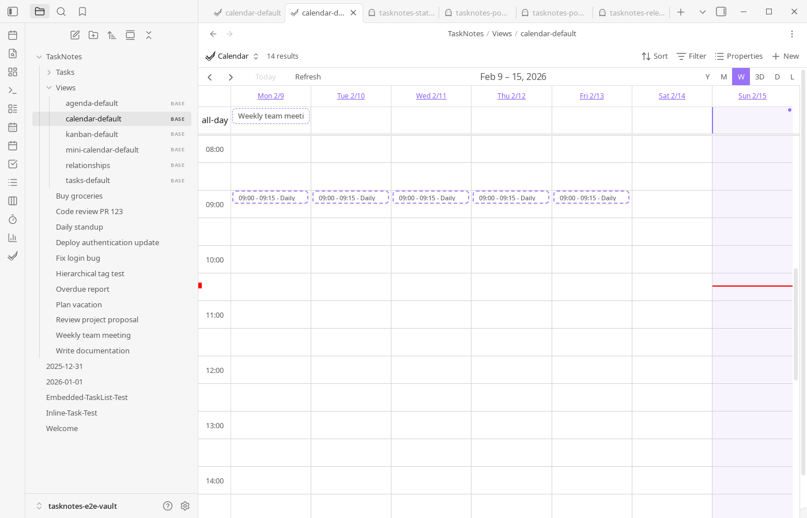
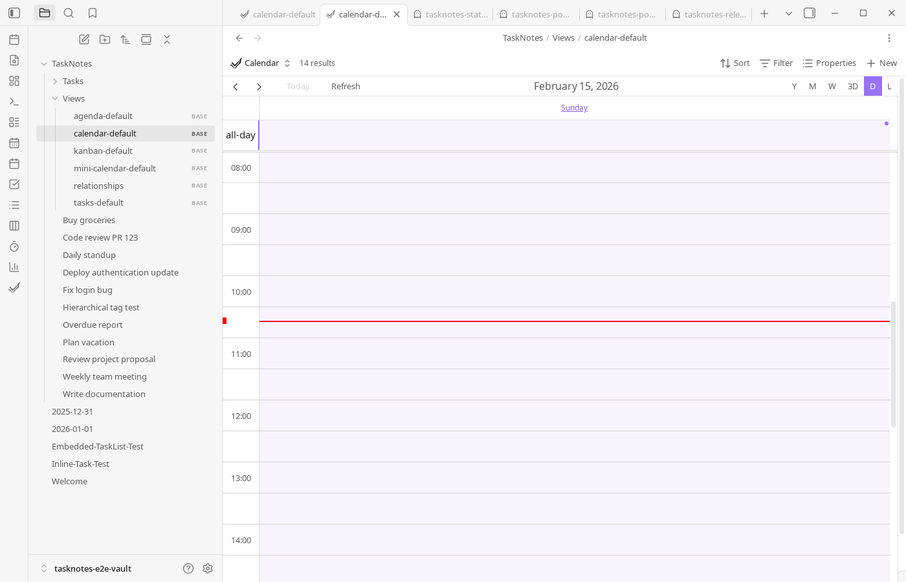
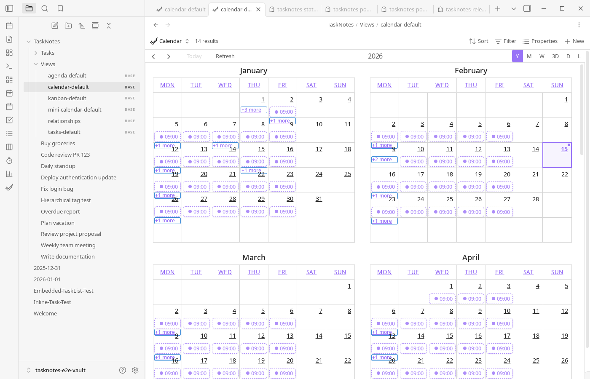
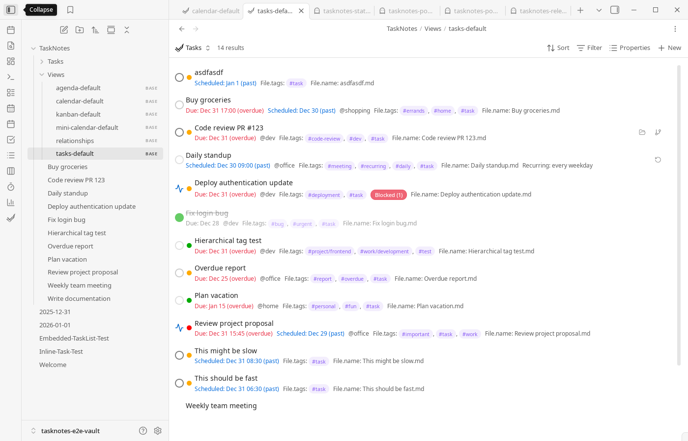
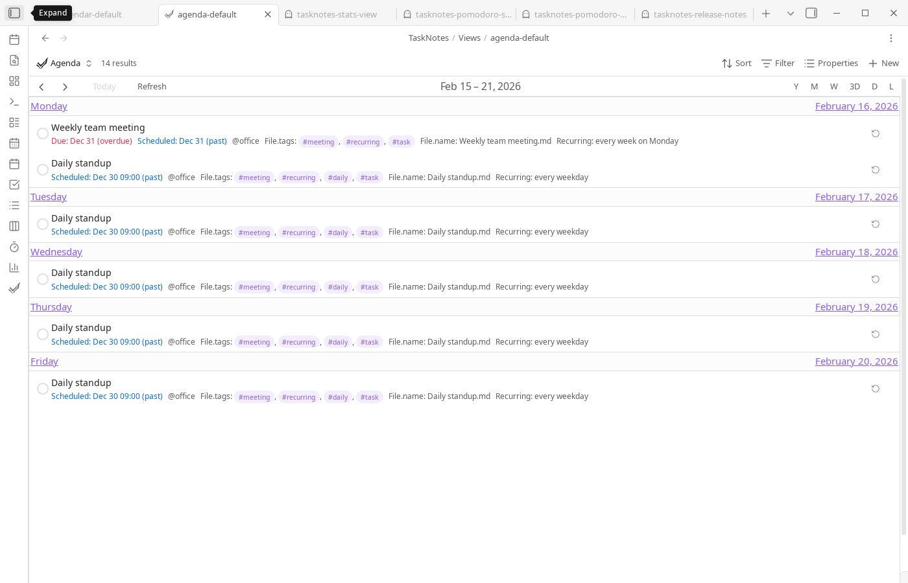
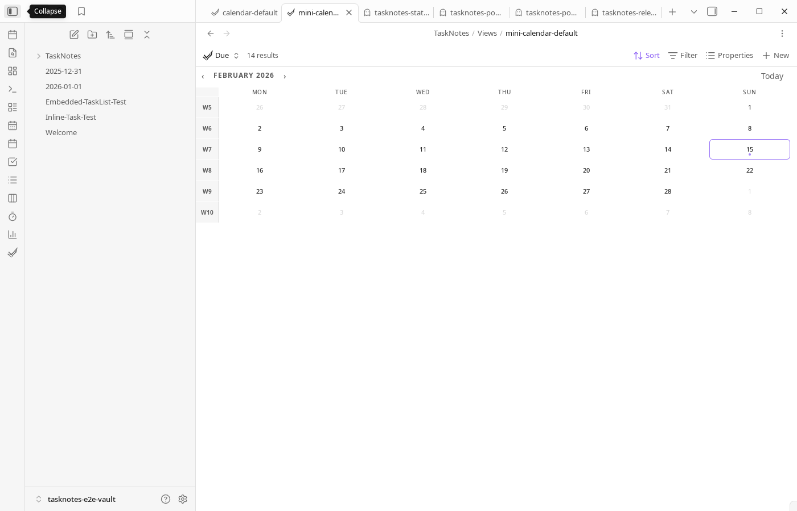
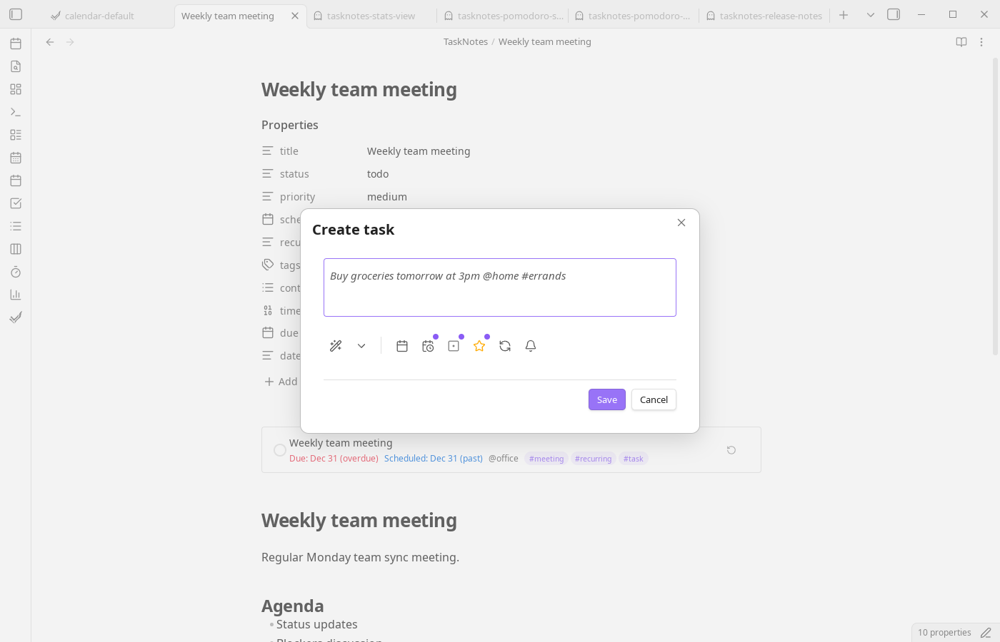
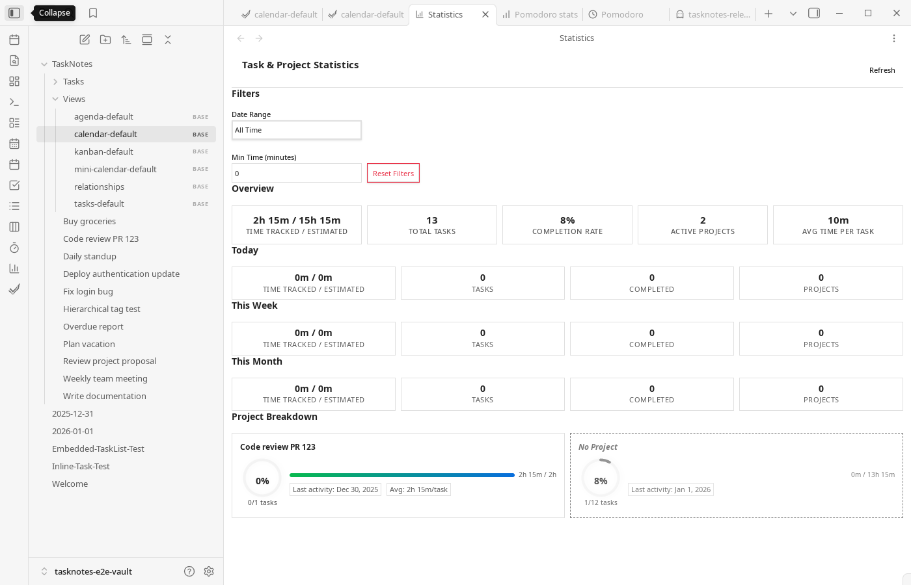
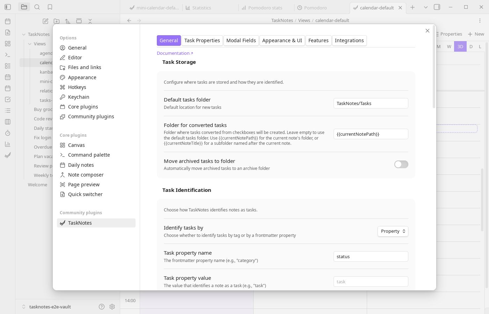

#  TaskNotes for Obsidian

The most practical way to manage tasks in Obsidian. Each task is a plain Markdown note with structured frontmatter, and every view -- task list, kanban, calendar, upcoming, agenda -- is a [Bases](https://help.obsidian.md/bases) query you can inspect and customize. No hidden databases, no proprietary formats. Your tasks are just files.


## Overview

Each task is a Markdown note with YAML frontmatter. Every view is a [Bases](https://help.obsidian.md/bases) query.

Bases is Obsidian's core plugin for turning notes into databases—it reads properties from your notes and lets you filter, sort, and group them without writing code. TaskNotes stores tasks as notes with structured frontmatter, then uses Bases to query and display them. The Task List, Kanban, Calendar, and Agenda views are all `.base` files.

This keeps your data portable. Tasks are just Markdown files with YAML, so you can read them with any tool, transform them with scripts, or migrate them elsewhere. There's no plugin-specific database.

The frontmatter is extensible—add fields like `energy-level` or `client` and they're immediately available in Bases for filtering and grouping. The `.base` files are plain text too, so you can edit filters and sorting directly or duplicate them to create new views.

<!-- TODO: Add new GIF/video demo showcasing task creation, view switching, and calendar integration -->

**[Full Documentation](https://tasknotes.dev/)**

## Quick start

Create a task with **TaskNotes: Create new task**. The plugin parses natural language -- type "Buy groceries tomorrow #errands" and it extracts the due date and context automatically. You can also convert existing notes into tasks in place, or generate tasks in bulk from any Bases view.

Tasks are stored as Markdown files in your vault. Open them directly, edit the frontmatter, or use the plugin's views to manage them.

Open a view with commands like **TaskNotes: Open tasks view** or **TaskNotes: Open kanban board**. These open the corresponding `.base` files from `TaskNotes/Views/`.

## How it works with Bases

TaskNotes registers custom view types (`tasknotesTaskList`, `tasknotesKanban`, `tasknotesCalendar`, `tasknotesMiniCalendar`) with Obsidian's Bases core plugin. Your task notes become rows; frontmatter properties become columns. The default `.base` files ship with formula properties for computed values like days until due, overdue status, and urgency scores.

Edit the `.base` files directly or use the Bases UI -- they're plain YAML. See [default base templates](./docs/views/default-base-templates.md) for the full list of included formulas and [Core Concepts](./docs/core-concepts.md#bases-integration) for setup details.

## Task structure

```yaml
title: "Complete documentation"
status: "in-progress"
due: "2024-01-20"
priority: "high"
contexts: ["work"]
projects: ["[[Website Redesign]]"]
timeEstimate: 120
timeEntries:
  - startTime: "2024-01-15T10:30:00Z"
    endTime: "2024-01-15T11:15:00Z"
```

Recurring tasks use RRULE format with per-instance completion tracking:

```yaml
title: "Weekly meeting"
recurrence: "FREQ=WEEKLY;BYDAY=MO"
complete_instances: ["2024-01-08"]
```

All property names are configurable. If you already use `deadline` instead of `due`, remap it in settings.

## Other features

Calendar sync with Google and Microsoft (OAuth) or any ICS feed. Time tracking with start/stop per task, Pomodoro timer, and session history. Recurring tasks with fixed or flexible schedules and per-instance completion tracking. Dependencies between tasks. Natural language parsing for task creation. Custom statuses, priorities, and user-defined fields.

## Integrations

TaskNotes has an optional HTTP API. There's a [browser extension](https://github.com/callumalpass/tasknotes-browser-extension) and a [CLI](https://github.com/callumalpass/tasknotes-cli). Webhooks can notify external services on task changes. See [HTTP API docs](./docs/HTTP_API.md) and [Webhooks docs](./docs/webhooks.md).

## Language support

UI: English, German, Spanish, French, Japanese, Russian, Chinese, Portuguese, Korean.

Natural language parsing: English, German, Spanish, French, Italian, Japanese, Dutch, Portuguese, Russian, Swedish, Ukrainian, Chinese.

## Screenshots

<details>
<summary>View screenshots</summary>

Screenshots are generated from the Playwright documentation suite (`npm run e2e:docs`).

### Calendar








### Task views








### Features








</details>

## Development

### Quick start

```bash
bun install              # Install dependencies
bun run dev              # Watch mode (rebuilds on change)
bun run build            # Production build (type-check + bundle)
bun test                 # Run Jest unit/integration tests
```

Open the dev vault in Obsidian with [Hot Reload](https://github.com/pjeby/hot-reload) for instant iteration.

### Testing

**Unit/Integration tests (Jest):**

```bash
bun test                 # All tests
bun run test:unit        # Unit tests only
bun run test:integration # Integration tests only
bun run test:coverage    # With coverage report
```

**E2E tests (Playwright + Chrome DevTools Protocol):**

E2E tests connect to a running Obsidian instance via CDP to test real UI interactions. The upstream developer authored 102+ test specs covering issue regressions, screenshots, and diagnostics.

```bash
# 1. Build and copy plugin to the isolated e2e vault
bun run build:test

# 2. Close Obsidian if it's running, then launch with e2e vault
bun run e2e:launch

# 3. First time only: enable community plugins and TaskNotes in Settings
# 4. Close Obsidian, then run tests
bun run e2e

# Or run specific test suites:
bun run e2e -- e2e/tasknotes.spec.ts                      # Main suite (102+ tests)
bun run e2e -- e2e/diagnostics/console-capture.spec.ts    # Capture console logs
bun run e2e -- e2e/issues/issue-1102-frontmatter-status-sync.spec.ts  # Single issue
```

**Faster iteration (attach to running instance):**

Instead of letting Playwright launch Obsidian each time, start Obsidian manually with the debug port and Playwright will connect to it. You can also use the [Obsidian CLI](https://help.obsidian.md/cli) (1.12+) for plugin reload, eval, and screenshot capture, or [wdio-obsidian-service](https://github.com/jesse-r-s-hines/wdio-obsidian-service) for multi-version testing:

```bash
# Launch Obsidian with debug port (leave it running)
"/path/to/Obsidian" --remote-debugging-port=9333

# Run tests against the running instance (skips startup delay)
bun run e2e
```

**Platform setup:**

| Platform | Binary Source | Setup |
|----------|-------------|-------|
| **Windows** | Auto-detected from `%LOCALAPPDATA%\Obsidian\` | None |
| **macOS** | Auto-detected from `/Applications/Obsidian.app` | None |
| **WSL2** | Windows `Obsidian.exe` via `/mnt/c/...` (auto-detected) | None |
| **Linux native** | Extracted AppImage | `bun run e2e:setup /path/to/Obsidian.AppImage` |

**Key E2E files:**

| File | Purpose |
|------|---------|
| `e2e/obsidian.ts` | Launcher: finds binary, spawns Obsidian, connects via CDP |
| `e2e/tasknotes.spec.ts` | Main test suite (102+ issue-specific tests) |
| `e2e/issues/` | Per-GitHub-issue regression tests |
| `e2e/diagnostics/console-capture.spec.ts` | Capture all console output to file |
| `e2e/docs-screenshots.spec.ts` | Documentation screenshot generation |
| `tasknotes-e2e-vault/` | Isolated vault for E2E (separate from dev vault) |
| `playwright.config.ts` | Config: 1 worker, sequential, 60s timeout |

See the [contributing guide](./docs/contributing.md) for full development setup and the [E2E testing strategy](./knowledge-base/03-reference/architecture/e2e-testing-strategy.md) for the architecture comparison.

## Known limitations

- **System notifications on Windows**: Obsidian may not register as a notification sender with Windows, causing system (OS-level) notifications to silently fail even when permission is granted. This is a [known Electron issue](https://github.com/electron/electron/issues/4973) that affects all Electron apps and requires a fix from the Obsidian team ([related discussion](https://github.com/uphy/obsidian-reminder/issues/73)). **Workaround**: Use "In-app" or "Both" notification delivery type in settings.

## Credits

Calendar components by [FullCalendar.io](https://fullcalendar.io/).

## License

MIT—see [LICENSE](LICENSE).
