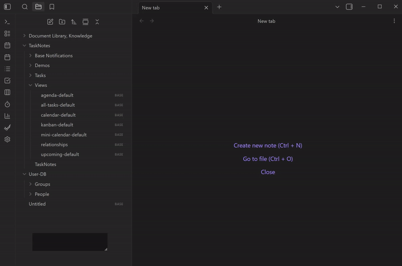
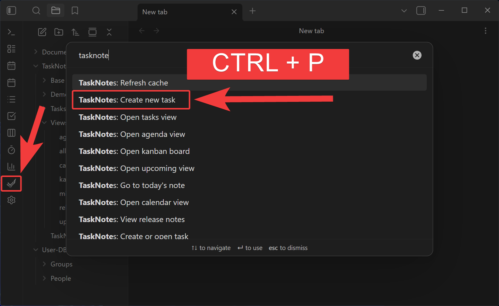

#  TaskNotes for Obsidian

The most practical way to manage tasks in Obsidian. Each task is a plain Markdown note with structured frontmatter, and every view -- task list, kanban, calendar, upcoming, agenda -- is a [Bases](https://help.obsidian.md/bases) query you can inspect and customize. No hidden databases, no proprietary formats. Your tasks are just files.

**[Full Documentation](https://tasknotes.dev/)**



## Quick Start

1. Install from **Community Plugins** in Obsidian settings
2. Create a task: Command palette → **TaskNotes: Create new task**
3. Open a view: **TaskNotes: Open tasks view** or **TaskNotes: Open kanban board**

Natural language works out of the box -- type "Buy groceries tomorrow #errands @home !high" and it extracts the due date, context, tag, and priority automatically.

## How It Works

Each task is a Markdown note with YAML frontmatter. Every view is a [Bases](https://help.obsidian.md/bases) query.

Bases is Obsidian's core plugin for turning notes into databases. TaskNotes stores tasks as notes with structured frontmatter, then uses Bases to query and display them. The Task List, Kanban, Calendar, and Agenda views are all `.base` files -- plain text, editable, duplicatable.

```yaml
title: "Complete documentation"
status: "in-progress"
due: "2024-01-20"
priority: "high"
contexts: ["work"]
projects: ["[[Website Redesign]]"]
timeEstimate: 120
```

All property names are configurable. If you already use `deadline` instead of `due`, remap it in settings.

## Views

| View | Description |
|------|-------------|
| **Task List** | Sortable, groupable list with inline subtask expansion |
| **Kanban** | Drag-and-drop board with configurable columns |
| **Calendar** | Month/week/day views with drag-to-reschedule |
| **Upcoming** | Todoist-style time-grouped view (overdue, today, tomorrow, this week) |
| **Agenda** | Date-navigated daily/weekly agenda |
| **Mini Calendar** | Compact month calendar with task dots |

## Features

### Bulk Tasking

Generate tasks from any Bases view, convert existing notes to tasks in-place, or batch-edit properties across multiple tasks. Access via toolbar buttons on any Bases view or right-click in the file explorer.

- **Generate mode** -- create task files from view results (meeting notes → action items)
- **Convert mode** -- add task metadata to existing notes without moving them
- **Edit mode** -- batch-update priority, dates, assignees across selected tasks
- **Action bar** -- set due, scheduled, status, priority, reminders, and assignees for the batch
- **Property picker** -- add custom properties with type detection and conversion

### Notification System

Three-tier reminder architecture with a unified toast + bell delivery system:

- **Per-task reminders** -- stored in frontmatter, portable and scriptable
- **Default reminders** -- auto-added to every new task at creation time
- **Global reminders** -- vault-wide rules evaluated at runtime, never written to files
- **Per-person overrides** -- customize reminder behavior per team member in shared vaults
- **Per-category behavior** -- fine-tune how overdue, today, tomorrow, and this-week items are handled

### Shared Vault & Team Attribution

- **Device identity** -- each device gets a UUID mapped to a person note
- **Auto-attribution** -- `creator` field auto-filled on task creation
- **Person/group picker** -- assign tasks to people or groups
- **Assignee-aware notifications** -- filter notifications to only your tasks

### Property Mapping & Migration

- **Per-task field overrides** -- map `deadline` to Due, `review_date` to Scheduled per task
- **Per-view field mapping** -- configure property mappings per `.base` view
- **Migration tool** -- rename property keys across all files with file count and confirmation
- **Autocomplete** -- property name suggestions in the migration command

### Core Features

- **Natural language input** with configurable triggers (@, #, +, *, !)
- **Recurring tasks** with RRULE support, calendar drag-and-drop, and per-instance completion tracking
- **Task dependencies** with blockedBy/blocking relationships
- **Time tracking** with start/stop per task and Pomodoro timer
- **Calendar sync** with Google, Microsoft (OAuth), or any ICS feed
- **Custom statuses and priorities** with colors, icons, and auto-archive
- **Inline task conversion** -- turn checkboxes into tracked tasks
- **Note vs task differentiation** -- non-task items in views show file icon instead of status dot
- **HTTP API** with browser extension and CLI support
- **9 languages** -- EN, DE, ES, FR, JA, RU, ZH, PT, KO

<details>
<summary>Screenshots</summary>

### Calendar


### Task Views


### Features




</details>

## Development

```bash
bun install              # Install dependencies
bun run dev              # Watch mode (rebuilds on change)
bun run build            # Production build (type-check + bundle)
bun test                 # Run Jest unit/integration tests
```

Open the dev vault in Obsidian with [Hot Reload](https://github.com/pjeby/hot-reload) for instant iteration.

**E2E tests** connect to a running Obsidian instance via Chrome DevTools Protocol:

```bash
bun run build:test       # Build and copy to e2e vault
bun run e2e              # Run full Playwright suite (100+ tests)
```

See the [contributing guide](./docs/contributing.md) for full development setup.

## Known Limitations

- **System notifications on Windows**: Electron may not register as a notification sender. Use "In-app" delivery type as a workaround.

## Credits

Calendar components by [FullCalendar.io](https://fullcalendar.io/).

## License

MIT -- see [LICENSE](LICENSE).
