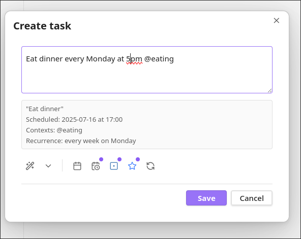
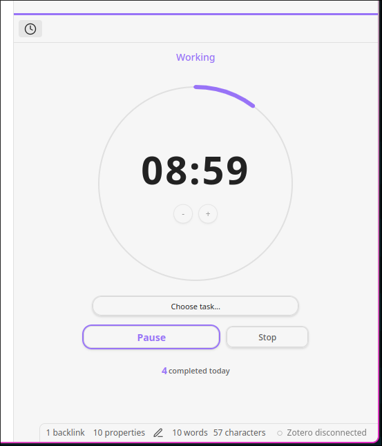
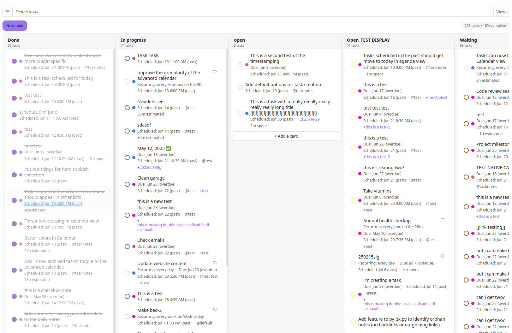

#  TaskNotes for Obsidian

Task management plugin where each task lives as a separate note with YAML frontmatter. Features calendar integration, Kanban boards, time tracking, and Pomodoro timer.

**UI Languages:** English · Deutsch · Español · Français · 日本語 · Русский · 中文

**NLP Support:** English · Deutsch · Español · Français · Italiano · 日本語 · Nederlands · Português · Русский · Svenska · Українська · 中文


**[📖 Documentation](https://callumalpass.github.io/tasknotes/)**

## Overview

Each task is a full Markdown note with structured metadata in YAML frontmatter. This means your tasks have all the benefits of regular notes - linking, tagging, graph view, and unlimited content - while still working as structured data for filtering and organization.

The plugin supports time tracking, recurring tasks, calendar integration with external ICS feeds, and integration with the Obsidian Bases plugin.

## Why YAML Frontmatter?

YAML is a standard data format that works with many tools, so you can easily extract and transform your task data into other formats. This keeps your data portable and aligns with Obsidian's file-over-app philosophy.

The frontmatter is extensible—add custom fields like "assigned-to" or "attachments" and use tools like Obsidian Bases to work with that data. This flexibility makes features like time-tracking natural, since there's an obvious place to store timing information.

Each task being a full note means you can write descriptions, jot down thoughts as you work, and connect tasks to other notes through Obsidian's linking and graph features. Bases integration provides custom views on your task data.


## Core Features

### Task Management

- Individual Markdown files with YAML frontmatter
- Properties: title, status, priority, due date, scheduled date, contexts, projects, tags, time estimates, completion date
- Project organization using note-based linking
- Recurring tasks with per-date completion tracking
- Time tracking with multiple sessions per task
- Dependency management with blocked-by and blocking relationships
- Archive function using tags 
- Filtering and grouping options

### Calendar Integration

- Month view displaying tasks and notes
- Mini calendar view for compact layouts
- ICS/iCal feed subscriptions
- Direct navigation to daily notes

### Time Management

- Time tracking with start/stop functionality
- Pomodoro timer with task integration
- Session history and statistics

### Editor Integration

- Interactive task previews for wikilinks
- Universal line-to-task conversion
- Template support with parent note context

### Views

- **Calendar**: Month view with agenda
- **Task List**: Filtering and grouping options
- **Kanban**: Drag-and-drop task management
- **Agenda**: Daily task and note overview
- **Notes**: Date-based note browser
- **Pomodoro**: Timer with statistics



*Create tasks with natural language parsing for due dates, recurrence, and contexts*



*Built-in pomodoro timer with task integration and daily completion tracking*



*Kanban boards with drag-and-drop functionality and customizable columns*


*Project management with subtasks and hierarchical organization*

## Configuration

### Customization

- **Field Mapping**: Customize YAML property names to match existing workflows
- **Custom Statuses**: Define task statuses with colors and completion behavior
- **Custom Priorities**: Create priority levels with weight-based sorting
- **Templates**: Configure daily note templates with Obsidian variables

## YAML Structure

### Task Example

```yaml
title: "Complete documentation"
status: "in-progress"
due: "2024-01-20"
priority: "high"
contexts: ["work"]
projects: ["[[Website Redesign]]"]
timeEstimate: 120
timeEntries:
  - startTime: "2024-01-15T10:30:00Z"
    endTime: "2024-01-15T11:15:00Z"
```

### Recurring Task

```yaml
title: "Weekly meeting"
recurrence: "FREQ=WEEKLY;BYDAY=MO"
complete_instances: ["2024-01-08"]
```

## HTTP API

TaskNotes includes an optional HTTP API server for external integrations. This enables creating tasks from browsers, automation tools, mobile apps, and custom scripts.

### Browser Integration

The API enables browser integrations:
- **Bookmarklets** for one-click task creation from any webpage
- **Browser extensions**: [for example](https://github.com/callumalpass/tasknotes-browser-extension) 
- **Automation** with Zapier, IFTTT, and similar services

### Documentation

See [HTTP API Documentation](./docs/HTTP_API.md) for complete endpoint reference and integration examples.

## Credits

This plugin uses [FullCalendar.io](https://fullcalendar.io/) for its calendar components.

## License

This project is licensed under the MIT License - see the [LICENSE](LICENSE) file for details.
