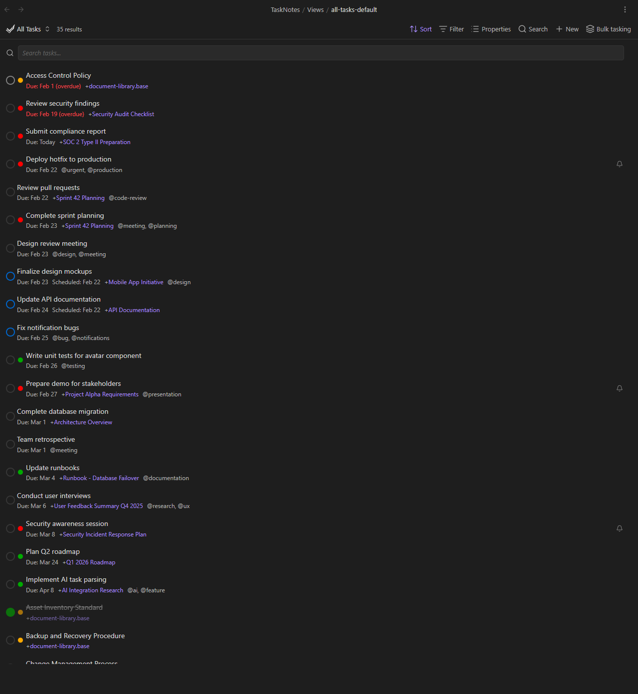

# Contributing

TaskNotes is an open-source Obsidian plugin. Contributions are welcome, whether you are fixing a bug, adding a feature, improving documentation, or reporting an issue.

## Getting Started

1. Fork [callumalpass/tasknotes](https://github.com/callumalpass/tasknotes) on GitHub
2. Clone your fork
3. Install dependencies with `bun install` (or `npm install`)
4. Set up a development vault (see below)
5. Start the dev server and begin making changes

## Development Setup

TaskNotes uses [Bun](https://bun.sh/) as its package manager and test runner. Node.js with npm also works if you prefer.

```bash
bun install        # Install dependencies
bun run dev        # Watch mode -- rebuilds on every change
bun run build      # Production build (type-check + minify)
```

<!-- GIF: Running bun run dev, editing a source file, and seeing Hot Reload pick up the change in Obsidian -->



### Dev Vault

The recommended setup is to clone the repo directly into a vault's plugin folder:

```
your-dev-vault/
  .obsidian/
    plugins/
      tasknotes/                <-- clone here
  TaskNotes/
    Tasks/                      <-- generated task files
    Views/                      <-- default .base views
    Demos/                      <-- demo .base files
  User-DB/
    People/                     <-- generated person notes
    Groups/                     <-- generated group notes
  Document Library, Knowledge/  <-- generated document notes
```

With this layout, `bun run dev` rebuilds `main.js` and `styles.css` in place. Install the [Hot Reload](https://github.com/pjeby/hot-reload) community plugin in your dev vault for automatic reloading whenever the build output changes.

### Test Data

A test data generator populates the dev vault with realistic content: person notes, group notes, document notes, task notes, and demo `.base` views. Run it after cloning to get a working dev vault, or any time you need to reset to a clean state (for example, after testing bulk convert and the documents have extra frontmatter fields).

**Option A: Test Fixtures Plugin (recommended)**

Install the [TaskNotes Test Fixtures](https://github.com/cybersader/tasknotes-test-fixtures) plugin via [BRAT](https://github.com/TfTHacker/obsidian42-brat) (`cybersader/tasknotes-test-fixtures`). It provides the same test data through Obsidian commands -- no terminal needed, works on mobile too.

| Command | Description |
|---------|-------------|
| Generate all test data | Creates all files (overwrites existing) |
| Clean and regenerate all test data | Full reset -- deletes then recreates |
| Remove all generated test data | Deletes without regenerating |

> **Tip:** You can also [clone the test fixtures repo](https://github.com/cybersader/tasknotes-test-fixtures) into `.obsidian/plugins/` and modify it directly. This keeps all contributors on the same set of fixtures and lets you create custom commands for specific testing scenarios (e.g. overdue-only tasks, multi-user shared vault setups). Edit `src/main.ts`, run `npm run build`, and reload Obsidian.

**Option B: Node script**

```bash
# Generate all test data (overwrites generated files, ignores your own files)
node scripts/generate-test-data.mjs          # or: bun run generate-test-data

# Full reset -- delete all generated data, then regenerate from scratch
node scripts/generate-test-data.mjs --clean  # or: bun run generate-test-data:clean
```

**What `--clean` removes:**

- `User-DB/People/` and `User-DB/Groups/` -- all files
- `TaskNotes/Tasks/` -- all files
- `Document Library, Knowledge/` subdirectories (Projects, Compliance, Technical, HR, Meeting Notes, Research, Templates, Design, Operations, Security) -- all files in these folders

**What `--clean` does NOT touch:**

- Your own files at the root of `Document Library, Knowledge/` (e.g. personal notes, policies you created)
- The `TaskNotes/Demos/` and `TaskNotes/Views/` folders (`.base` files are managed separately via `test-fixtures/`)

**Resetting demo `.base` views** (if you modified a demo and want to restore it):

The canonical versions live in `test-fixtures/TaskNotes/Demos/`. Copy them back to the vault:

```bash
cp test-fixtures/TaskNotes/Demos/*.base ../../../TaskNotes/Demos/
```

After running the generator or restoring fixtures, reload Obsidian (Ctrl+P > "Reload app without saving") to pick up the changes.

### What You Need

- [Obsidian](https://obsidian.md/) 1.10.1 or later with the [Bases](https://help.obsidian.md/bases) core plugin enabled
- [Bun](https://bun.sh/) (or Node.js 18+)
- A text editor or IDE with TypeScript support

## Project Structure

```
tasknotes/
  src/                  TypeScript source code
    bases/              Bases view system (rendering, toolbar, property mapping)
    bulk/               Bulk tasking engines (generate, convert, edit)
    identity/           Device identity and person/group note discovery
    modals/             Modal dialogs (task creation, edit, bulk, reminders)
    notifications/      Background monitoring, toast, bell badge
    services/           Core business logic (task CRUD, field mapping)
    settings/           Settings UI and defaults
    ui/                 Reusable UI components (PropertyPicker, pickers)
    utils/              Shared utilities
  styles/               CSS source files (concatenated at build time)
  docs/                 Documentation (this site)
  tests/                Jest unit and integration tests
  e2e/                  Playwright end-to-end tests
  main.js               Build output (do not edit directly)
  styles.css            CSS build output (do not edit directly)
  manifest.json         Obsidian plugin manifest
  package.json          Dependencies and scripts
```

Key files to know:

| File | Purpose |
|------|---------|
| `src/main.ts` | Plugin entry point, command registration, lifecycle |
| `src/services/TaskService.ts` | Task creation, update, deletion |
| `src/services/FieldMapper.ts` | Translates between internal and user-configured property names |
| `src/bases/BasesViewBase.ts` | Base class for all TaskNotes Bases view types |
| `esbuild.config.mjs` | Build configuration |
| `build-css.mjs` | CSS concatenation script |

## Building and Testing

### Build Commands

```bash
bun run dev          # Watch mode (CSS + esbuild, rebuilds on change)
bun run build        # Production build (CSS + type-check + esbuild)
bun run build-css    # Rebuild CSS only
```

### Running Tests

```bash
bun test             # Run all Jest tests
bun run test:watch   # Watch mode
bun run test:unit    # Unit tests only
bun run test:integration   # Integration tests only
```

### End-to-End Tests

TaskNotes has a Playwright test suite that connects to a running Obsidian instance via Chrome DevTools Protocol. E2E tests use a separate vault (`tasknotes-e2e-vault/`) to avoid interfering with your dev vault.

```bash
bun run e2e:setup    # First-time setup (Linux/WSL)
bun run build:test   # Build and copy to e2e vault
bun run e2e          # Run the full test suite
```

On Windows and macOS, setup auto-detects the Obsidian installation. On Linux/WSL, the setup script extracts the Obsidian AppImage.

## Architecture Overview

TaskNotes is built around a few key systems:

**Bases Integration.** TaskNotes extends Obsidian's [Bases](https://help.obsidian.md/bases) with custom view types (Task List, Kanban, Calendar, Upcoming, Agenda). Each view type extends `BasesViewBase`, which handles data loading, filtering, and rendering. The `BasesToolbarInjector` adds TaskNotes buttons to native Bases views.

**Task Service.** `TaskService` handles creating, reading, updating, and deleting task files. `FieldMapper` translates between internal field names (like `due`) and user-configured property names (like `deadline`). Per-task overrides are resolved via `fieldOverrideUtils`.

**Notification System.** `BasesQueryWatcher` monitors `.base` files with `notify: true`, evaluates their queries in the background, and triggers the toast notification and bell badge when items match. `VaultWideNotificationService` aggregates notifications from views and upstream reminders.

**Bulk Tasking.** `BulkOperationEngine` routes to specialized engines: `BulkTaskEngine` (generate), `BulkConvertEngine` (convert in-place), `BulkEditEngine` (modify properties), and `BulkUpdateEngine` (reschedule, archive, complete, delete).

**Identity System.** `DeviceIdentityManager` assigns each device a UUID. `UserRegistry` maps devices to person notes. `PersonNoteService` discovers person notes and `GroupRegistry` discovers groups with recursive member resolution.

## Pull Request Process

1. **Branch from `main`.** Create a feature branch with a descriptive name.
2. **Make focused changes.** Keep PRs small and focused on one thing. A bug fix and a new feature should be separate PRs.
3. **Write tests where possible.** Unit tests for logic, E2E tests for UI behavior.
4. **Follow existing patterns.** Look at similar code in the codebase before introducing new patterns.
5. **Describe your changes.** The PR body should explain what changed and why. Include screenshots for UI changes.
6. **Update documentation.** If your change adds or modifies user-facing behavior, update the relevant docs page.

## Coding Standards

- **TypeScript.** All source code is TypeScript. Avoid `any` types where a more specific type is reasonable.
- **Use existing utilities.** Check `src/utils/` and `src/services/` before creating new helpers. Many common operations already have functions.
- **Follow Obsidian guidelines.** The [Obsidian Plugin Guidelines](https://docs.obsidian.md/Plugins/Releasing/Plugin+guidelines) apply. Key points: sentence case for UI text, no manual HTML headings in settings tabs, use `Setting` API for settings UI.
- **ESLint.** The project uses [eslint-plugin-obsidianmd](https://github.com/obsidianmd/eslint-plugin) for Obsidian-specific linting rules. Run `bun run lint` before submitting.
- **CSS.** Styles live in `styles/` as individual files. Use `tn-` prefixed class names to avoid conflicts with Obsidian's styles. The build concatenates all CSS files into `styles.css`.

## Documentation

Documentation lives in `docs/` and is built with a custom static site builder in `docs-builder/`. The builder reads markdown from `docs/`, processes it with [marked](https://marked.js.org/), and outputs HTML to `docs-builder/dist/`. Navigation is read from `mkdocs.yml` (the `nav:` section only -- MkDocs itself is not used for the production site).

### Previewing the docs locally

**First-time setup:**

```bash
cd docs-builder
npm install          # or: bun install
```

**Build and serve:**

```bash
cd docs-builder
npm run dev          # or: bun run dev -- builds to dist/ and serves at http://127.0.0.1:4321
```

Or run the steps separately:

```bash
cd docs-builder
node build.js                                    # build only
python3 -m http.server 4321 --directory dist     # serve
```

Open `http://127.0.0.1:4321` in your browser to preview. The builder does not live-reload -- re-run `node build.js` after edits and refresh the browser.

### Writing docs

**Images and GIFs** go in `docs/assets/`. Use descriptive filenames like `feature-toast-notification.png` or `bulk-tasking-generate-mode.gif`.

**Image paths** depend on the page's location:

| Page location | Image path |
|---------------|------------|
| `docs/features/*.md` | `../assets/filename.png` |
| `docs/views/*.md` | `../assets/filename.png` |
| `docs/settings/*.md` | `../assets/filename.png` |
| `docs/*.md` (top-level) | `assets/filename.png` |

**Capturing screenshots in Obsidian:** Use the [Custom Attachment Location](https://github.com/RainCat1998/obsidian-custom-attachment-location) community plugin to route pasted images directly to `docs/assets/`. Set the attachment folder to the docs assets path so screenshots land in the right place without manual copying.

**Placeholders:** When adding a feature before screenshots are ready, use HTML comment placeholders:

```markdown
<!-- SCREENSHOT: Description of what the screenshot should show -->
<!-- GIF: Description of the interaction to capture -->
<!-- VIDEO: Description of the workflow to record -->
```

Replace placeholders with actual images as they become available.

**Writing style:** Natural descriptions, concrete examples, no jargon. Use double dashes (`--`) instead of em dashes. Link to [Obsidian help docs](https://help.obsidian.md/) where relevant. Follow the breadcrumb pattern at the top of each page (`[← Back to Features](../features.md)`).

**Navigation:** Update `mkdocs.yml` when adding new pages. Place feature pages under the Features nav section, view pages under Views.

## Reporting Issues and Feature Requests

If you find a bug or have a feature request, open an issue on [GitHub](https://github.com/cybersader/tasknotes/issues). Include:

- Steps to reproduce the issue
- What you expected to happen
- What actually happened
- Your Obsidian version and TaskNotes version
- Debug log output if applicable (see [Collecting Debug Logs](troubleshooting.md#collecting-debug-logs))

For troubleshooting common problems before filing an issue, see [Troubleshooting](troubleshooting.md).

## Resources

- [Obsidian Plugin API](https://docs.obsidian.md/Reference/TypeScript+API/Plugin)
- [Obsidian Plugin Developer Docs](https://docs.obsidian.md/Plugins/Getting+started/Build+a+plugin)
- [Obsidian Plugin Guidelines](https://docs.obsidian.md/Plugins/Releasing/Plugin+guidelines)
- [TaskNotes Source Code (fork)](https://github.com/cybersader/tasknotes)
- [TaskNotes Source Code (upstream)](https://github.com/callumalpass/tasknotes)
