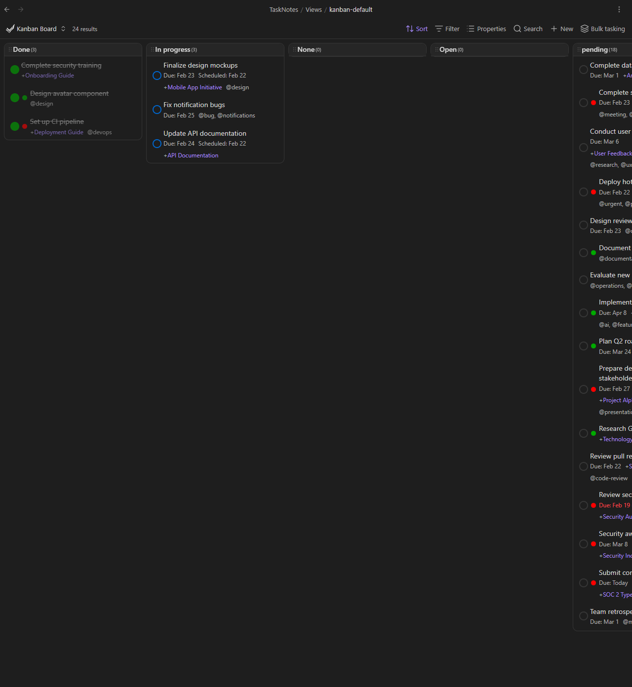

# Core Concepts

<!--
Recording Script
SETUP:
  cd .obsidian/plugins/tasknotes
  node scripts/generate-test-data.mjs --clean   # or: bun run generate-test-data:clean
  Reload plugin in Obsidian

Show opening a .base file and seeing filtered task results appear
Show a task note's frontmatter alongside the view it appears in
Show enabling notifications on a view, then running a bulk action from the toolbar
-->

TaskNotes follows the "one note per task" principle. Each task lives as a separate Markdown note with structured metadata in YAML frontmatter. Views powered by Obsidian's Bases core plugin let you filter, organize, and act on those tasks.

## Notes as Tasks

Individual Markdown notes replace centralized databases or proprietary formats. Each task file can be read, edited, and backed up with any text editor or automation tool.

### What a Task Looks Like

A TaskNotes task is a standard Markdown file with YAML frontmatter:

```markdown
---
tags:
  - task
title: Review quarterly report
status: in-progress
priority: high
due: 2025-01-15
scheduled: 2025-01-14
contexts:
  - "@office"
projects:
  - "[[Q1 Planning]]"
---

## Notes

Key points to review:
- Revenue projections
- Budget allocations

## Meeting Notes

Discussion with finance team on 2025-01-10...
```

The frontmatter contains structured, queryable properties. The note body holds freeform content: research findings, meeting notes, checklists, or links to related documents.

### Why Plain Markdown?

Since tasks are proper Obsidian notes, they work with every core feature you already use:

- **Backlinks**: See which notes reference a task
- **Graph View**: Visualize task relationships and project connections
- **Tags**: Use Obsidian's tag system for additional categorization
- **Search**: Find tasks using Obsidian's built-in search
- **Links**: Reference tasks from daily notes, meeting notes, or project documents

This approach creates many small files. TaskNotes stores tasks in a configurable folder (default: `TaskNotes/Tasks/`) to keep them organized. You keep using normal note workflows, and TaskNotes adds structure, filtering, and commands on top.

### Not Just Tasks

Not every note needs to start as a task. Meeting notes, research documents, and project briefs often accumulate action items over time. TaskNotes can handle this in two ways:

- **Convert** an existing note into a task by adding the right frontmatter properties in place. Use this when the note itself is the work.
- **Generate** a new task file that links back to the source document. Use this when you need a separate tracker.

You can also do both in bulk from any view. See [Bulk Tasking](features/bulk-tasking.md) for details.

## Properties

Task properties are stored in YAML frontmatter, a standard format with broad tool support. Think of frontmatter as the machine-readable layer and the note body as the human-readable layer. TaskNotes automations and view filters rely on frontmatter; your project notes and context stay in the body.

### Property Types

TaskNotes uses several property types:

| Type | Example | Description |
|------|---------|-------------|
| Text | `title: Buy groceries` | Single text value |
| List | `tags: [work, urgent]` | Multiple values |
| Date | `due: 2025-01-15` | ISO 8601 date format |
| DateTime | `scheduled: 2025-01-15T09:00` | Date with time |
| Link | `projects: ["[[Project A]]"]` | Obsidian wikilinks |
| Link (person) | `assignee: "[[Alice Chen]]"` | Wikilink to a person note |
| Number | `timeEstimate: 60` | Numeric values (minutes) |

### Field Mapping

Property keys are configurable. If your vault uses `deadline` instead of `due`, you can map TaskNotes to use your existing field names without modifying your files.

### Custom Properties

Add any frontmatter property to your tasks. User-defined fields work in filtering, sorting, and templates. Define custom fields in **Settings > Task Properties** to include them in task modals and views.

## Views

TaskNotes uses Obsidian's Bases core plugin for its views. A `.base` file defines a query (which files to include, how to filter them) and each view within it controls the layout (task list, kanban board, calendar, etc.).

<!-- GIF: Opening a .base file and seeing filtered task results -->


Bases provides:

- **Filtering**: Query tasks using AND/OR conditions on any property
- **Sorting**: Order tasks by due date, priority, status, or custom fields
- **Grouping**: Organize tasks by any property with collapsible groups
- **Multiple layouts**: Task List, Kanban, Calendar, Agenda, and more

Views are stored as `.base` files in `TaskNotes/Views/`. You can duplicate, modify, or create new views by editing these files directly. This makes view behavior inspectable and predictable: if a task appears in the wrong place, open the `.base` file and see exactly which filter or grouping rule produced that result.

### Enabling Bases

Bases is a core plugin included with Obsidian 1.10.1+:

1. Open **Settings > Core Plugins**
2. Enable **Bases**
3. TaskNotes views will now function

### Beyond Filtering

Views are not just for looking at tasks. They can drive actions too.

<!-- GIF: Enabling notifications on a view, or running a bulk action from the toolbar -->



- **Notifications.** Enable notifications on any view to get alerted when items match your filter. Useful for tracking overdue tasks, blocked items, or any condition you define. This is separate from task reminders, which alert you based on a task's due date.
- **Bulk operations.** The toolbar on any view lets you generate new task files or convert existing notes into tasks, using the items the view currently shows. Useful when a project plan or document library produces work items you want to track individually.
- **Property mapping.** Each view can use different property names for the same concept. One view might use `deadline` while another uses `review_date`. You configure this per view so that tasks created from a view inherit the right field names automatically.
- **Creation defaults.** Set default values for new tasks created from a specific view, so they inherit the right status, tags, or project without manual entry.

### Other Views

For a time-grouped overview across your views, try the **Upcoming View** (run **TaskNotes: Open upcoming view** from the command palette). It groups tasks into Overdue, Today, This Week, and later periods. See [Upcoming View](views/upcoming-view.md) for details.

If you work in a shared vault, TaskNotes can attribute tasks to people and filter notifications to show only your assignments. See [Team & Attribution](features/shared-vault.md).
