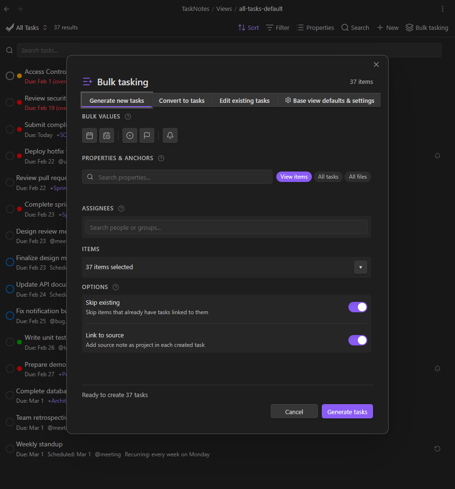
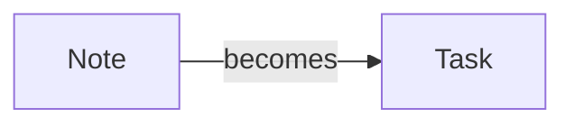
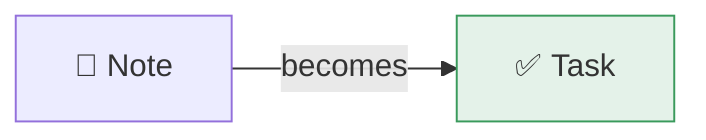

# Writing Documentation

This page covers the documentation build system, writing conventions, and the full styling reference. For contributor onboarding, see [Contributing](../contributing.md).

## Docs Builder

Documentation lives in `docs/` and is built with a custom static site builder in `docs-builder/`. The builder reads markdown from `docs/`, processes it with [marked](https://marked.js.org/), and outputs HTML to `docs-builder/dist/`. Navigation is read from `mkdocs.yml` (the `nav:` section only -- MkDocs itself is not used for the production site).

### First-Time Setup

```bash
cd docs-builder
npm install          # or: bun install
```

### Build and Serve

```bash
cd docs-builder
npm run dev          # builds to dist/ and serves at http://127.0.0.1:4321
```

Or run the steps separately:

```bash
cd docs-builder
node build.js                                    # build only
python3 -m http.server 4321 --directory dist     # serve
```

The builder does not live-reload -- re-run `node build.js` after edits and refresh the browser.

## Writing Conventions

- **Style:** Natural descriptions, concrete examples, no jargon. Use double dashes (`--`) instead of em dashes.
- **Links:** Link to [Obsidian help docs](https://help.obsidian.md/) where relevant.
- **Breadcrumbs:** Follow the breadcrumb pattern at the top of each page (`[<- Back to Features](../features.md)`).
- **Navigation:** Update `mkdocs.yml` when adding new pages. Place feature pages under the Features nav section, view pages under Views.

## Images and Media

**Images and GIFs** go in `docs/assets/`. Use descriptive filenames like `feature-toast-notification.png` or `bulk-tasking-generate-mode.gif`.

**Image paths** depend on the page's location:

| Page location | Image path |
|---------------|------------|
| `docs/features/*.md` | `../assets/filename.png` |
| `docs/views/*.md` | `../assets/filename.png` |
| `docs/settings/*.md` | `../assets/filename.png` |
| `docs/*.md` (top-level) | `assets/filename.png` |

Standard markdown image syntax:

```markdown

```

### Videos

Use HTML `<video>` tags for `.mp4` files. Obsidian `![[wikilink]]` embeds are **not supported** by the docs builder.

```html
<video controls width="100%">
  <source src="../assets/bulk-convert-demo.mp4" type="video/mp4">
</video>
```

### Attachment Plugin

The dev vault uses [Custom Attachment Location](https://github.com/mnaoumov/obsidian-custom-attachment-location) to route pasted images to `docs/assets/`. Set the path to `.obsidian/plugins/tasknotes/docs/assets` (absolute from vault root, no `./` prefix) to avoid path resolution issues.

Note: The collect attachments command in that plugin does not move `.mp4` files -- videos must be placed manually.

## Placeholders

When adding a feature before screenshots are ready, use HTML comment placeholders:

```markdown
<!-- SCREENSHOT: Description of what the screenshot should show -->
<!-- GIF: Description of the interaction to capture -->
<!-- VIDEO: Description of the workflow to record -->
```

Replace placeholders with actual images as they become available.

---

## Styling Reference

Everything below documents the styling features available in the docs builder. All examples use standard markdown or HTML that the builder processes.

### Theme

The docs site uses a scholarly/technical aesthetic:

| Role | Font | Notes |
|------|------|-------|
| Display (headings) | Cormorant Garamond | Refined optical serif |
| Body text | IBM Plex Serif | Technical warmth |
| UI, nav, code | IBM Plex Mono | File-listing feel |

One accent colour: **amber**. Light and dark themes are supported -- toggle via the switch in the sidebar footer.

---

### Callouts

Obsidian-style callout syntax is fully supported. The builder converts `> [!type]` blocks into styled, coloured cards. See the [Obsidian Callouts documentation](https://help.obsidian.md/Editing+and+formatting/Callouts) for the original syntax reference and full list of supported types.

#### Basic callout

```markdown
> [!info] This is an info callout
> Body text goes here. Supports **bold**, `code`, [links](https://example.com), and other inline formatting.
```

> [!info] This is an info callout
> Body text goes here. Supports **bold**, `code`, [links](https://example.com), and other inline formatting.

#### Callout without custom title

Omit the title to use the type name as the heading:

```markdown
> [!warning]
> Something to watch out for.
```

> [!warning]
> Something to watch out for.

#### Foldable callouts

Add `+` (open by default) or `-` (closed by default) after the type:

```markdown
> [!tip]+ Click to collapse this
> This content is visible by default but can be collapsed.

> [!example]- Click to expand this
> This content is hidden by default.
```

> [!tip]+ Click to collapse this
> This content is visible by default but can be collapsed.

> [!example]- Click to expand this
> This content is hidden by default.

#### Callout types and colours

| Type | Aliases | Colour | Icon |
|------|---------|--------|------|
| `note` | -- | Blue | Pencil |
| `info` | -- | Blue | Info circle |
| `todo` | -- | Blue | Checkbox |
| `tip` | `hint`, `important` | Green | Lightbulb |
| `success` | `check`, `done` | Green | Checkmark |
| `abstract` | `summary`, `tldr` | Cyan | Clipboard |
| `question` | `help`, `faq` | Yellow | Question mark |
| `warning` | `caution`, `attention` | Orange | Warning triangle |
| `danger` | `error` | Red | Zap |
| `failure` | `fail`, `missing` | Red | X mark |
| `bug` | -- | Red | Bug |
| `example` | -- | Purple | List |
| `quote` | `cite` | Gray | Quote mark |

#### Multi-paragraph callouts

Continue lines with `>` to include multiple paragraphs, lists, or code:

```markdown
> [!note] Multi-paragraph example
> First paragraph of the callout.
>
> Second paragraph. You can include:
>
> - Bullet lists
> - With multiple items
>
> And `inline code` or **bold text**.
```

> [!note] Multi-paragraph example
> First paragraph of the callout.
>
> Second paragraph. You can include:
>
> - Bullet lists
> - With multiple items
>
> And `inline code` or **bold text**.

---

### Badges

Inline labels for headings. Useful for marking features as experimental, new, or deprecated.

```markdown
## Feature Name <span class="badge badge--experimental">Experimental</span>
```

Renders as a small amber pill next to the heading text. Available badge classes:

| Class | Appearance |
|-------|------------|
| `badge badge--experimental` | Amber border and text, uppercase "EXPERIMENTAL" |

To add more badge variants, define new `badge--*` classes in `docs-builder/src/styles/main.css`.

---

### Collapsible Details

For expandable sections that are not callouts, use standard HTML `<details>` and `<summary>`:

```html
<details>
<summary>Click to expand</summary>

Content inside the collapsible. Supports full markdown once there is a blank line after the `<summary>` tag.

</details>
```

<details>
<summary>Click to expand</summary>

Content inside the collapsible. Supports full markdown once there is a blank line after the `<summary>` tag.

</details>

These render as amber-bordered cards with a rotation triangle indicator. For coloured, typed collapsibles, use foldable callouts instead (`> [!type]+` or `> [!type]-`).

---

### Tables

Standard markdown tables are supported and automatically wrapped in a scrollable container for wide content:

```markdown
| Column A | Column B | Column C |
|----------|----------|----------|
| Value 1  | Value 2  | Value 3  |
```

Long tables scroll horizontally rather than overflowing into the table of contents.

---

### Code Blocks

Fenced code blocks get syntax highlighting via [highlight.js](https://highlightjs.org/). Specify the language after the opening fence:

````markdown
```typescript
function greet(name: string): string {
  return `Hello, ${name}`;
}
```
````

A copy button appears on hover in the top-right corner of every code block.

**Supported languages:** All languages bundled with highlight.js -- `typescript`, `javascript`, `bash`, `yaml`, `json`, `css`, `html`, `python`, `markdown`, and many more.

**Inline code** uses backticks as usual: `` `like this` ``.

---

### Mermaid Diagrams

[Mermaid](https://mermaid.js.org/) diagrams are rendered client-side. Use a fenced code block with the `mermaid` language:

````markdown

````



Supports all Mermaid diagram types: flowcharts, sequence diagrams, class diagrams, state diagrams, Gantt charts, and more. See the [Mermaid documentation](https://mermaid.js.org/intro/) for the full syntax reference.

Theme is auto-detected from the site's light/dark mode toggle.

---

### Blockquotes

Standard markdown blockquotes (without a `[!type]` callout marker) render with an amber left border:

```markdown
> This is a plain blockquote.
> It uses italic styling and a left border.
```

> This is a plain blockquote.
> It uses italic styling and a left border.

---

### Headings and Table of Contents

Headings `##` through `####` (h2--h4) automatically get anchor IDs and appear in the right-side "On this page" table of contents. `#` (h1) is stripped and replaced by the page title from frontmatter.

```markdown
## Section Heading
### Subsection
#### Sub-subsection
```

Link to headings with standard anchor syntax:

```markdown
[See the callouts section](#callouts)
```

---

### Links

**Internal links** use relative markdown paths. The builder resolves them to the correct URL:

```markdown
[Task Management](task-management.md)
[Agenda View](../views/agenda-view.md)
[Projects section](task-management.md#projects)
```

**External links** use full URLs:

```markdown
[Obsidian Help](https://help.obsidian.md/)
```

**Obsidian wikilinks (`[[...]]`) are not supported.** Use standard markdown link syntax.

---

### What Is NOT Supported

The docs builder uses vanilla [marked.js](https://marked.js.org/) with the extensions documented above. The following syntaxes from other systems do **not** work:

| Syntax | Source | Use instead |
|--------|--------|-------------|
| `![[filename]]` | Obsidian embeds | `` for images, `<video>` for videos |
| `[[wikilink]]` | Obsidian links | `[text](path.md)` standard markdown links |
| `??? type "title"` | PyMdownx admonitions | `> [!type] title` Obsidian callouts |
| `::: directive` | rST / MyST | Not supported |
| `{.class}` attribute syntax | Pandoc / attr_list | Use inline `<span class="...">` HTML |
| Footnotes (`[^1]`) | Various | Not currently supported |
| Definition lists (`term\n: definition`) | Various | Not currently supported |
