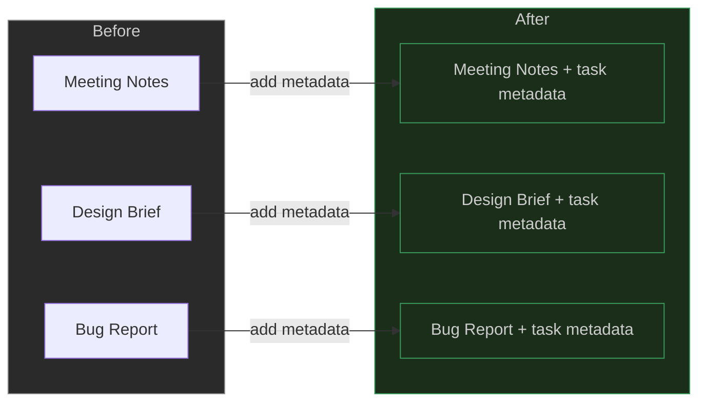
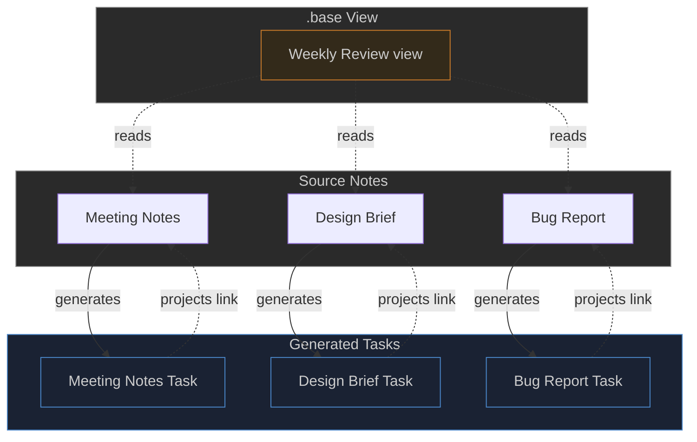

# Bulk Tasking

[← Back to Features](../features.md)

TaskNotes lets you create, convert, and edit tasks in batch from any [Bases](https://help.obsidian.md/bases) view. The bulk tasking modal has three modes -- **Convert**, **Edit**, and **Generate** -- each designed for a different workflow. You can also bulk-task files directly from the file explorer.

> [!info] Roadmap
> Bulk tasking is under active development. Upcoming work includes modal customization (layout, field visibility, default values per view), improved [Edit](#edit-mode) and [Generate](#generate-mode) workflows, and performance optimizations for large views. See the sections below for per-mode status.

<!--
Recording Script — GIF/video demos for this page

PREREQUISITES:
  Install the tasknotes-test-fixtures plugin (via BRAT: cybersader/tasknotes-test-fixtures)
  Enable it in Settings > Community Plugins

SETUP (one-time or to reset state):
  Cmd/Ctrl+P → "TaskNotes Test Fixtures: Full test setup (configure + generate)"
  This backs up your settings, configures TaskNotes for the test data, and
  syncs all fixtures (skipping unchanged files, removing stale ones).
  Generated files appear at:
    TaskNotes/Tasks/          50 task notes
    TaskNotes/Demos/          19 demo .base views (open these for recording)
    User-DB/People/           7 person notes
    User-DB/Groups/           5 group notes
    Document Library, Knowledge/  43 docs across 10 subdirectories

DEMO .BASE FILES TO USE:
  TaskNotes/Demos/Bulk Generate Demo.base       — documents ready for bulk task generation
  TaskNotes/Demos/Bulk Generate — Results.base  — shows generated tasks with source links
  TaskNotes/Demos/Bulk Convert Demo.base        — non-task notes to convert in-place
  TaskNotes/Demos/Bulk Edit Demo.base           — active tasks for bulk property editing

RECORDING STEPS:

  BULK CONVERT (GIF 1):
  1. Open "Bulk Convert Demo.base"
  2. Show the "Notes to Convert" view — note the "Is Task" column is blank/empty for all rows
  3. Click the "Bulk tasking" button
  4. Modal opens — Convert tab is selected by default (first tab)
  5. Show the compatibility check (X items will be converted, Y already tasks, Z non-Markdown)
  6. Click "Convert" to run
  7. Show the progress bar completing
  8. Close the modal
  9. Back in the view, show the "Is Task" column now shows "true" on converted items
  10. Open one of the converted files
  11. Show the frontmatter — isTask: true has been added, existing metadata preserved

  BULK EDIT (GIF 2):
  1. Open "Bulk Edit Demo.base"
  2. Show active tasks in the default view
  3. Click the "Bulk tasking" button
  4. Switch to the "Edit" tab
  5. Click the flag icon, set priority to "high"
  6. Click the calendar icon, reschedule due dates to next week
  7. Click "Edit" to run
  8. Show the progress bar completing
  9. Close the modal
  10. Open one of the edited task files
  11. Show the updated frontmatter — priority and due date changed

  BULK GENERATE (GIF 3):
  1. Open "Bulk Generate Demo.base"
  2. Show the document list in the "Ready to Generate" view
  3. Click the "Bulk tasking" button in the toolbar
  4. Switch to the "Generate" tab
  5. Click the calendar icon in the action bar, set a due date
  6. Click the flag icon, set priority to "high"
  7. Click the "Generate" button to run
  8. Show the progress bar completing
  9. Close the modal
  10. Open "Bulk Generate — Results.base" (companion view showing TaskNotes/Tasks/)
  11. Show the generated tasks with their "Source Document" column linking back
  12. Open one of the newly created task files
  13. Show the frontmatter — projects field contains a wikilink to the source document

  UNIVERSAL BUTTONS (GIF 4):
  1. Open any regular Table view (not a TaskNotes view type)
  2. Show that "New task" and "Bulk tasking" buttons appear in the toolbar
  3. Click "Bulk tasking" to show the modal works from any Bases view

  FILE EXPLORER CONTEXT MENU (GIF 5):
  1. Select multiple files in the file explorer
  2. Right-click to show the context menu
  3. Show "Bulk tasking (N files)" option
  4. Right-click a folder
  5. Show "Bulk tasking (N files in folder)" option

CLEANUP (bulk ops create/modify files — reset to clean state):
  Cmd/Ctrl+P → "TaskNotes Test Fixtures: Sync test data"
  This reverts any changes and removes files created by bulk operations.

RESTORE ORIGINAL SETTINGS:
  Cmd/Ctrl+P → "TaskNotes Test Fixtures: Restore TaskNotes settings from backup"
-->

Open the modal by clicking the **Bulk tasking** button in any Bases view toolbar, or by right-clicking files or folders in the file explorer.

The modal shows the items from the current view (or selection) and lets you pick a mode using tabs at the top: **Convert**, **Edit**, or **Generate**. A fourth tab, **Defaults**, appears when the modal is opened from a Bases view. The active tab expands to show its full label.

## Convert Mode

Convert mode turns existing notes into tasks without creating new files. It adds task identification metadata (a frontmatter property or tag, depending on your settings) and optionally sets default values for status, priority, and creation date. The note's existing content and frontmatter are preserved.

<video controls width="100%">
  <source src="../assets/bulk-convert-demo.mp4" type="video/mp4">
</video>

What Convert does to each note:

1. **Adds task identification** -- sets the property you configured in settings (e.g., `task: true`) or adds your task tag
2. **Applies defaults** (optional) -- sets status, priority, and `dateCreated` if they are not already present
3. **Sets the creator** (optional) -- auto-attributes the task to the current device's person note if device identity is configured
4. **Links to the view** (optional) -- adds the `.base` file as a project link
5. **Never overwrites** -- existing frontmatter values are left untouched; only missing fields are added

**Options:**

| Option | Default | What it does |
|--------|---------|--------------|
| Apply defaults | On | Set status, priority, and dateCreated on notes that do not already have them |
| Link to base | On | Add the `.base` file as a wikilink in the `projects` field |

Before running, Convert shows a compatibility check: how many items are already tasks (will be skipped), how many are non-Markdown files (will be skipped), and how many will be converted.

## Edit Mode Experimental

> [!warning] Under active development
> Edit mode is functional but still being refined. Expect improvements to field handling, validation, and undo support in upcoming releases.

Edit mode modifies frontmatter properties on files that are already tasks. Unlike Convert, it overwrites existing values with whatever you set. Files that are not tasks are skipped.

This is useful for batch updates: reschedule 20 tasks to next week, change the priority on everything in a view, or assign a group of tasks to someone.

<!-- GIF: Using Edit mode to batch-update priority and due date on multiple tasks -->
![[file-20260225134350339.gif]]

**Behavior:**

- Only files that are already identified as tasks are edited
- Only fields you explicitly set are written -- blank fields in the action bar are left untouched on the target files
- Non-Markdown files and non-task files are skipped with a count shown in the pre-check

## Generate Mode Experimental

> [!warning] Under active development
> Generate mode is functional but still being refined. Expect improvements to duplicate detection, template support, and naming conventions in upcoming releases.

Generate mode creates a new task file for each item in the view. The source items stay unchanged. This is useful when you have a list of notes (meeting notes, project plans, reference documents) and want to spin off tasks linked back to them.

<!-- GIF: Opening the bulk modal from a Bases view, selecting Generate mode, and creating tasks -->
![[file-20260225135305462.gif]]

Each generated task:

- Gets its own Markdown file in your configured task folder
- Links back to the source note via the `projects` property (a wikilink to the original file)
- Inherits any bulk values you set in the action bar (status, priority, dates, assignees, reminders, custom properties)

**Options:**

| Option | Default | What it does |
|--------|---------|--------------|
| Skip existing | On | If a task already links to a source note, skip it instead of creating a duplicate |
| Link to source | On | Add the source note as a wikilink in the new task's `projects` field |

The engine processes items in parallel (batches of 5) for speed, with a progress bar showing how many have been created.

## The Action Bar

All three modes share an action bar at the top of the modal. It contains icon buttons for the most common task properties:

<!-- SCREENSHOT: Action bar with icons for due, scheduled, status, priority, reminders, assignee -->
![[file-20260225135639815.gif]]
{>>Should we add better visuals or even icons to below table - not sure how helpful it currently is unless we link to other pages like task properties<<}

| Icon           | Property       | Picker                                                               |
| -------------- | -------------- | -------------------------------------------------------------------- |
| Calendar       | Due date       | Date picker with relative options (Today, Tomorrow, Next week, etc.) |
| Calendar clock | Scheduled date | Date picker                                                          |
| Circle         | Status         | Dropdown with your configured statuses                               |
| Flag           | Priority       | Dropdown with your configured priorities                             |
| Bell           | Reminders      | Reminder editor (stackable -- you can add multiple reminders)        |
| User           | Assignee       | Person and group picker                                              |

Each icon shows a dot indicator when a value is set, and the tooltip updates to show the current value. For reminders, the dot shows a count badge.

If you set reminders but no dates, a warning appears -- relative reminders need a date to anchor to.

Values set in the action bar apply to every item in the batch. In Generate mode they are written to the new task files. In Convert mode they are added only if the field is missing. In Edit mode they overwrite the existing value.

## Custom Properties in Bulk Operations

Below the action bar, a{>>Update this - we change the name<<} **Properties & Anchors** section lets you add any frontmatter property to the batch. It uses the same PropertyPicker that appears in individual task modals.

<!-- SCREENSHOT: PropertyPicker in bulk modal showing discovered properties with type badges -->{>>In the demonstration video, I also showed the case of needing to convert types when it comes to the property. So we can also mention that here in a drop, like in a call out below the GIF just in case<<}
![[file-20260225182511076.gif]]

Type a property name or search existing properties discovered from your task files. The picker shows:

- Property names with type badges (text, number, date, list, link)
- A "Map to" option that lets you assign a custom property to a standard task field (e.g., map `deadline` to the due date slot)
- Properties already set in the batch, shown as editable rows below the picker

Custom properties are written to frontmatter alongside the standard task fields. In Generate and Convert modes they are added. In Edit mode they overwrite.

If the view you opened from has per-view field mappings configured, those mappings are pre-loaded into the Properties & Anchors section automatically.

## Duplicate Detection{>>Wont have time to test this yet - should probably mark as experimental as well
<<}

In Generate mode, TaskNotes checks for existing tasks that already link to each source note before creating new ones. This prevents accidental duplicates when you run bulk generation more than once.

The detection works by scanning the `projects` field on all existing tasks:

- Compares wikilinks (`[[Note Name]]`) and Markdown links (`[text](path)`)
- Matches on full path or basename (handles vault reorganization)
- Case-insensitive comparison

If the **Skip existing** toggle is on (the default), items with existing linked tasks are skipped and counted separately in the results. You can turn this off if you intentionally want multiple tasks per source note.

## When to Use Generate vs Convert{>>This section should reference applicable workflow and/or workflow tutorial pages<<}
{>>Should the below 2 sections be linked to from the applicable above sections as callouts?<<}
Generate and Convert solve different problems. Choose the one that matches your workflow:

**Use Generate** when you want to **spin off tasks from reference material** without changing the source notes. The source notes stay as they are (meeting notes, project plans, documents), and new task files are created in your tasks folder. Each generated task links back to its source via the `projects` field, creating a parent-child relationship. This is useful when:

- You have meeting notes and want to create action items from them
- You are reviewing a project plan and want to spin off individual tasks
- The source notes are not tasks themselves -- they are reference material that tasks relate to

After generating, you can see the relationship from either direction: open a source document and its **Subtasks** tab shows the generated tasks, or open a task and its **Projects** tab shows the source it came from.

**Use Convert** when the notes **are the tasks** and you want to manage them as tasks in place. Convert adds task identification metadata (a frontmatter property or tag) to existing notes so TaskNotes recognizes them. The notes stay where they are, keep their content, and gain task properties like status, priority, and dates. This is useful when:

- You have a folder of notes that each represent a piece of work to track
- You want to manage existing notes through TaskNotes views without duplicating them
- The notes themselves are the deliverables, not references to separate work

The key difference: **Generate creates new files** (tasks that link back to sources), while **Convert marks existing files as tasks** (no new files created). If you find yourself generating tasks that are essentially duplicates of the source notes, Convert is probably the better fit.

### Convert Mode -- What Happens

The notes you select **become** tasks. No new files are created -- task metadata is added in place.

Same files, same locations, same content -- they just gain task properties so TaskNotes can track them.

### Generate Mode -- What Happens

New task files are created and linked back to the source notes. The sources stay untouched.

The `projects` link creates a bidirectional relationship: open a source note and see its generated tasks in the **Subtasks** tab, or open a task and see which note it came from in the **Projects** tab.

> [!tip]+ How the projects/subtasks relationship works
> Generate mode relies on the **projects** field to connect tasks to source notes. When a generated task has `projects: ["[[Meeting Note]]"]`, that meeting note becomes the task's project. Open the meeting note and its **Subtasks** tab shows all tasks generated from it. Open the task and its **Projects** tab shows the meeting note. This is the same linking model used throughout TaskNotes -- see [Projects](task-management.md#projects) for the full explanation.
>
> Convert mode does not create this relationship by default, because the note becomes the task itself. You can optionally link converted notes to the `.base` file they were converted from using the "Link to base" toggle.

See [Workflows](../workflows.md) for practical examples of both approaches, including [Bulk Tasking from Meeting Notes](../workflows.md#bulk-tasking-from-meeting-notes) and [Project-Centered Planning](../workflows.md#project-centered-planning).

## Universal Bases View Buttons

TaskNotes adds **New task** and **Bulk tasking** buttons to every Bases view toolbar, not just TaskNotes-registered view types. This means Table, Board, and any other native Bases view gets TaskNotes controls automatically.

<!-- GIF: TaskNotes "New task" and "Bulk tasking" buttons appearing on a native Bases Table view -->
![[file-20260225182354220.gif]]

The buttons appear next to Obsidian's built-in "New" button. They use the same styling as native toolbar items so they blend in.

> [!info]- How it works
> A `MutationObserver` watches for new Bases toolbars appearing in the DOM. When a toolbar is detected, TaskNotes checks whether it belongs to a TaskNotes-registered view (which injects its own buttons) or a native view. Native views get the universal buttons injected. If a view switches from a native type to a TaskNotes type, the universal buttons are automatically removed to avoid duplicates.

**Per-view control:**

<!-- GIF: Toggling "Show toolbar buttons" off in a view's Configure panel -->{>>I already kind of did that in the GIF above.<<}

You can disable TaskNotes controls on specific views. Open the view's Configure panel (the gear icon in the Bases toolbar) and toggle **Show toolbar buttons** off. This writes `showTaskNotesUI: false` to that view's configuration in the `.base` file.

**Right-click context menus:**

<!-- GIF: Right-clicking a row in a Bases view showing task vs non-task context menu options -->{>>If the file is not a task, then it'll show a convert to task button. So this is something we want to call out for in this section. And also, if you don't change a value when trying to convert to task, like if you're not, if you don't set some sort of value on it, then it won't become a task.<<}

On views with universal buttons, right-clicking a row or card shows a context menu:

- If the file is a task: the full task context menu (edit, complete, reschedule, etc.)
- If the file is not a task: "Convert to task" and "Open note" options

## Right-Click in the File Explorer

<!-- GIF: Right-clicking files and folders in the file explorer to open bulk tasking modal -->

<video controls width="100%">
  <source src="../assets/bulk-file-explorer-demo.mp4" type="video/mp4">
</video>

You do not need a Bases view to use bulk tasking. Right-click any file or folder in Obsidian's file explorer:

- **Single file:** "Edit task" (if it is a task) or "Convert to task" (if it is not)
- **Multiple files:** Select several files, right-click, and choose **Bulk tasking (N files)** to open the bulk modal with those files
- **Folder:** Right-click a folder and choose **Bulk tasking (N files in folder)** to include all Markdown files inside it

The modal opens without a Bases view context, so the Defaults tab is not available. Convert, Edit, and Generate modes all work normally.

## Settings

These settings are in **Settings > Features > Bases views**:

| Setting | Default | Description |
|---------|---------|-------------|
| Bulk tasking button | On | Show the **Bulk tasking** button in Bases view toolbars |
| Universal view buttons | On | Show **New task** and **Bulk tasking** on all Bases views, not just TaskNotes view types |
| Default bulk mode | Generate | Which tab the bulk modal opens to by default (Convert, Edit, or Generate) |

## Related

- [Task Management](task-management.md) for creating individual tasks
- [Custom Properties](custom-properties.md) for the PropertyPicker used in bulk operations
- [Property Mapping](property-mapping.md) for how views can use different property names
- [Views](../views.md) for the Bases views that bulk tasking operates on
