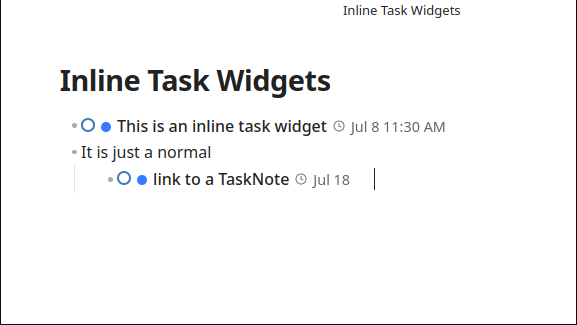
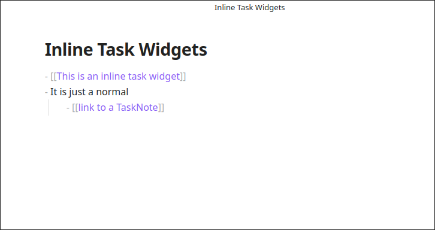
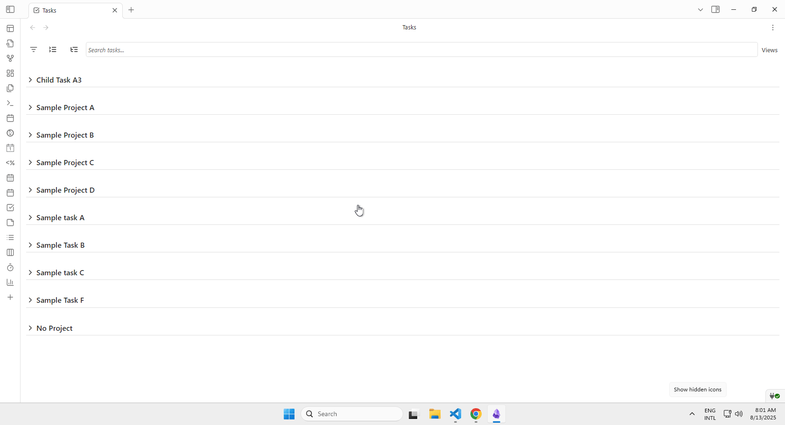

# Inline Task Integration

<!--
Recording Script
SETUP:
  cd .obsidian/plugins/tasknotes
  node scripts/generate-test-data.mjs --clean   # or: bun run generate-test-data:clean
  Reload plugin in Obsidian
  Open a note that contains task wikilinks (e.g., a document from Document Library)

Show hovering over a task wikilink → overlay widget with status dot, priority, action menu
Show clicking the convert button next to a checkbox → task file created, line replaced with wikilink

RELATIONSHIPS WIDGET section (open a task note that has subtasks/dependencies, e.g., "Launch Project Beta"):
  Show the Relationships Widget embedded in the note
  Show clicking through tabs: Subtasks (Kanban), Projects (List), Blocked By (List), Blocking (Kanban)
  Show collapsing/expanding the widget
  Show real-time update after adding a new subtask
  Show subtask chevron on a task card → expand/collapse child tasks inline
  Show both left and right chevron position options

CLEANUP (subtask creation / dependency changes modify files):
  cd .obsidian/plugins/tasknotes
  node scripts/generate-test-data.mjs --clean   # or: bun run generate-test-data:clean
-->

TaskNotes integrates with the Obsidian editor to allow task management directly within notes. This is achieved through interactive widgets, a conversion feature for checkboxes, and natural language processing.
Inline features support capture and task updates without leaving the current note.

## Task Link Overlays

<!-- GIF: Hovering over a task wikilink and seeing the overlay widget with status dot, priority, and action menu -->

When a wikilink to a task note is created, TaskNotes can replace it with an interactive **Task Link Overlay**. Enable or disable overlays from `Settings -> TaskNotes -> Features` (`Task link overlay`). The widget displays information about the task, such as status, priority, and due date, and allows actions like status/priority changes or opening the edit modal.

*Task link overlays in Live Preview mode show interactive widgets with status, dates, and quick actions*

*In Source mode, task links appear as standard wikilinks until rendered*

### Widget Features

<!-- GIF: Interacting with a task link overlay — clicking status dot, opening action menu, changing due date -->

Each overlay shows the task's **status dot** (click to cycle), **priority dot**, **title** (click to edit), **dates** (calendar/clock icons), and a **recurrence indicator** if applicable. An **action menu** (ellipsis, shown on hover) provides additional options. This lets you update status and metadata in-place without opening the task file.

### Mode-Specific Behavior

Task link overlays work in both Live Preview and Reading modes:

- **Live Preview Mode**: Widgets hide when the cursor is within the wikilink range, allowing for easy editing.
- **Reading Mode**: Widgets display with full functionality and integrate with the reading mode typography.

The overlays support drag-and-drop to calendar views and provide keyboard shortcuts for quick navigation (Ctrl/Cmd+Click to open the source file).

## Create Inline Task Command

The `Create inline task` command allows you to create a new task from the current line in the editor. This command is available in the command palette.

When you run the command, the current line is used as the title of the new task. The line is then replaced with a link to the new task file.

## Instant Task Conversion

<!-- GIF: Clicking the convert button next to a checkbox, seeing the task file created and the line replaced with a wikilink -->

The **Instant Task Conversion** feature transforms lines in your notes into TaskNotes files. This works with both checkbox tasks and regular lines of text. Turn the feature on or off from `Settings -> TaskNotes -> Features` (`Show convert button next to checkboxes`). When enabled, a "convert" button appears next to content in edit mode. Clicking this button creates a new task note using the line text as the title and replaces the original line with a link to the new task file.
This supports progressive conversion from draft notes to dedicated task files.

### Folder Configuration

By default, converted tasks are placed in the same folder as the current note (`{{currentNotePath}}`). You can change this behavior in `Settings -> TaskNotes -> General` (`Folder for converted tasks`):

- **Leave empty**: Uses your default tasks folder (configured in the same section)
- **`{{currentNotePath}}`**: Places tasks in the same folder as the note you're editing (default)
- **`{{currentNoteTitle}}`**: Creates a subfolder named after the current note
- **Custom path**: Specify any folder path (e.g., `TaskNotes/Converted`)

### Supported Line Types

The conversion feature works with:

- **Checkbox tasks**: `- [ ] Task description` becomes a TaskNote with task metadata
- **Bullet points**: `- Some task idea` becomes a TaskNote with the text as title
- **Numbered lists**: `1. Important item` becomes a TaskNote
- **Blockquoted content**: `> Task in callout` becomes a TaskNote (preserves blockquote formatting)
- **Plain text lines**: `Important thing to do` becomes a TaskNote
- **Mixed formats**: `> - [ ] Task in blockquote` handles both blockquote and checkbox formatting

### Content Processing

When converting lines:

- **Special characters** like `>`, `#`, `-` are automatically removed from the task title
- **Original formatting** is preserved in the note (e.g., `> [[Task Title]]` for blockquoted content)
- **Task metadata** is extracted from checkbox tasks (due dates, priorities, etc.)
- **Natural language processing** can extract dates and metadata from plain text (if enabled)
Conversion preserves surrounding formatting, including callouts, outlines, and nested lists.

The feature handles edge cases like nested blockquotes and maintains proper indentation in the final link replacement.

## Bulk Task Conversion

The **Bulk Task Conversion** command converts all checkbox tasks in the current note to TaskNotes in a single operation. This command is available in the command palette as "Convert all tasks in note to TaskNotes".

### Usage

<!-- GIF: Running "Convert all tasks in note to TaskNotes" from the command palette — checkboxes replaced with wikilinks -->

1. Open a note containing checkbox tasks
2. Open the command palette (`Ctrl+P` / `Cmd+P`)
3. Run **Convert all tasks in note to TaskNotes**

The command scans for all checkbox tasks (`- [ ]`, `* [ ]`, `1. [ ]`, etc.), including tasks inside blockquotes, creates individual task files, and replaces each checkbox with a wikilink. It displays progress and shows a summary when complete (for example, "Successfully converted 5 tasks to TaskNotes.").

> [!info]- How it works under the hood
> The command:
>
> 1. Scans the entire note for checkbox tasks
> 2. Includes tasks inside blockquotes (e.g., `> - [ ] task in callout`)
> 3. Applies the same conversion logic as instant task conversion
> 4. Creates individual TaskNote files for each task
> 5. Replaces the original checkboxes with links to the new task files
> 6. Preserves original indentation and formatting (including blockquote markers)

> [!warning] Important considerations
> **This command modifies note content permanently.** Before using:
>
> - **Create a backup** of your note if it contains important data
> - **Review the tasks** to ensure they should become individual TaskNotes
> - **Expect processing time** — notes with many tasks may take several seconds
> - **Avoid interruption** — do not edit the note while conversion is running

> [!note]- Performance
> Processing time depends on the number of tasks:
>
> - Small notes (1–10 tasks): Near-instant
> - Medium notes (10–50 tasks): 2–5 seconds
> - Large notes (50+ tasks): 10+ seconds
>
> The operation creates multiple files and updates note content, which requires disk I/O and editor updates.

### Error Handling

If some tasks fail to convert, the command will:

- Complete successfully converted tasks
- Display a summary showing both successes and failures
- Log detailed error information to the console for troubleshooting

Failed conversions typically occur due to:

- Tasks with titles containing invalid filename characters
- Insufficient disk permissions
- Very long task titles (over 200 characters)
For large notes, converting a small section first helps validate folder and filename settings.

## Relationships Widget

**New in v4**: The Relationships Widget consolidates what were previously three separate widgets (project subtasks, task dependencies, and blocking tasks) into a single dynamic interface.

<!-- SCREENSHOT: Relationships Widget embedded in a task note showing the Subtasks tab with Kanban cards -->

The widget appears in task notes and automatically displays up to four tabs based on available relationship data:

- **Subtasks Tab (Kanban)**: Shows tasks that reference the current note as a project. Uses Kanban layout for visual task management.
- **Projects Tab (List)**: Shows projects that the current task belongs to. Uses list layout.
- **Blocked By Tab (List)**: Shows tasks that are blocking the current task. Uses list layout.
- **Blocking Tab (Kanban)**: Shows tasks that the current task is blocking. Uses Kanban layout.

<!-- GIF: Clicking through the four Relationships Widget tabs -- Subtasks (Kanban), Projects (List), Blocked By (List), Blocking (Kanban) -->

### Automatic Tab Management

<!-- GIF: Opening two different task notes — one with all four tabs, one with only Subtasks — to show automatic tab visibility -->

The widget only shows tabs that have data. For example, a task with subtasks but no dependencies displays just the **Subtasks** tab. A task that is blocked by another and also blocks a third shows **Blocked By** and **Blocking** tabs alongside any others. If you add a dependency to a task, the relevant tab appears immediately without reloading the note.

### Features

The widget embeds the `TaskNotes/Views/relationships.base` view directly in the editor. Every filter, grouping rule, or property shown in that `.base` file is exactly what appears inside the widget, so you can customize the experience by editing the file just like any other Bases view.

Additional behavior:

- **Collapsible Interface**: Click the widget title to expand or collapse. The state is remembered between sessions.
- **Persistent Grouping**: Any grouping defined in the `.base` file is honoured, and collapsed groups retain their state per note.
- **Task Details**: Each task shows its status, priority, due date, and other configured properties.
- **Real-time Updates**: The widget updates automatically when tasks are added, modified, or deleted via Bases views.

<!-- GIF: Collapsing and expanding the Relationships Widget, then showing it update in real-time after adding a new subtask -->

### Configuration

Enable or disable the widget in `Settings -> TaskNotes -> Appearance` (`Show relationships widget`).

Position the widget at the top (after frontmatter) or bottom of the note using the **Relationships Position** setting.

### Expandable Subtasks Chevron

<!-- GIF: Clicking the subtask chevron on a task card to expand/collapse child tasks inline, showing both left and right chevron positions -->

Tasks with subtasks can display an expand/collapse chevron that toggles subtask visibility.

- The chevron can be positioned on the Right (default, hover to show) or on the Left (always visible, matches group chevrons).
- Configure this in `Settings -> TaskNotes -> Appearance` (`Subtask chevron position`).

### Migration from v3

> See the full [Migration Guide (v3 → v4)](../migration-v3-to-v4.md) for all breaking changes.

In v3, TaskNotes provided three separate widgets controlled by individual settings:

- `showProjectSubtasks` and `projectSubtasksPosition`
- `showTaskDependencies` and `taskDependenciesPosition`
- `showBlockingTasks` and `blockingTasksPosition`

These settings are replaced in v4 by:

- `showRelationships` and `relationshipsPosition`

If you had project subtasks enabled in v3, the relationships widget is enabled automatically after upgrading to v4. The underlying Bases file changed from `TaskNotes/Views/project-subtasks.base` to `TaskNotes/Views/relationships.base`. Run the **Create default files** action in `Settings -> TaskNotes -> Integrations` if `relationships.base` is missing.

## Natural Language Processing

TaskNotes includes a natural language parser that extracts dates, priority, status, tags, contexts, projects, time estimates, recurrence, and custom property values from task descriptions. The same engine powers the [task creation modal](task-management.md), [inline conversion](#instant-task-conversion), and [bulk operations](bulk-tasking.md).

See **[Natural Language Input](natural-language.md)** for the full syntax reference, trigger configuration, auto-suggestion behavior, and language support.
