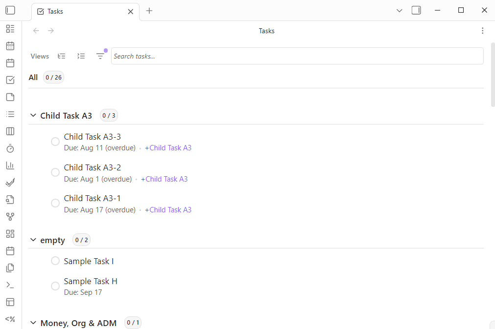
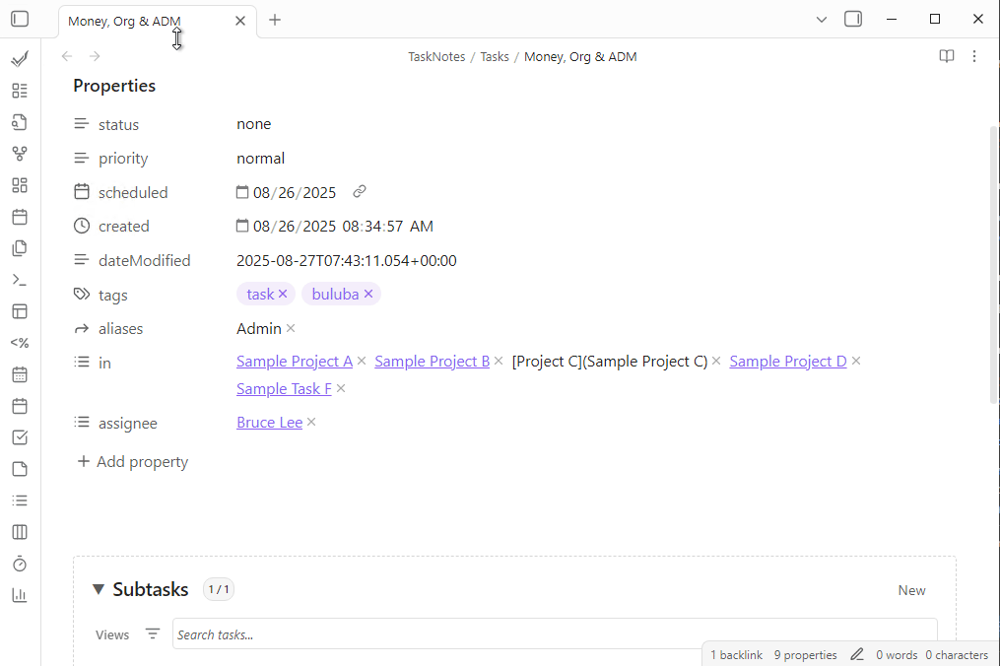
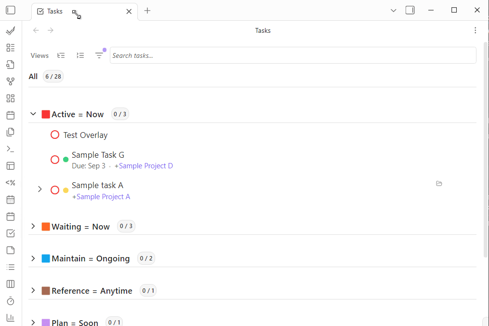

# Natural Language Input

[← Back to Features](../features.md)

<!--
Recording Script
SETUP:
  cd .obsidian/plugins/tasknotes
  node scripts/generate-test-data.mjs --clean   # or: bun run generate-test-data:clean
  Reload plugin in Obsidian

Show typing a natural language task description in the creation modal → fields auto-populate
Show trigger characters activating auto-suggestions (@, #, +, *)
Show project auto-suggester with multi-row cards
Show status auto-suggester
-->

TaskNotes includes a natural language processor that parses task descriptions to extract structured data. The same engine powers the [task creation modal](task-management.md), [inline task conversion](inline-tasks.md#instant-task-conversion), and [bulk operations](bulk-tasking.md). Typing "Prepare quarterly report due Friday #work high priority" automatically sets the due date, tag, and priority.

<!-- GIF: Typing a natural language task description and seeing fields auto-populate -->

## What Gets Extracted

The NLP engine recognizes:

| Pattern | Example | What it sets |
|---------|---------|-------------|
| **Dates and times** | "tomorrow", "next Friday", "January 15th at 3pm" | Due date, scheduled date |
| **Priority** | "high priority", "urgent", or trigger `!high` | Priority level |
| **Status** | "open", "in-progress", "done", or trigger `*in-progress` | Status |
| **Tags** | `#work`, `#urgent` | Tags list |
| **Contexts** | `@home`, `@office` | Contexts list |
| **Projects** | `+project` or `+[[Project Name]]` (for names with spaces) | Projects list |
| **Time estimates** | "2h", "30min", "1h30m" | Time estimate |
| **Recurrence** | "daily", "weekly", "every Monday" | Recurrence pattern |
| **Custom properties** | `effort: high` or `effort: "very high"` (quoted for multi-word) | Custom field values |

NLP parses common patterns during capture; fields can be refined in the modal afterward.

## Trigger Characters

Each extractable field has a trigger character that activates parsing and auto-suggestions:

| Field                                          | Default trigger           | Example              |
| ---------------------------------------------- | ------------------------- | -------------------- |
| Tags                                           | `#`                       | `#work`              |
| Contexts                                       | `@`                       | `@home`              |
| Projects                                       | `+`                       | `+[[Project Alpha]]` |
| Status                                         | `*`                       | `*in-progress`       |
| Priority{>>Link to relevant pages?<<}          | `!` (disabled by default) | `!high`              |
| {>>Link to relevant pages?<<}Custom properties | `fieldname:`              | `effort: high`       |

Triggers are configurable in **Settings > Features > NLP Triggers**. Each trigger supports up to 10 characters and can include trailing spaces (e.g., `"def: "` for a custom field). When the tag trigger is set to `#`, Obsidian's native tag suggester is used.

## Auto-Suggestions

When you type a trigger character in the NLP input field, an autocomplete menu appears with available values. Navigate with arrow keys and select with `Enter` or `Tab`.
{>>Should we show a gif here?<<}
### Project Suggestions

When typing `+`, you see up to 20 suggestions from your vault's markdown files. Suggestions display additional information to help identify files:

```
project-alpha [title: Alpha Project Development | aliases: alpha, proj-alpha]
meeting-notes [title: Weekly Team Meeting Notes]
simple-project
work-file [aliases: work, office-tasks]
```

Project suggestions search across:
- File names (basename without extension)
- Frontmatter titles (using your configured field mapping)
- Frontmatter aliases
- Optional filtering by required tags, folders, and a specific frontmatter property/value defined in Settings > Appearance & UI > Project Autosuggest

Selecting a project suggestion inserts it as `+[[filename]]`, creating a wikilink to the file while maintaining the `+` project marker that the parser recognizes.

### Enhanced Project Auto-suggester

Project suggestions can display configurable multi-row cards and support smarter search. Configure up to 3 rows using a simple token syntax in **Settings > Appearance & UI > Project Autosuggest**.

**Properties:** `file.basename`, `file.name`, `file.path`, `file.parent`, `title`, `aliases`, and any frontmatter key.

**Flags:**

- `n` or `n(Label)` — show the field name/label before the value
- `s` — include this field in `+` search (in addition to defaults)

**Literals:** you can mix in fixed text or emojis between tokens.

**Examples:**

- `{title|n(Title)}` → Title: Alpha Project
- `🔖 {aliases|n(Aliases)}` → 🔖 Aliases: alpha, proj-alpha
- `{file.path|n(Path)|s}` → include path in `+` search as well as display it

**Search behavior:**

- **Defaults:** `+` search always includes file basename, title (via your field mapping), and aliases
- **`|s` flag:** add more searchable fields on top of the defaults (e.g., `file.path` or a custom frontmatter key like `customer`)
- **Fuzzy:** optional fuzzy matching can be enabled in settings for broader, multi-word matches

**Performance tips:**

- Keep rows to three or fewer for clarity and performance (the UI supports up to 3)
- Prefer specific searchable fields with `|s` on large vaults
{>>The below images seem pretty random where they are.  They're showing project-related functionality with the NLP while typing - not sure that's necessarily best - especially not in this random spot in the doc<<}




### Status Suggestions

When typing the status trigger character (default `*`), you see suggestions for all configured status options. For example, typing `*in` shows "In Progress" if that is one of your configured statuses.



## Rich Markdown Editor

The task creation modal uses a rich CodeMirror markdown editor instead of a plain textarea.

- **Live Preview**: Rendered markdown preview as you type
- **Syntax Highlighting**: Code blocks, links, and formatting are highlighted
- **Wikilink Support**: Create links to other notes using `[[Note Name]]` syntax
- **Keyboard Shortcuts**: `Ctrl/Cmd+Enter` saves the task; `Esc` or `Tab` to navigate out
- **Placeholder Text**: Shows an example task (e.g., "Buy groceries tomorrow at 3pm @home #errands") when the editor is empty

## Language Support

The NLP engine supports multiple languages: English, Spanish, French, German, Italian, Japanese, Dutch, Portuguese, Russian, Swedish, Chinese, and Ukrainian.

Parser language is configured in TaskNotes settings (`nlpLanguage`). Per-request locale is not currently supported.

## Configuration

| Setting | Location | What it controls |
|---------|----------|-----------------|
| NLP Triggers | Settings > Features | Trigger characters for each field type |
| Project Autosuggest | Settings > Appearance & UI | Project card rows, search fields, fuzzy matching, filters |
| NLP Language | Settings > General | Parser language |

## API Access

For programmatic access to the NLP parser, see the [NLP API](../nlp-api.md) — HTTP endpoints for parsing text and creating tasks from natural language descriptions.

## Related

- [Task Management](task-management.md) — Task creation modal, projects, dependencies
- [Inline Task Integration](inline-tasks.md) — Editor widgets, instant conversion
- [Bulk Tasking](bulk-tasking.md) — Batch operations that use the NLP engine
- [Custom Properties](custom-properties.md) — Register custom fields that NLP can extract
