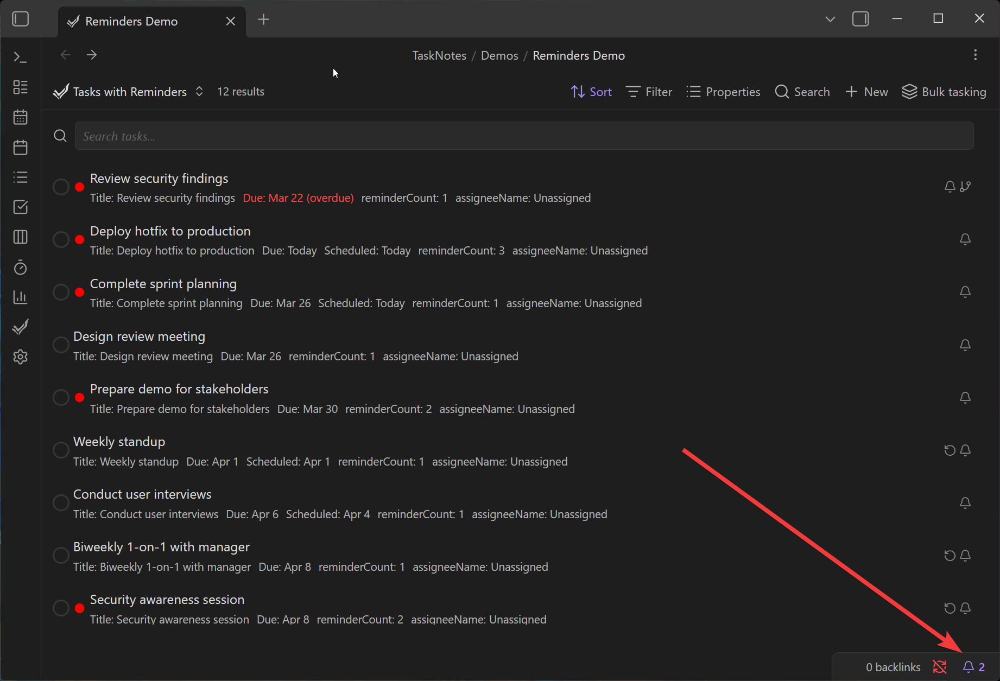

# Notification Delivery

[← Back to Features](../features.md)

<!--
Recording Script
SETUP:
  cd .obsidian/plugins/tasknotes
  node scripts/generate-test-data.mjs --clean
  Reload plugin in Obsidian
  Disable Hider plugin if active (need to see status bar bell icon)

TRIGGERING NOTIFICATIONS:
  Option 1: Use "Send test" button in Settings → Features → Notifications
  Option 2: Run "TaskNotes: Check reminders now" from command palette (clears all state, force-fires)
  Option 3: Set absolute reminder 2-3 min ahead, wait for check cycle

CLEANUP: Reload plugin to reset seen/snoozed state
-->

TaskNotes has a unified notification delivery system that aggregates items from multiple sources and presents them through a consistent toast + bell interface. This page covers the **delivery pipeline** — how notifications appear, how you control them, and how they're tracked.

> [!abstract] Three notification sources, one delivery system
> Multiple parts of TaskNotes generate notification items. They all converge into the same delivery pipeline:
>
> 1. **[Task Reminders](reminders.md)** — per-task, default, and global reminders based on due/scheduled dates
> 2. **[Base View Notifications](bases-notifications.md)** — query-based alerts from views with `notify: true`
> 3. **View-Entry Tracking** *(future)* — alerts when items first appear in a view
>
> Regardless of source, every notification item flows through the same toast, bell icon, and Upcoming View integration described below.

## Toast Notification

<!-- SCREENSHOT: Toast notification in bottom-right corner showing item count, action button, snooze dropdown, and dismiss -->

When notification items need attention, a toast appears in the bottom-right corner of the Obsidian window. It shows:

- **Item count** with breakdown by time category (e.g., "3 overdue, 2 due today")
- **View button** — opens the Upcoming View to see all items
- **Snooze dropdown** — preset durations to temporarily hide the toast
- **"Got it" button** — dismisses individual items (marks as seen)

The toast persists until you act on it. It does not auto-dismiss, following [WCAG 2.2.4](https://www.w3.org/WAI/WCAG21/Understanding/no-timing.html) accessibility guidelines for timed content.

> [!tip] Expanding the toast
> Click the item count area to expand the toast and see a breakdown of individual items. Each item shows its title, time context, and source.

## Bell Icon (Status Bar)

<!-- SCREENSHOT: Status bar showing bell icon with count badge -->

A bell icon appears in the Obsidian status bar when there are active notification items. The badge shows the count of **unseen** items that have "Show in bell count" enabled for their category.

Click the bell to open the Upcoming View, where you can see all items organized by time category and take action.

## Per-Category Behavior

The most powerful part of the notification system is **per-category control**. Each time category has independent settings for how items are handled after you dismiss them:

<!-- SCREENSHOT: Reminder behavior by category (advanced) panel in Features settings -->

### Categories

| Category | What it includes | Default behavior |
|----------|-----------------|------------------|
| **Overdue** | Items past their due date | Snooze 4 hours, then return |
| **Due today** | Items due today | Dismiss until restart |
| **Due tomorrow** | Items due tomorrow | Dismiss until restart |
| **This week** | Items due this week | Dismiss until restart |
| **Scheduled/start date** | Items with scheduled dates | Dismiss until next reminder |

### Per-Category Controls

Each category has three settings:

**After "Got it"** — What happens when you dismiss an item in this category:

| Option | Behavior |
|--------|----------|
| Snooze N hours | Returns to bell/toast after the snooze period |
| Until restart | Stays dismissed until Obsidian restarts |
| Until next reminder | Stays dismissed until the next scheduled reminder fires |

**Show in bell count** — Whether items in this category contribute to the bell badge number. Useful for suppressing "noise" categories (e.g., you may not want "this week" items counting in the badge).

**Show popup** — Whether items in this category trigger the toast popup. Even when disabled, items still appear in the bell count (if enabled) and in the Upcoming View.

> [!example] Example configuration
> - **Overdue**: Snooze 4 hours + show popup + show in bell → persistent, can't ignore
> - **Due today**: Until restart + show popup + show in bell → see once per session
> - **Due tomorrow**: Until restart + bell only (no popup) → awareness without interruption
> - **This week**: Until restart + bell only → planning horizon, no toast

Configure these in **Settings → Features → Notifications → Reminder behavior by category**.

## Seen Tracking

The notification system tracks which items you've seen to avoid re-notifying you:

- Clicking "Got it" on an item marks it as **seen** for the configured duration
- The seen state is stored in localStorage (per-device, not synced)
- **"Check reminders now" command** clears all seen state for testing/demos

## Snooze

Two levels of snooze exist:

1. **Toast-level snooze** — The snooze dropdown on the toast itself. Hides the entire toast for the selected duration. All categories are suppressed.
2. **Per-item "Got it"** — Dismisses a single item according to its category's "After Got it" setting. Other items remain visible.

## Testing and Debugging

### Send Test Button

In **Settings → Features → Notifications**, the **"Send test"** button fires a test notification using your configured delivery type (in-app or system). Useful for verifying that the toast renders correctly.

### Check Reminders Now Command

The command palette includes **"TaskNotes: Check reminders now"**. This:

1. Clears all seen/snoozed/processed state
2. Forces an immediate full scan of all tasks
3. Includes a 2-minute grace period for recently-past reminders
4. Triggers the toast immediately

This is the fastest way to verify notifications are working, especially for demos and GIF captures.

## Notification Type

In **Settings → Features → Notifications**, choose how notifications are delivered:

| Type | Behavior |
|------|----------|
| **In-app** | Toast + bell icon inside Obsidian |
| **System** | Desktop OS notifications (requires permission) |
| **Both** | Both in-app and system notifications |

## Related

- [Task Reminders](reminders.md) — what generates reminder notifications (per-task, default, global)
- [View Notifications](bases-notifications.md) — query-based notifications from Bases views
- [Shared Vault](shared-vault.md) — per-person notification filtering and availability windows
- [Settings → Features](../settings/features.md) — enable/disable and configure notification behavior
