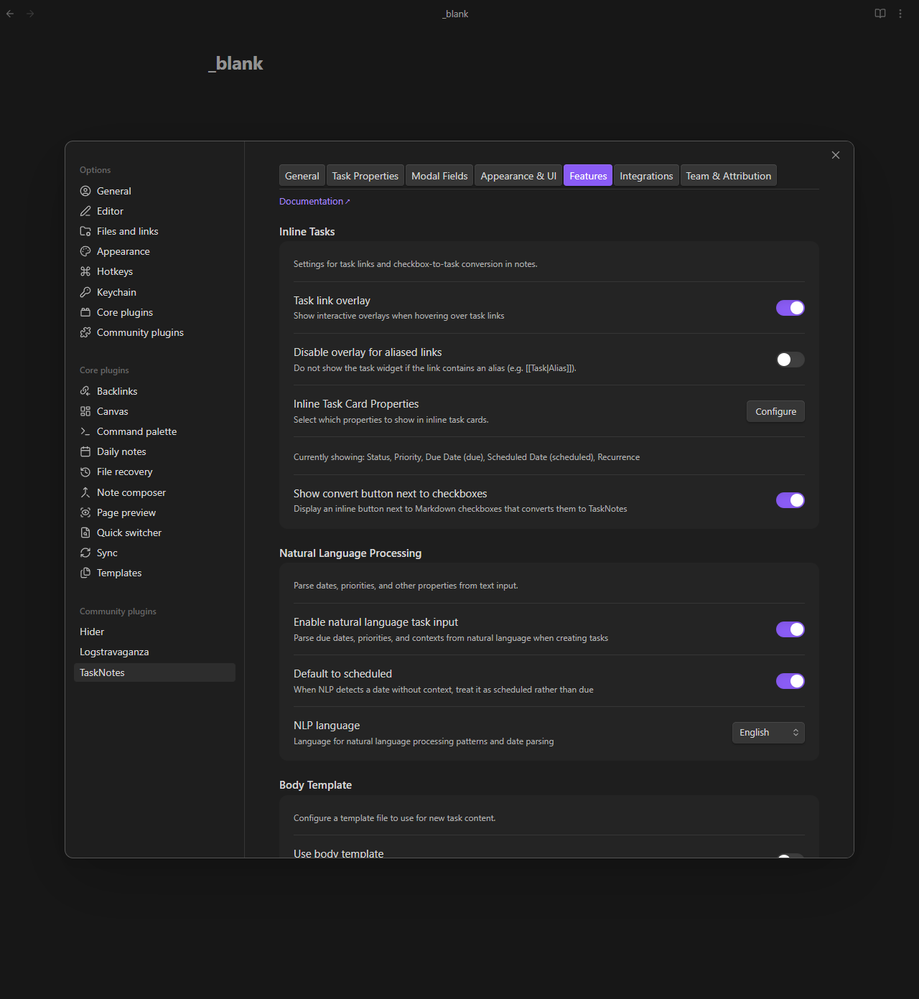
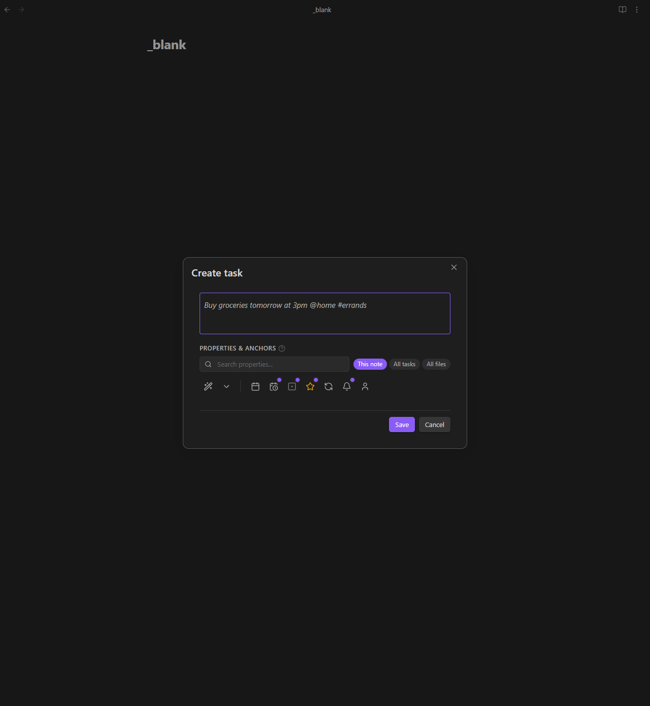

# Per-View Property Mapping

[← Back to Features](../features.md)

<!--
Recording Script
SETUP:
  cd .obsidian/plugins/tasknotes
  node scripts/generate-test-data.mjs --clean   # or: bun run generate-test-data:clean
  Reload plugin in Obsidian

Use: TaskNotes/Demos/Per-View Mapping Demo.base
Show Configure panel with field mapping settings
Show creating a task from a mapped view → PropertyPicker shows pre-populated mapped fields
Show opening the Configure panel from a Bases toolbar and setting up field mappings
-->

Different views can use different property names for the same concept. One view might use `deadline` while another uses `due`. Per-view property mapping lets each view define its own field names, so tasks created from that view automatically use the right properties without manual adjustment.

<!-- SCREENSHOT: Configure panel showing field mapping for a view -->



This builds on the [custom properties](custom-properties.md) system. Where custom properties let individual tasks override field names, per-view mapping sets the default for every task created from a specific view.

## How It Works

TaskNotes uses a three-layer resolution stack to determine which frontmatter property name to use for a given field:

1. **Per-view mapping** -- configured in the `.base` file's YAML. Applied when creating or editing tasks from that view.
2. **Per-task override** -- stored as tracking properties in the task's frontmatter (e.g., `tnDueDateProp: deadline`). Makes the task self-describing so it works correctly regardless of which view you open it from.
3. **Global mapping** -- the default from Settings > Task Properties. Used when no per-task override exists.

When you create a task from a view that has a mapping, TaskNotes writes both the mapped property name and the tracking property. For example, a view that maps `due` to `deadline` produces:

```yaml
title: Ship v2.0
deadline: 2026-04-01
tnDueDateProp: deadline
```

The tracking property (`tnDueDateProp`) tells TaskNotes to read the due date from `deadline` on this specific task. The notification system, overdue calculations, sorting, and all views respect this -- no matter which view displays the task later.

<!-- GIF: Creating a task from a mapped view -- the PropertyPicker shows pre-populated mapped fields -->



## Which Fields Can Be Mapped

Five core fields support per-view mapping:

| Internal field | Default property | What it controls |
|---------------|-----------------|-----------------|
| `due` | `due` | Due date |
| `scheduled` | `scheduled` | Scheduled date |
| `completedDate` | `completedDate` | Completion date |
| `dateCreated` | `dateCreated` | Creation date |
| `assignee` | `assignee` | Task assignee |

Other built-in fields like `status`, `priority`, and `title` are not mappable through this system. They use the global field mapping in settings.

## The Configure Panel

Open the Configure panel from any Bases view toolbar by clicking the gear icon (or the TaskNotes section in the native Bases configure panel). The TaskNotes section includes:

- **Show toolbar buttons** -- toggle TaskNotes buttons on this view
- **Notify on matches** -- enable [view notifications](bases-notifications.md) for this view
- **Properties & mapping** -- link to the bulk tasking modal's View Settings tab, where you configure mappings and defaults

<!-- GIF: Opening the Configure panel from a Bases toolbar and setting up field mappings -->


In the View Settings tab of the bulk tasking modal, the PropertyPicker appears with **Use as** options for all five mappable fields. Select a property and choose which core field it should replace for this view. The mapping is saved to the `.base` file immediately.

## View Defaults

Beyond field mapping, each view can define default values that pre-populate new tasks. These are stored as `tnDefaults` in the view's YAML:

```yaml
views:
  - type: tasknotesTaskList
    name: Sprint Board
    tnDefaults:
      status: in-progress
      priority: high
      tags:
        - sprint-12
```

When you create a task from this view, the status starts as "in-progress", priority as "high", and the tag "sprint-12" is pre-applied. You can override any default in the task creation modal before saving.

Defaults use the property names as they appear in frontmatter (after any mapping). If your view maps `due` to `deadline`, set the default on `deadline`, not `due`.

The View Settings tab of the bulk tasking modal lets you add and edit defaults interactively using the same PropertyPicker used for custom properties.

## Field Mapping in YAML

Per-view mapping is stored inside the `.base` file as `tnFieldMapping` on each view object. IDs are generated lazily -- they only appear once you configure a mapping or default:

```yaml
tnBaseId: "a1b2c3d4-e5f6-7890-abcd-ef1234567890"

views:
  - type: tasknotesTaskList
    name: Project Tracker
    tnViewId: "f1e2d3c4-b5a6-7890-1234-567890abcdef"
    tnFieldMapping:
      due: deadline
      assignee: owner
    tnDefaults:
      status: todo
      priority: medium
```

Only the fields you want to remap need entries in `tnFieldMapping`. Fields not listed use the global mapping from settings.

The `tnBaseId` and `tnViewId` are UUIDs that give each `.base` file and view a stable identity. They are generated automatically the first time you configure any mapping or default -- you do not need to create them manually. Plain `.base` files without any TaskNotes configuration stay clean.

## Creating Tasks from Mapped Views

When you create a task from a view with custom mappings (via the "New task" button or bulk tasking):

1. The task creation modal pre-populates the Additional Properties section with the mapped fields and their "Use as" roles already assigned
2. You fill in values using the rich editors (date picker for dates, person/group picker for assignees)
3. On save, TaskNotes writes the custom property name and the tracking property to the task's frontmatter
4. The task is self-describing -- it works correctly in any view, not just the one it was created from

**Provenance tracking** (optional): TaskNotes can record which `.base` file and view created each task, using `tnSourceBaseId` and `tnSourceViewId` properties in the task's frontmatter. This is off by default to avoid frontmatter clutter.

For bulk operations, the same mapping applies. Bulk Generate passes the view's mapping to the task creation engine. Bulk Convert applies the mapping after assembling the frontmatter. Bulk Edit respects existing per-task overrides.

## Settings

| Setting | Default | Description |
|---------|---------|-------------|
| Track source view | Off | Write `tnSourceBaseId` and `tnSourceViewId` to tasks created from views |

Per-view settings (`tnFieldMapping`, `tnDefaults`) are configured through the View Settings tab in the bulk tasking modal or by editing the `.base` file YAML directly.

## Related

- [Custom Properties](custom-properties.md) for per-task field overrides
- [Bulk Tasking](bulk-tasking.md) for bulk operations that respect view mappings
- [Views](../views.md) for the Bases views that carry mappings
