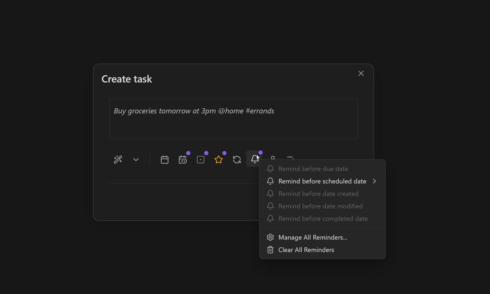
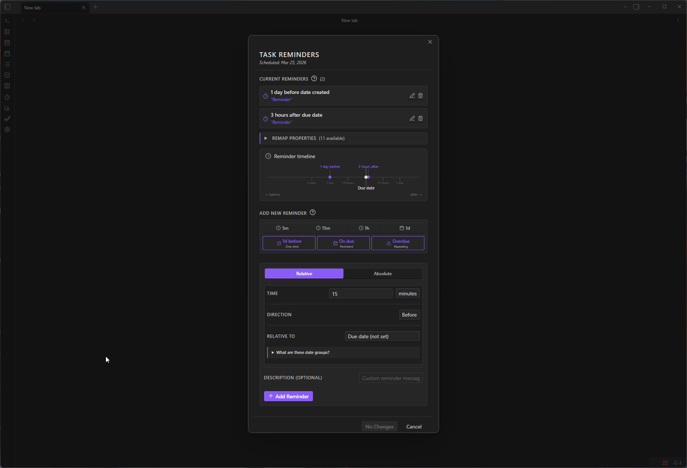
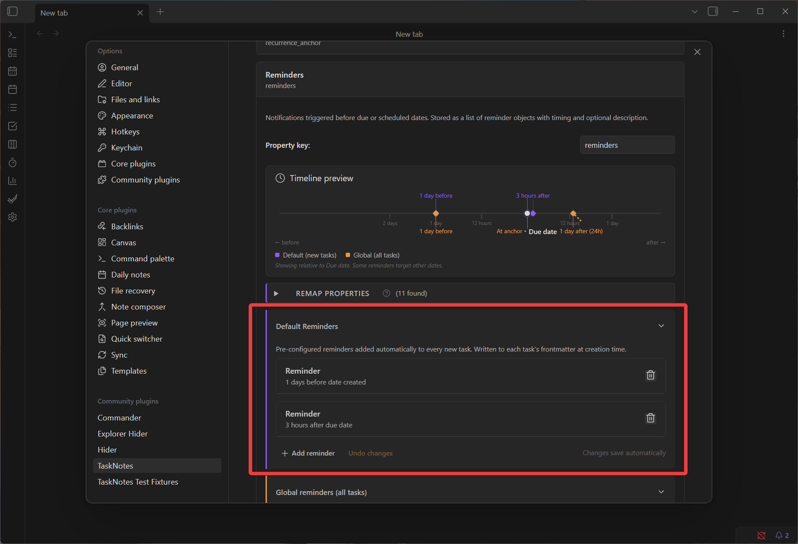
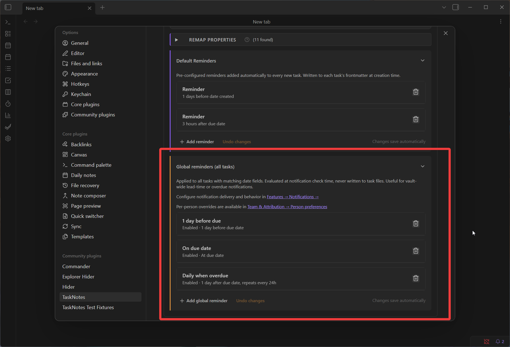
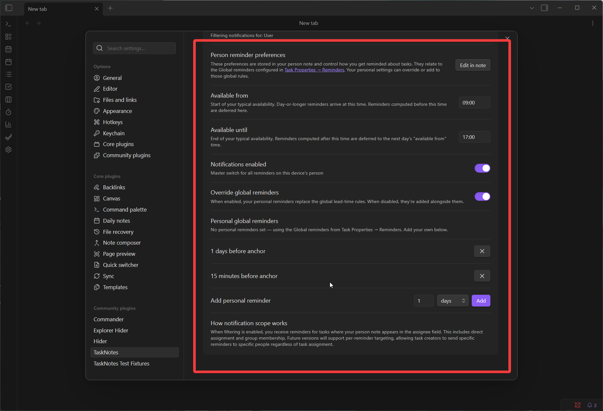
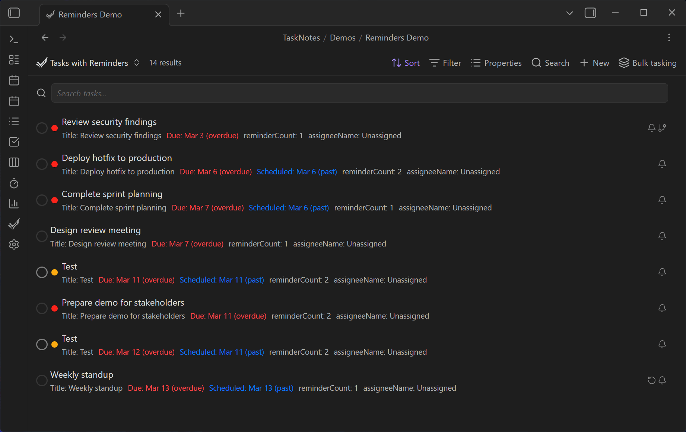
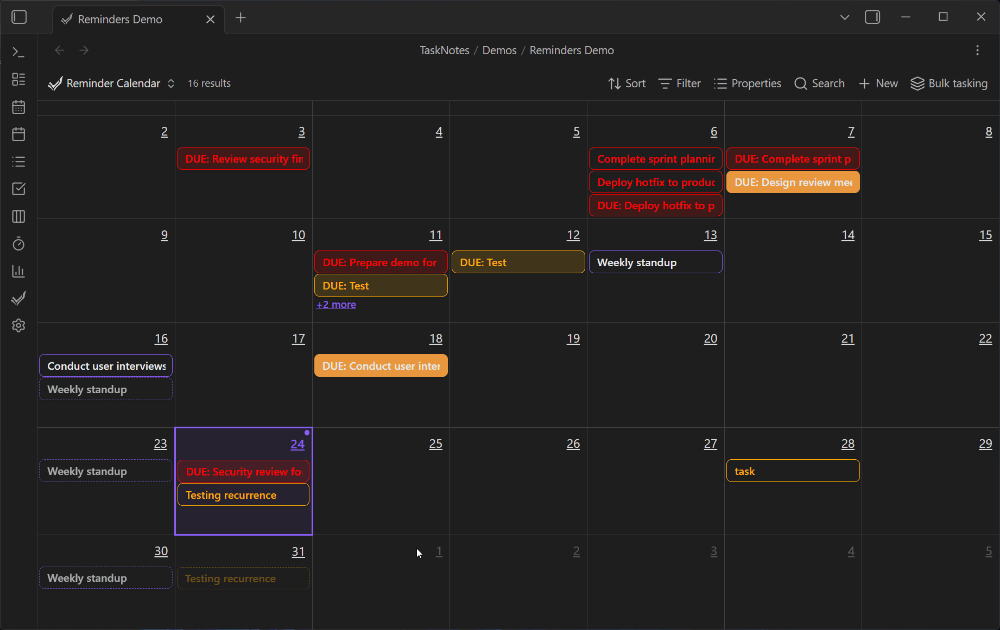
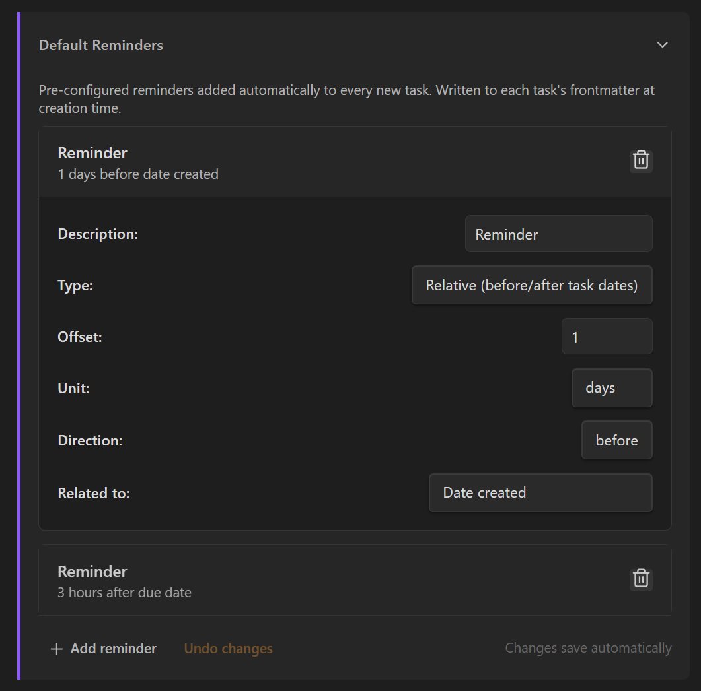
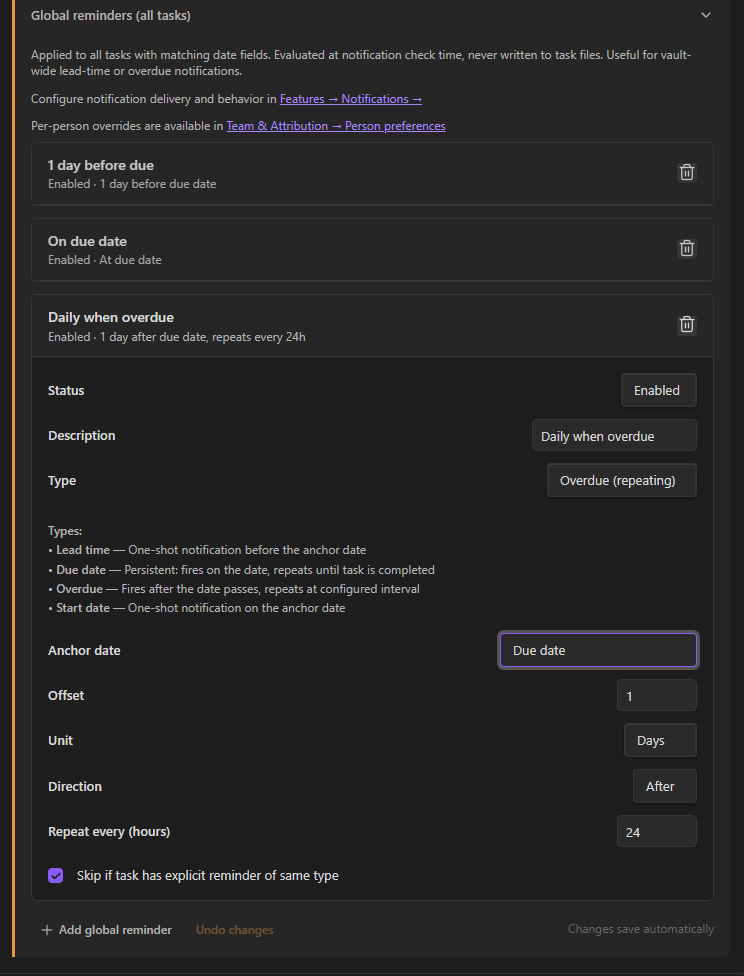

# Task Reminders

<!--
Recording Script
SETUP (need tasks with reminders):
  cd .obsidian/plugins/tasknotes
  node scripts/generate-test-data.mjs --clean   # or: bun run generate-test-data:clean
  Reload plugin in Obsidian
  Disable Hider plugin (or untoggle hideStatusBar) so bell icon is visible

Use: TaskNotes/Demos/Reminders Demo.base
Show clicking the bell icon on a task card → "15 minutes before due" → reminder indicator appears
Show a reminder notification firing → toast notification with task name and action buttons

TRIGGERING A REMINDER TOAST FOR CAPTURE:
  The notification check runs every 30 seconds. Reminders must be in the FUTURE to fire.
  - Set an ABSOLUTE reminder 2-3 minutes from now on any task in the demo base
  - Wait ~30s for the check cycle to queue it, then wait for the time to arrive
  - The toast appears in the bottom-right (same UI as Bases query notifications)
  - Toast assets are shared — save to docs/assets/notifications/ for use in both reminders and bases-notifications docs

CLEANUP (dismissing reminders modifies task files):
  node scripts/generate-test-data.mjs --clean   # or: bun run generate-test-data:clean
-->

TaskNotes reminders use iCalendar `VALARM` semantics and support both relative and absolute reminder types.

The reminders system is designed to support both habit-like workflows ("always remind me 15 minutes before") and one-off commitments ("alert me exactly at this date and time"). Most users mix both styles depending on the task.

## How Reminders Work (3 Tiers)

TaskNotes has three distinct reminder tiers. Understanding the difference helps you configure reminders that match your workflow.

> [!abstract] TL;DR
> **Per-task** = one reminder on one task (frontmatter). **Default** = auto-added to every new task at creation. **Global** = runs in the background for all tasks, never touches files.

---

### Per-Task Reminders (frontmatter)

> [!info] Stored in each task's YAML frontmatter
> Per-task reminders are the most hands-on type. You add them to individual tasks and they persist with the file.

- Added via: task creation modal, edit modal, bell icon on cards, or context menu
- Portable and scriptable — any tool that reads Markdown + YAML can inspect them
- Survive rescheduling (relative reminders adjust with the anchor date)

When you click the bell icon on a task card and pick "15 minutes before due", that's a per-task reminder.

<!-- SCREENSHOT: Reminder modal showing per-task reminders on an individual task -->





---

### Default Reminders (creation-time)

> [!tip] Configured in Settings — written to every new task automatically
> Default reminders act as a template. They're injected into a task's frontmatter at creation time, then behave identically to per-task reminders.

- Configured in: **Settings → Task Properties → Reminders → Default reminders**
- Applied to: manual task creation, instant conversion, and natural language task creation
- Written to frontmatter at creation — then editable per-task like any other reminder

Use default reminders for recurring habits like "always remind me 1 day before due" or "3 hours after scheduled date". You can still edit or remove them on individual tasks after creation.

<!-- SCREENSHOT: Settings → Task Properties → Reminders → Default reminders section -->



---

### Global Reminders (runtime)

> [!warning] Never written to task files — evaluated in the background
> Global reminders generate notifications dynamically at check time. They apply vault-wide without modifying any task files.

- Configured in: **Settings → Task Properties → Reminders → Global reminders**
- Applied to: all tasks with matching date fields, regardless of when they were created
- Three built-in rules (disabled by default): 1 day before due, on due date, daily when overdue
- Per-person overrides available in **Team & Attribution → Person preferences**

Global reminders are useful for vault-wide policies ("notify me on every due date") without modifying individual task files. They complement per-task reminders — if a task already has an explicit reminder with the same semantic type, the global rule can optionally skip it.

<!-- SCREENSHOT: Settings → Task Properties → Reminders → Global reminders section -->


---

### Personal Global Overrides (per-person)

> [!example] Stored in person note frontmatter — overrides or extends global rules
> In shared vaults, each person can customize how global reminders apply to them. Personal overrides can either **replace** or **add to** the global rules.

- Configured in: **Settings → Team & Attribution → Person preferences**
- **Override mode**: your personal reminders replace global rules entirely
- **Additive mode**: your personal reminders run alongside global rules (duplicates deduplicated)
- Availability window defers reminders outside your hours to your next available time

<!-- SCREENSHOT: Team & Attribution → Person preferences → Personal global reminders -->


---

### Comparison Table

| | Per-Task | Default | Global | Personal Global |
|---|---|---|---|---|
| **Stored in** | Task frontmatter | Plugin settings | Plugin settings | Person note frontmatter |
| **Written to task** | Yes | Yes (at creation) | Never | Never |
| **When evaluated** | Notification check | Task creation | Notification check | Notification check |
| **Scope** | Single task | All new tasks | All tasks with dates | Tasks assigned to person |
| **Editable per-task** | Yes | After creation | No | No |
| **Override per-person** | N/A | Not yet | Yes (add to / replace) | N/A (IS the override) |

## Reminder Types

### Relative Reminders

Relative reminders trigger based on a date anchor (`due` or `scheduled` dates, or any custom date property).

Use relative reminders when you want reminder behavior to stay consistent even when task dates change.

Examples:

- 15 minutes before due date
- 1 hour before scheduled date
- 2 days before due date
- 30 minutes after scheduled date

### Absolute Reminders

Absolute reminders trigger at a fixed date/time.

Use absolute reminders when the reminder itself is tied to a specific moment, independent of task rescheduling.

Examples:

- October 26, 2025 at 9:00 AM
- Tomorrow at 2:30 PM
- Next Monday at 10:00 AM

## Adding Reminders

<!-- GIF: Clicking the bell icon on a task card, selecting "15 minutes before due", and seeing the reminder indicator appear -->


You can add reminders from:

1. **Task Creation Modal**
2. **Task Edit Modal**
3. **Task Cards** (bell icon)
4. **Reminder field context menu**

From a workflow perspective, task cards and context menus are fastest for quick reminders, while task modals are better for reviewing multiple reminders on the same task.

### Quick Reminder Options

Common shortcuts are available for both due and scheduled anchors, such as:

- 5 minutes before
- 15 minutes before
- 1 hour before
- 1 day before

Quick options appear only when the anchor date exists. This prevents invalid reminder states and keeps the quick menu focused on options that can be applied immediately.



> [!tip] Configuring defaults
> To change which reminders are automatically added to new tasks, go to **Settings → Task Properties → Reminders → Default reminders**. To set vault-wide background reminders, use the **Global reminders** section on the same page.

## Reminder Data Format

Reminders are stored in YAML frontmatter arrays.

Because reminders are stored in frontmatter, they remain portable and scriptable. You can inspect or transform reminder data with any tooling that reads Markdown + YAML.

### Relative Structure

```yaml
reminders:
  - id: "rem_1678886400000_abc123xyz"
    type: "relative"
    relatedTo: "due"
    offset: "-PT15M"
    description: "Review task details"
```

### Absolute Structure

```yaml
reminders:
  - id: "rem_1678886400001_def456uvw"
    type: "absolute"
    absoluteTime: "2025-10-26T09:00:00"
    description: "Follow up with client"
```

Field meanings:

- `id`: unique identifier
- `type`: `relative` or `absolute`
- `relatedTo`: `due` or `scheduled` (relative only)
- `offset`: ISO 8601 duration, negative before and positive after (relative only)
- `absoluteTime`: ISO 8601 timestamp (absolute only)
- `description`: optional message

You typically do not need to edit these fields manually, but understanding the structure helps when debugging automation or importing task data.

<!-- GIF: A reminder notification firing -- the Obsidian notice appearing with task name and action buttons -->


## Visual Indicators

Tasks with reminders show a bell icon on task cards.

- Solid bell indicates active reminders
- Clicking opens quick reminder actions
- Reminder UI shows task context (due/scheduled dates and reminder count)

These indicators are intended to make reminders discoverable in list-heavy views without opening every task.

## Configuring Reminders

All reminder configuration lives in **Settings → Task Properties → Reminders**:


### Default Reminders

Configure reminders that are automatically added to every new task. Each default reminder specifies:

- **Anchor**: which date property to trigger from (due, scheduled, date created, or custom)
- **Offset**: how far before or after the anchor
- **Direction**: before or after



Defaults apply to manual creation, instant conversion, and natural language task creation.

### Global Reminders

Configure vault-wide rules that run in the background:

- Each rule targets an anchor property and fires at a specified offset
- Rules can be individually enabled/disabled
- "Skip if explicit exists" prevents double-notifications when a task already has a matching per-task reminder
- Semantic types (lead-time, due-date, overdue, start-date) control deduplication behavior


### Per-Person Overrides

In shared vaults, each person can customize how global reminders apply to them:

- **Override mode**: Replace global reminders entirely with personal ones
- **Additive mode**: Add personal reminders alongside global ones (deduplicating matching offsets)
- **Availability window**: Reminders outside your hours are deferred to your next available time

Configure in **Settings → Team & Attribution → Person preferences**.

<!-- SCREENSHOT: Person preferences section in Team & Attribution settings -->

> [!abstract]- Technical details
> - Reminders follow iCalendar `VALARM` concepts with ISO 8601 offsets
> - The reminder property name can be customized through [field mapping](property-mapping.md)
> - For settings-level behavior (notification channels, enable/disable state), see [Features Settings](../settings/features.md)

## Related

- [Notification Delivery](notification-delivery.md) for toast, bell icon, per-category behavior, snooze, and seen tracking
- [View Notifications](bases-notifications.md) for per-view query-based alerts (experimental -- separate from per-task reminders)
- [Upcoming View](../views/upcoming-view.md) for the time-grouped view that shows overdue and upcoming tasks
- [Custom Properties](custom-properties.md) for using custom date properties as reminder anchors
