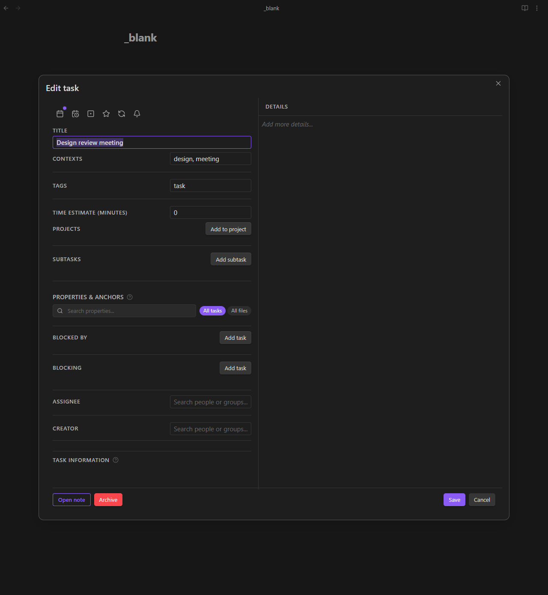

# Team and Attribution

[← Back to Features](../features.md)

<!--
Recording Script
SETUP (need person/group notes + tasks with creator field):
  cd .obsidian/plugins/tasknotes
  node scripts/generate-test-data.mjs --clean   # or: bun run generate-test-data:clean
  Reload plugin in Obsidian

Use: TaskNotes/Demos/Shared Vault Demo.base
Show Team & Attribution settings tab with device-to-person mapping
Show registering a device to a person note in the Your Identity section
Show using the person/group picker in a task modal to assign a task
Show discovery panel with person avatars and group member lists
-->

In a shared vault, TaskNotes automatically detects who is on each device and maps them to a person note. Tasks are attributed to people and groups, notifications filter to show only your assignments, and each person can override settings on their own device without affecting anyone else.

<!-- SCREENSHOT: Team & Attribution settings tab showing device-to-person mapping -->


This system works entirely within Obsidian. There is no external server or account system. Person and group identities are regular Markdown files in your vault.

## Device Identity

Every device that opens the vault gets a unique ID. TaskNotes generates a UUID v4 and stores it in `localStorage`, which means:

- Each device keeps its own ID (not synced by Obsidian Sync, iCloud, or git)
- The ID persists across Obsidian restarts
- Reinstalling Obsidian generates a new ID

TaskNotes also detects a human-readable device name from the platform (e.g., "Windows PC", "Mac", "iPhone"). You can set a custom name in the Team & Attribution settings tab.

The device ID is used to look up which person note belongs to the person using this device. This is the foundation of automatic task attribution.

<!-- GIF: Registering a device to a person note in the Your Identity section -->


## Person Notes

A person note is a Markdown file with a specific property in its frontmatter that identifies it as a person. By default, TaskNotes looks for `type: person`:

```yaml
---
type: person
title: Alice Chen
role: Engineer
department: Platform
availableFrom: "09:00"
availableUntil: "17:00"
---
```

TaskNotes discovers person notes by scanning a folder you configure (e.g., `User-DB/`) and checking for the person type property. You can also add a tag filter if you want to be more selective.

**What person notes are used for:**

- **Task attribution.** When you create a task, your person note is automatically set as the creator (as a wikilink like `[[Alice Chen]]`)
- **Assignee selection.** The person/group picker in task modals and bulk operations shows all discovered persons
- **Avatar rendering.** Colored initials appear in views and the Upcoming View based on the person's name
- **Notification preferences.** Person notes can define availability windows and reminder lead times that override global defaults

The type property name and value are both configurable. If your vault already uses a different convention (like `role: team-member`), you can change the property name and value in settings.

## Group Notes

Groups are notes with `type: group` in frontmatter and a `members` array listing their members as wikilinks:

```yaml
---
type: group
title: Platform Team
members:
  - "[[Alice Chen]]"
  - "[[Bob Rivera]]"
  - "[[DevOps Team]]"
---
```

Groups can contain other groups. In the example above, `DevOps Team` might be another group note with its own members. TaskNotes resolves nested groups recursively (up to 10 levels deep) and detects cycles so a group that accidentally contains itself does not cause infinite loops.

**Where groups appear:**

- In the person/group picker when assigning tasks
- In the "Only notify for my tasks" filter (if you are a member of an assigned group, you get notified)
- In the discovery panel in settings

Group notes are discovered the same way as person notes: TaskNotes scans the configured folder for notes with the group type property. You can use the same folder for both persons and groups, or separate folders.

## Creator and Assignee Fields

TaskNotes uses two frontmatter fields for attribution:

| Field | Default name | Purpose |
|-------|-------------|---------|
| Creator | `creator` | Who created the task (auto-set on creation) |
| Assignee | `assignee` | Who the task is assigned to (set manually or via bulk operations) |

Both are stored as wikilinks (e.g., `[[Alice Chen]]`). The assignee field can hold a single person, a group, or an array of multiple assignees.

**Auto-set creator:** When you create a task and your device is registered to a person note, TaskNotes automatically fills in the creator field. This happens in individual task creation, bulk generation, and bulk conversion. You can turn this off in settings.

<!-- GIF: Using the person/group picker in a task modal to assign a task -->



**Person/group picker:** Task modals and the bulk tasking action bar include a picker that shows all discovered persons and groups. Start typing to filter, or scroll through the list. Groups show their member count.

Both field names are configurable. If you want to use `owner` instead of `creator`, or `assigned_to` instead of `assignee`, change them in settings and TaskNotes will read and write using your chosen names.

## Assignee-Aware Notifications

When "Only notify for my tasks" is enabled, the notification system checks whether the current device's person is relevant to each task before showing it:

1. Look up the current device's person note
2. For each task with a notification, check the assignee field
3. If the assignee is a group, resolve it to all member persons (recursively)
4. Show the notification only if the current person is in the resolved list

This means you only see notifications for tasks assigned to you or to a group you belong to. Tasks assigned to other people are silently filtered out.

The setting is per-device. In a shared vault, each person can independently choose whether to filter notifications or see everything.

## Discovery Panel

The Team & Attribution settings tab includes a discovery panel that shows all found persons and groups:

<!-- SCREENSHOT: Discovery panel showing persons with avatars and groups with member lists -->


- **Persons** are listed with colored avatar initials (generated from their name), their display name, and optional role/department fields
- **Groups** show their display name and a list of their members inline
- **Empty states** guide you to create person or group notes if none are found, with a link to the documentation

The panel updates when you change the folder or tag filter settings.

## Your Identity

The "Your Identity" section in settings shows your device's UUID, detected platform name, and which person note you are mapped to. From here you can:

- **Register** your device to a person note (opens a file selector showing all person notes)
- **Change** your mapping to a different person
- **Unregister** your device (removes the mapping)
- **Set a custom device name** (e.g., "Work Laptop" instead of "Windows PC")

All registered devices are shown in the "Team Members" section below, with their device name, person mapping, and last seen timestamp.

## Settings

These settings are in **Settings > Team & Attribution**:

**Person notes:**

| Setting | Default | Description |
|---------|---------|-------------|
| Person notes folder | (empty) | Folder to scan for person notes |
| Person notes tag | (empty) | Optional tag filter for person discovery |
| Type property name | `type` | Frontmatter property used to identify persons and groups |
| Person type value | `person` | Value that marks a note as a person |

**Group notes:**

| Setting | Default | Description |
|---------|---------|-------------|
| Group notes folder | (falls back to person folder) | Folder to scan for group notes |
| Group notes tag | (empty) | Optional tag filter for group discovery |
| Group type value | `group` | Value that marks a note as a group |

**Attribution:**

| Setting | Default | Description |
|---------|---------|-------------|
| Auto-set creator | On | Automatically fill in the creator field when creating tasks |
| Creator field name | `creator` | Frontmatter property name for the task creator |
| Assignee field name | `assignee` | Frontmatter property name for the task assignee |

**Notification filtering:**

| Setting | Default | Description |
|---------|---------|-------------|
| Only notify for my tasks | Off | Filter notifications to only show tasks assigned to you or your groups |

## Related

- [View Notifications](bases-notifications.md) for the notification system that supports assignee filtering
- [Reminders](reminders.md) for per-task reminders
- [Custom Properties](custom-properties.md) for adding fields like assignee to task modals
