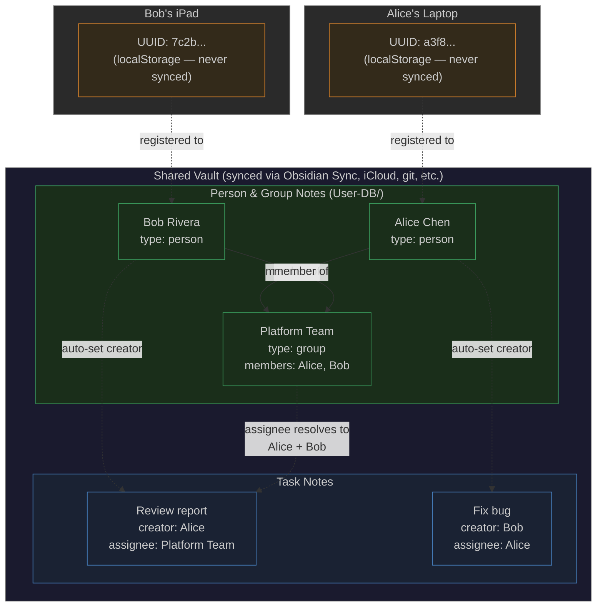
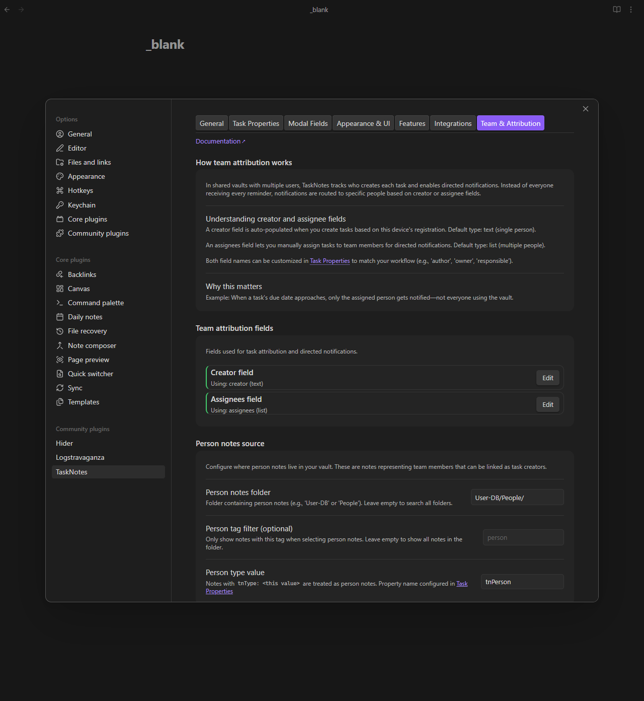
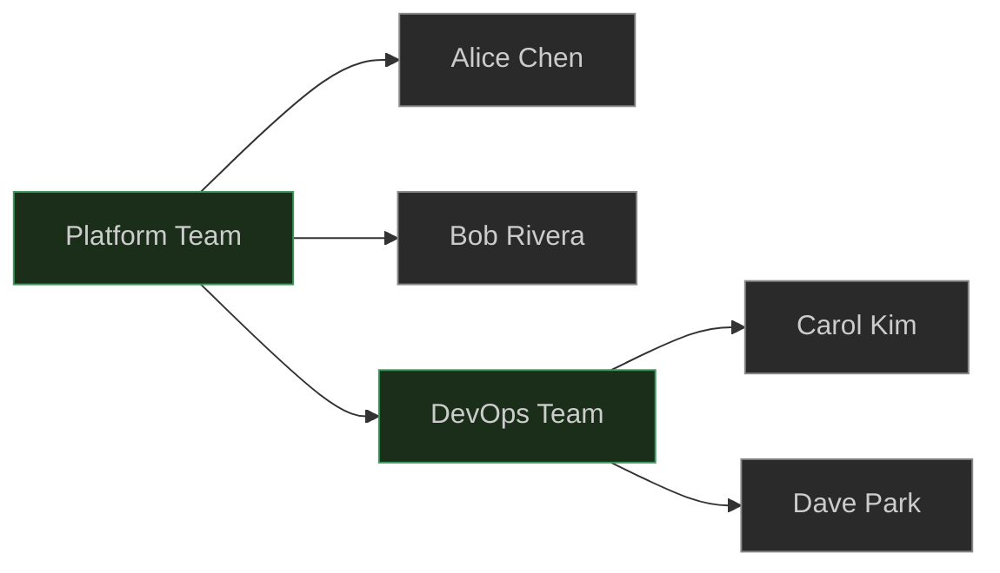
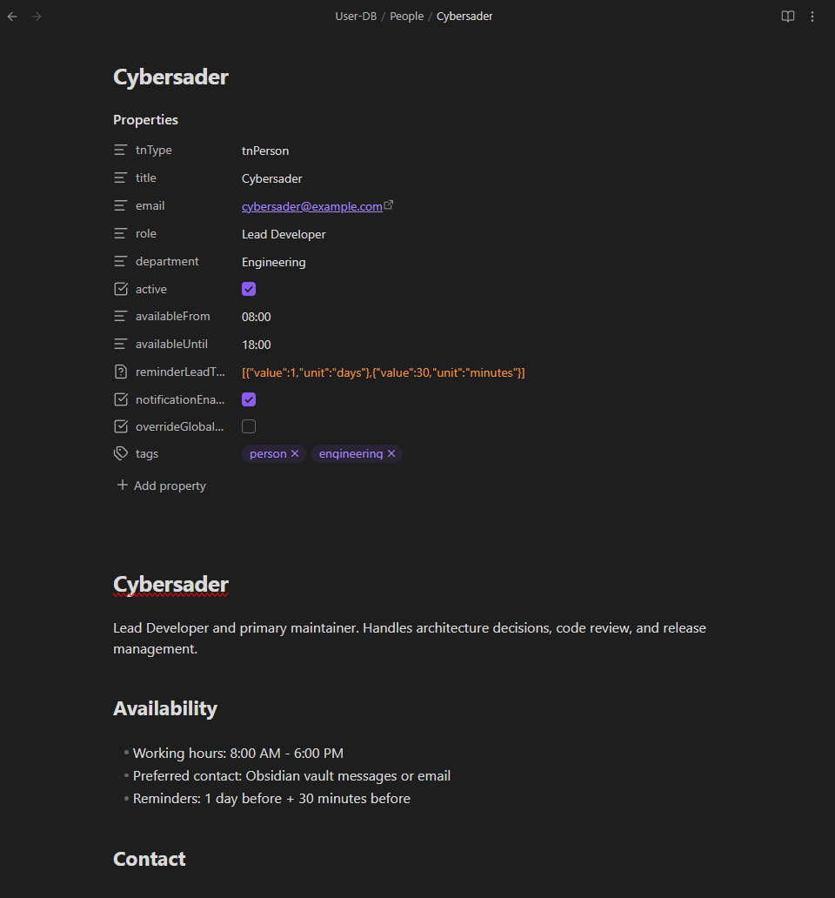
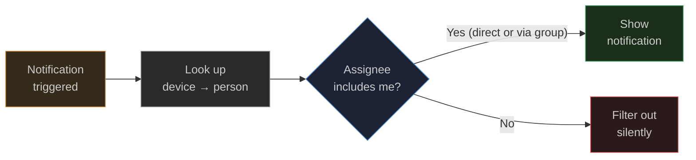

# Team and Attribution

[← Back to Features](../features.md)

<!--
Recording Script
SETUP (need person/group notes + tasks with creator field):
  cd .obsidian/plugins/tasknotes
  node scripts/generate-test-data.mjs --clean   # or: bun run generate-test-data:clean
  Reload plugin in Obsidian

Use: TaskNotes/Demos/Shared Vault Demo.base
Show Team & Attribution settings tab with device-to-person mapping
Show registering a device to a person note in the Your Identity section
Show using the person/group picker in a task modal to assign a task
Show discovery panel with person avatars and group member lists
-->

In a shared vault, TaskNotes maps each device to a person note so tasks are automatically attributed, assignees can be picked from a list, and notifications filter to show only your work. Everything runs inside Obsidian — no external server or account system. Person and group identities are regular Markdown files in your vault.



**How it works in three steps:**

1. **Register once** — each device gets a UUID stored in `localStorage`. You map it to your person note in Settings > Team & Attribution.
2. **Create tasks normally** — TaskNotes auto-fills the `creator` field with your person note. Assign tasks to people or groups via the picker.
3. **Notifications filter automatically** — enable "Only notify for my tasks" and you only see notifications for tasks assigned to you (or a group you belong to).

<!-- SCREENSHOT: Team & Attribution settings tab showing device-to-person mapping -->



## Device Identity

Every device that opens the vault gets a unique UUID stored in `localStorage`:

- **Not synced** — Obsidian Sync, iCloud, and git do not touch `localStorage`
- **Persists** across Obsidian restarts

> [!warning] Reinstalling Obsidian generates a new device ID
> The UUID lives in Obsidian's local app data (`localStorage`), not in the vault. If you reinstall Obsidian, clear app data, or switch to a new Obsidian installation, the old UUID is lost and a new one is generated. You will need to re-register the device to your person note in Settings > Team & Attribution. Existing tasks created with the old device are unaffected — they reference your person note by name, not by device ID.

TaskNotes also detects a human-readable device name from the platform (e.g., "Windows PC", "Mac", "iPhone"). You can set a custom name in settings.

> [!info]- How device identification works under the hood
> **UUID generation:** TaskNotes calls the Web Crypto API (`crypto.randomUUID()`) to generate a standard UUID v4 — a 128-bit random identifier like `a3f8d2e1-7b4c-4a9f-8e5d-6f1a2b3c4d5e`. On older platforms without `crypto.randomUUID`, it falls back to `Math.random()`-based generation.
>
> **Storage:** The UUID is saved to `localStorage` under a TaskNotes-specific key. `localStorage` is a browser/Electron storage API that is **per-device and per-vault** — it lives in the app's local data directory, not in the vault folder. Sync services (Obsidian Sync, iCloud, git) never see it because it is not a file.
>
> **Device name detection:** TaskNotes reads `navigator.platform` and `navigator.userAgent` (standard browser APIs exposed by Electron) to detect the operating system:
>
> | Platform string | Detected name |
> |----------------|---------------|
> | `Win*` | Windows PC |
> | `Mac*` | Mac |
> | `Mac*` + `iPad` user agent | iPad |
> | `Mac*` + `iPhone` user agent | iPhone |
> | `Linux*` | Linux PC |
> | `Linux*` + `Android` user agent | Android Device |
>
> You can override this with a custom name in Settings > Team & Attribution.

<!-- GIF: Registering a device to a person note in the Your Identity section -->

> [!info]- Your Identity section in settings
> The "Your Identity" section shows your device's UUID, detected platform name, and which person note you are mapped to. From here you can:
>
> - **Register** your device to a person note (opens a file selector showing all person notes)
> - **Change** your mapping to a different person
> - **Unregister** your device (removes the mapping)
> - **Set a custom device name** (e.g., "Work Laptop" instead of "Windows PC")
>
> All registered devices are shown in the "Team Members" section below, with their device name, person mapping, and last seen timestamp.

## Person Notes

A person note is a Markdown file with `type: person` in its frontmatter:

```yaml
---
type: person
title: Alice Chen
role: Engineer
department: Platform
availableFrom: "09:00"
availableUntil: "17:00"
---
```

TaskNotes discovers person notes by scanning a folder you configure (e.g., `User-DB/`). You can also add a tag filter if you want to be more selective.

| Person notes are used for | How |
|--------------------------|-----|
| **Task attribution** | Creator field auto-set to your person note as a wikilink (`[[Alice Chen]]`) |
| **Assignee selection** | Person/group picker in task modals and bulk operations |
| **Avatar rendering** | Colored initials in views and the Upcoming View |
| **Notification preferences** | Availability windows and reminder lead times that override global defaults |

> [!tip]- Custom type property
> The type property name and value are both configurable. If your vault already uses a different convention (like `role: team-member`), change the property name and value in Settings > Team & Attribution. See [Property Migration](property-migration.md) for bulk-renaming existing notes.

## Group Notes

Groups are notes with `type: group` and a `members` array of wikilinks:

```yaml
---
type: group
title: Platform Team
members:
  - "[[Alice Chen]]"
  - "[[Bob Rivera]]"
  - "[[DevOps Team]]"
---
```

Groups can **nest** — `DevOps Team` above could be another group with its own members. TaskNotes resolves nested groups recursively (up to 10 levels deep) and detects cycles.



Groups appear in the person/group picker when assigning tasks, in notification filtering (if you are a member of an assigned group, you get notified), and in the discovery panel in settings.

> [!info]- Discovery panel
> The Team & Attribution settings tab includes a discovery panel that shows all found persons and groups:
>
> <!-- SCREENSHOT: Discovery panel showing persons with avatars and groups with member lists -->
>
> 
>
> - **Persons** are listed with colored avatar initials, display name, and optional role/department fields
> - **Groups** show their display name and members inline
> - **Empty states** guide you to create person or group notes if none are found
>
> The panel updates when you change the folder or tag filter settings.

## Creator and Assignee

TaskNotes uses two frontmatter fields for attribution:

| Field | Default name | Purpose | Set by |
|-------|-------------|---------|--------|
| Creator | `creator` | Who created the task | Auto-set on creation |
| Assignee | `assignee` | Who the task is assigned to | Manual or via bulk operations |

Both are stored as wikilinks (e.g., `[[Alice Chen]]`). The assignee field can hold a single person, a group, or an array of multiple assignees.

<!-- GIF: Using the person/group picker in a task modal to assign a task -->

**Person/group picker:** Task modals and the bulk tasking action bar include a picker that shows all discovered persons and groups. Start typing to filter, or scroll through the list. Groups show their member count.

> [!tip]- Customizing field names
> Both field names are configurable. If you want to use `owner` instead of `creator`, or `assigned_to` instead of `assignee`, change them in Settings > Team & Attribution and TaskNotes will read and write using your chosen names.

## Assignee-Aware Notifications

When "Only notify for my tasks" is enabled, the notification system checks each task before showing it:



If the assignee is a group, TaskNotes resolves it to all member persons recursively. You only see notifications for tasks assigned to you or to a group you belong to.

This setting is **per-device** — each person can independently choose whether to filter or see everything.

## Settings

These settings are in **Settings > Team & Attribution**:

**Person notes:**

| Setting | Default | Description |
|---------|---------|-------------|
| Person notes folder | (empty) | Folder to scan for person notes |
| Person notes tag | (empty) | Optional tag filter for person discovery |
| Type property name | `type` | Frontmatter property used to identify persons and groups |
| Person type value | `person` | Value that marks a note as a person |

**Group notes:**

| Setting | Default | Description |
|---------|---------|-------------|
| Group notes folder | (falls back to person folder) | Folder to scan for group notes |
| Group notes tag | (empty) | Optional tag filter for group discovery |
| Group type value | `group` | Value that marks a note as a group |

**Attribution:**

| Setting | Default | Description |
|---------|---------|-------------|
| Auto-set creator | On | Automatically fill in the creator field when creating tasks |
| Creator field name | `creator` | Frontmatter property name for the task creator |
| Assignee field name | `assignee` | Frontmatter property name for the task assignee |

**Notification filtering:**

| Setting | Default | Description |
|---------|---------|-------------|
| Only notify for my tasks | Off | Filter notifications to only show tasks assigned to you or your groups |

## Related

- [View Notifications](bases-notifications.md) for the notification system that supports assignee filtering
- [Reminders](reminders.md) for per-task reminders
- [Custom Properties](custom-properties.md) for adding fields like assignee to task modals
