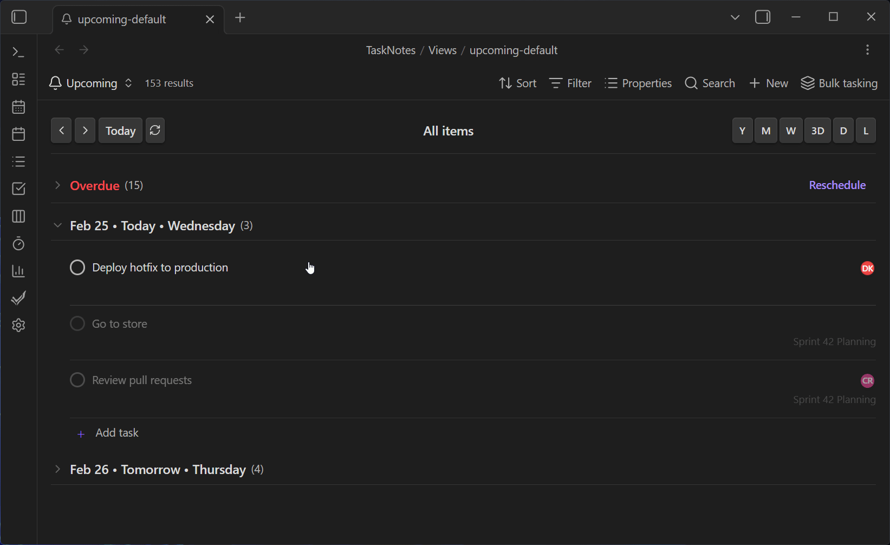
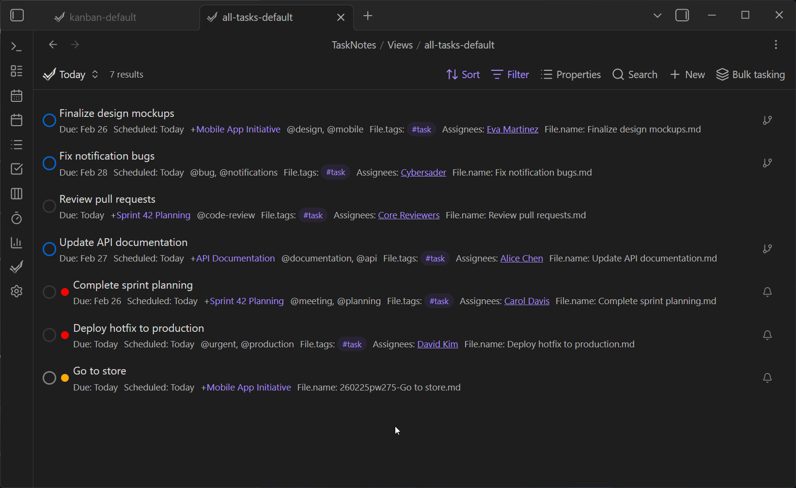
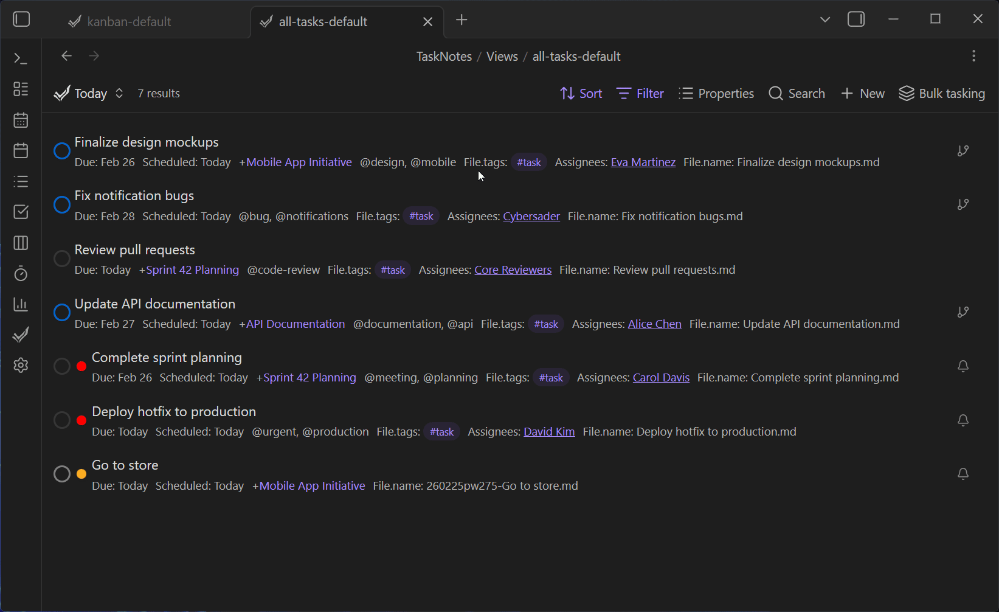
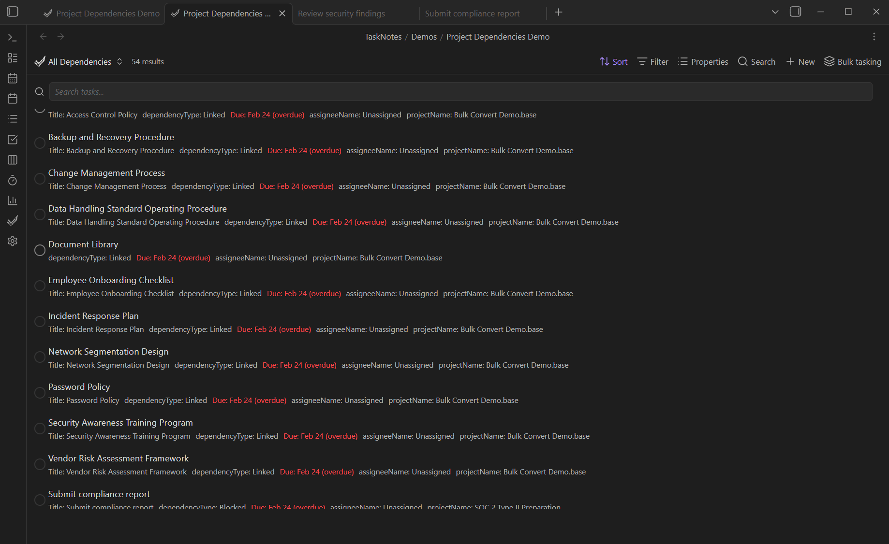

# Task Management


[← Back to Features](../features.md)

<!--
Recording Script
SETUP:
  cd .obsidian/plugins/tasknotes
  node scripts/generate-test-data.mjs --clean   # or: bun run generate-test-data:clean
  Reload plugin in Obsidian

Use: TaskNotes/Demos/Priority Dashboard Demo.base and Project Dependencies Demo.base
Show opening the task creation modal → fill title/due/priority → save
Show typing a natural language task description → fields auto-populate

PROJECTS section:
  Show clicking "Add Project" in task modal → fuzzy search → select project
  Show task frontmatter with projects: ["[[Project Alpha]]"]
  Show Kanban grouped by project with tasks in multiple columns
  Show project indicator icon on a task card
  Show right-click → "Create subtask" on a project task

DEPENDENCIES section:
  Show task frontmatter with blockedBy field
  Show clicking "Blocked by" in edit modal → fuzzy task selector → add dependency
  Show fork icon on task card → expand inline list of blocked tasks

CLEANUP (task creation / dependency changes modify files):
  cd .obsidian/plugins/tasknotes
  node scripts/generate-test-data.mjs --clean   # or: bun run generate-test-data:clean
-->

This page covers task creation, projects, dependencies, and automation. For the underlying architecture, see [Core Concepts](../core-concepts.md).

## Creating and Editing Tasks

The primary method is the **Task Creation Modal**, accessed via the "Create new task" command or by clicking dates/time slots in calendar views. The modal provides fields for title, status, priority, due dates, and all other task properties.

<!-- GIF: Opening the task creation modal, filling in title/due/priority, and saving -->

> [!info]- Task Creation Modal
> 


When creating a task, the title is automatically sanitized to remove characters forbidden in filenames.

TaskNotes also supports **natural language creation** — typing "Buy groceries tomorrow at 3pm @home #errands high priority" automatically sets the due date, tag, context, and priority. In most workflows, users combine both approaches: fast capture with natural language, then structured edits in the modal when more precision is needed.

For the full NLP syntax reference, trigger configuration, and auto-suggestion behavior, see [Natural Language Input](natural-language.md).

### Auto-Suggestions

The natural language input field activates auto-suggestions when you type trigger characters:

| Trigger | What it shows |
|---------|--------------|
| `@` | Contexts from existing tasks |
| `#` | Tags from existing tasks |
| `+` | Vault files as project suggestions |
| `*` | Configured status options |

For project card configuration, enhanced search, and status suggestion details, see [Natural Language Input — Auto-Suggestions](natural-language.md#auto-suggestions).

<!-- GIF: Typing a natural language task description and seeing fields auto-populate -->

## Task Properties

Tasks store their data in YAML frontmatter with properties for status, priority, dates, contexts, projects, tags, time estimates, recurrence, and reminders. Custom fields can extend this structure.

This frontmatter-first design keeps task data editable and portable while supporting consistent behavior across views and widgets.

For property types and examples, see [Core Concepts](../core-concepts.md#yaml-frontmatter). For configuration options, see [Task Properties Settings](../settings/task-properties.md).

## Projects

TaskNotes supports organizing tasks into projects using note-based linking. Projects are represented as links to actual notes in your vault, allowing you to leverage Obsidian's linking and backlinking features for project management.

This model avoids creating a separate project database. Any note can become a project anchor, and task/project relationships remain visible through normal Obsidian link tooling.

### Project Assignment

<!-- GIF: Opening the task edit modal, clicking "Add Project", searching for a project note, and selecting it -->



Tasks can be assigned to one or more projects through the task creation or editing interface. When creating or editing a task, click the "Add Project" button to open the project selection modal. This modal provides fuzzy search functionality to quickly find and select project notes from your vault.

> [!tip] See it in practice
> For project-based workflows end-to-end, see [Workflow Examples — Project-Centered Planning](../workflow-examples.md#project-centered-planning).
### Project Links

<!-- SCREENSHOT: Task frontmatter showing projects field with wikilinks, e.g. projects: ["[[Project Alpha]]", "[[Project Beta]]"] -->


Projects are stored as wikilinks in the task's frontmatter (e.g., `projects: ["[[Project A]]", "[[Project B]]"]`). These links are clickable in the task interface and will navigate directly to the project notes when clicked. Any note in your vault can serve as a project note simply by being linked from a task's projects field.

### Organization and Filtering

<!-- GIF: Kanban board grouped by project -- tasks appearing in multiple project columns, then switching to Task List grouped by project -->


Tasks can be filtered and grouped by their associated projects in all Bases-driven task views. Use the Bases filter editor to add `note.projects` conditions, and configure the grouping menu to organize Task List or Kanban boards by project. Tasks assigned to multiple projects will appear in each relevant project group, providing flexibility in project-based organization.

### Project Indicators

<!-- SCREENSHOT: Task card showing the project indicator icon, indicating this task is used as a project with subtasks linked to it -->


TaskCards display visual indicators when tasks are used as projects. These indicators help identify which tasks have other tasks linked to them as subtasks, making project hierarchy visible at a glance.

### Subtask Creation

<!-- GIF: Right-clicking a task that serves as a project, selecting "Create subtask" from the context menu, and seeing the new subtask linked automatically --> 


Tasks can have subtasks created directly from their context menu. When viewing a task that serves as a project, you can select "Create subtask" to create a new task automatically linked to the current project.

> [!tip] See it in practice
> For how subtasks fit into project workflows, see [Workflow Examples — Project-Centered Planning](../workflow-examples.md#project-centered-planning).
## Dependencies

<!-- SCREENSHOT: Task frontmatter showing blockedBy field with structured dependency objects (uid, reltype, gap) -->

Task dependencies capture prerequisite work. Dependencies are stored in the `blockedBy` frontmatter field. The simplest form is a list of wikilinks:

```yaml
blockedBy:
  - "[[Run staging environment tests]]"
  - "[[Security review for launch]]"
```

> [!abstract]- Advanced: RFC 9253 structured format
> Dependencies also support a structured format with relationship type and gap:
>
> ```yaml
> blockedBy:
>   - uid: "[[Operations/Order hardware]]"
>     reltype: FINISHTOSTART
>     gap: P1D
> ```
>
> - `uid` references the blocking task via wikilink
> - `reltype` defaults to `FINISHTOSTART` for dependencies created in the UI
> - `gap` is optional, uses ISO 8601 duration syntax (e.g., `PT4H`, `P2D`)
>
> Both formats are recognized. The UI creates simple wikilink entries by default.

Whenever a dependency is added, TaskNotes updates the upstream note's `blocking` list so the reverse relationship stays synchronized. Removing a dependency automatically clears both sides.

### Selecting dependencies in the UI

<!-- GIF: Opening the task edit modal, clicking "Blocked by", searching for a task in the fuzzy selector, and adding it as a dependency -->

- The task creation and edit modals expose "Blocked by" and "Blocking" buttons that launch a fuzzy task selector. The picker only offers valid tasks, excludes the current note, and prevents duplicate entries.
- The task context menu provides the same selector, enabling dependency management directly from the Task List, Kanban, and calendar views.
- Task cards show a fork icon whenever a task blocks other work. Clicking it expands an inline list of downstream tasks without triggering the parent card's modal, so you can inspect dependents in place.

<!-- GIF: Clicking the fork icon on a task card to expand inline list of downstream blocked tasks -->


These controls currently create and manage finish-to-start style blockers. Advanced `reltype` values and `gap` data are preserved in frontmatter, but blocking evaluation is currently based on whether unresolved dependencies exist rather than relationship-type-specific scheduling rules.

## Automation

### Auto-Archiving


TaskNotes can automatically archive tasks when they transition into a completed status. This keeps finished work out of your active lists without manual cleanup.

> [!tip] How to enable
> Go to **Settings → Task Properties → Task Statuses**. Each status card has an **Auto-archive** toggle and a **Delay** input (1–1440 minutes).

When auto-archive is enabled for a status:

- Any task moved into that status is queued for archiving after the configured delay
- Moving the task to a different status before the timer expires cancels the pending archive
- The queue persists across plugin restarts — pending archives resume when the plugin loads

## Related

- [Natural Language Input](natural-language.md) — NLP parsing, trigger characters, auto-suggestions, project card config
- [Inline Task Integration](inline-tasks.md) — Editor widgets, instant conversion, relationships widget
- [Bulk Tasking](bulk-tasking.md) — Batch create, convert, or edit tasks from any view
- [Custom Properties](custom-properties.md) — Register custom fields for modal UI, autocomplete, and NLP
- [Property Mapping](property-mapping.md) — Remap property names to core fields, per-task or per-view
- [Recurring Tasks](recurring-tasks.md) — RRule-based repetition with independent instance completion
- [Task Reminders](reminders.md) — Relative and absolute notification offsets
- [Folders & Filenames](../settings/task-defaults.md) — Task folder routing, filename patterns, archive behavior
- [Template Variables](template-variables.md) — Variables available in task body templates
