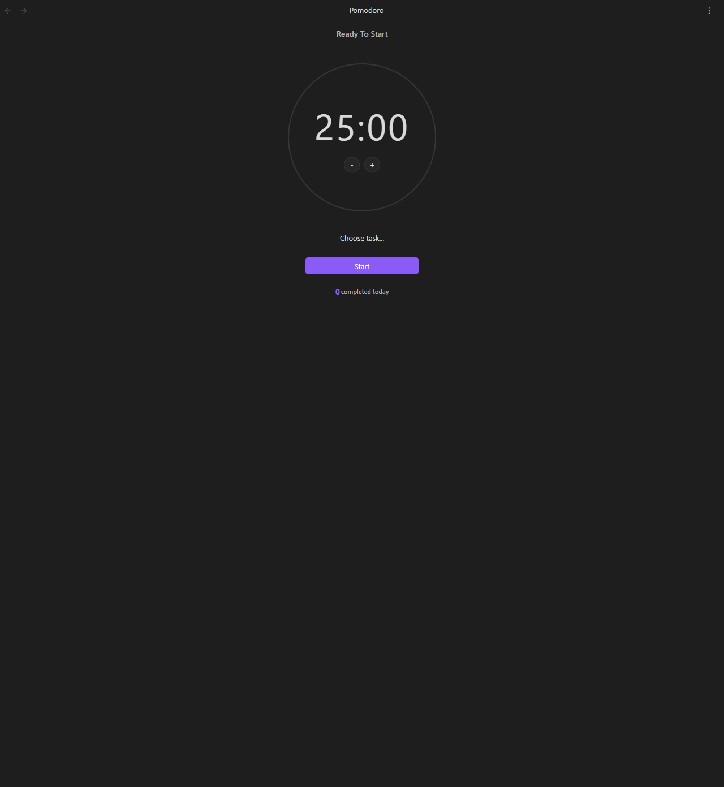

# Time Management

<!--
Recording Script
SETUP (need tasks with timeEstimate/timeEntries):
  cd .obsidian/plugins/tasknotes
  node scripts/generate-test-data.mjs --clean   # or: bun run generate-test-data:clean
  Reload plugin in Obsidian

Use: TaskNotes/Demos/Time Tracking Demo.base
Show starting the time tracker on a task card → work a few seconds → stop → see recorded entry
Show starting a Pomodoro session linked to a task → timer counting down → break prompt appears

CLEANUP (time tracking adds entries to task files):
  node scripts/generate-test-data.mjs --clean   # or: bun run generate-test-data:clean
-->

TaskNotes includes features for time tracking and productivity, such as a time tracker and a Pomodoro timer.

## Time Tracking

<!-- GIF: Starting the time tracker on a task card, working for a few seconds, and stopping it to see the recorded entry -->

TaskNotes has a time tracker to record the time spent on each task. Time tracking information is stored in the `timeEntries` array within each task's YAML frontmatter. Each time entry includes a start time and an end time.

The time tracking interface includes controls to start and stop tracking in task views and task cards. TaskNotes prevents duplicate active sessions on the same task. Active sessions on different tasks can exist at the same time, and total time spent on each task is calculated from completed sessions.

### Auto-Stop Time Tracking

TaskNotes can automatically stop time tracking when a task is marked as completed. This feature ensures that time tracking data accurately reflects work completion without requiring manual timer management.

The auto-stop feature works by monitoring task status changes across all views and interfaces. When a task's status changes from any non-completed state to a completed state (as defined by the custom status configuration), any active time tracking session for that task is automatically terminated.

**Configuration Options:** Configure these under `Settings -> TaskNotes -> Features` (Time Tracking section).

- **Auto-stop tracking** - Enable or disable the automatic stopping behavior (enabled by default)
- **Completion notification** - Show a notice when auto-stop occurs (disabled by default)

**Behavior:**

- Monitors all task status changes in real-time
- Stops only the specific task that was completed (other active timers continue)
- Preserves the recorded time data in the task's time entries
- Works with both standard and recurring task completions
- Functions across all task views (list, kanban, calendar, etc.)

The feature integrates with the custom status system, so completion detection respects your configured workflow statuses rather than relying on hardcoded completion states.

## Pomodoro Timer

<!-- GIF: Starting a Pomodoro session linked to a task, the timer counting down, and the break prompt appearing -->

TaskNotes also includes a Pomodoro timer, which is a tool for time management that uses a timer to break down work into intervals, separated by short breaks. The Pomodoro timer in TaskNotes has a dedicated view with controls to start, stop, and reset the timer.

When a task is associated with a Pomodoro session, the time is automatically recorded in the task's time tracking data upon completion of the session.

## Productivity Analytics

The **Pomodoro Stats View** provides analytics and historical data about your Pomodoro sessions. This includes a history of completed sessions, as well as metrics like completion rates and total time spent on tasks. The data can be visualized to show productivity patterns over time.

