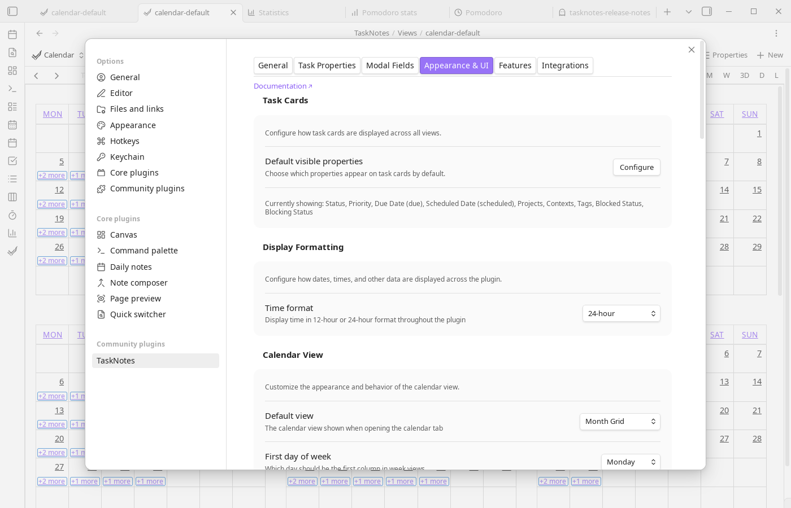

# Appearance & UI Settings

These settings control the visual appearance of the plugin, including the calendar, task cards, and other UI elements.




## Task Cards

Use **Default visible properties** to decide what metadata appears on task cards without opening each task. This is the primary control for card density.

Checklist progress is available as a visible property in task cards. In Bases view `order` arrays, the corresponding source property is `file.tasks` (shown as `tasks` in Bases property pickers once present in the view `order` list).

Nested task cards use CSS variables for their indentation. Add a CSS snippet if
you want a denser hierarchy than the default:

```css
.tasknotes-plugin {
  --tn-nested-task-indent: 12px;
  --tn-nested-task-padding: 8px;
}

body.is-mobile .tasknotes-plugin {
  --tn-nested-task-indent: 8px;
  --tn-nested-task-padding: 6px;
}
```

If task links inside normal markdown lists feel visually doubled with both a
list marker and the task status indicator, a CSS snippet can hide those markers
for task-link lines:

```css
.markdown-reading-view li:has(.task-inline-preview--reading-mode)::marker {
  content: "";
}

.markdown-source-view.mod-cm6 .cm-line:has(.tasknotes-inline-widget) .cm-formatting-list {
  display: none;
}
```

## Display Formatting

Use **Time format** to switch between 12-hour and 24-hour display across all TaskNotes surfaces.

## Calendar View

Calendar view settings determine the default landing mode, day/week framing, and timeline affordances. You can choose the default view, custom day span, first day of week, weekend visibility, week numbers, and whether today/current-time markers are shown. **Selection mirror** controls whether drag selections show a visual preview before committing.

Use **Calendar locale** for region-specific formatting and calendar systems (for example `en`, `de`, or `fa`). Leave it empty to use automatic detection.

## Default Event Visibility

This section controls which event layers are enabled when a calendar view opens. You can independently toggle scheduled tasks, due dates, due dates for already-scheduled tasks, time entries, recurring tasks, and ICS events.

## Time Settings

Time settings define the structure of timeline views: slot duration, earliest visible time, latest visible time, and initial scroll position. Use these together to match your workday shape.

## UI Elements

UI element toggles control auxiliary surfaces such as the tracked-task status bar entry, the project subtasks widget and its placement, expandable subtasks in cards, chevron position, and the alignment of the views/filters button.

## Related Settings

Some appearance-related settings are configured elsewhere:

- **Task filename format**: Configured in [Task Properties](task-properties.md) → Title card
- **Project autosuggest display**: Configured in [Task Properties](task-properties.md) → Projects card
