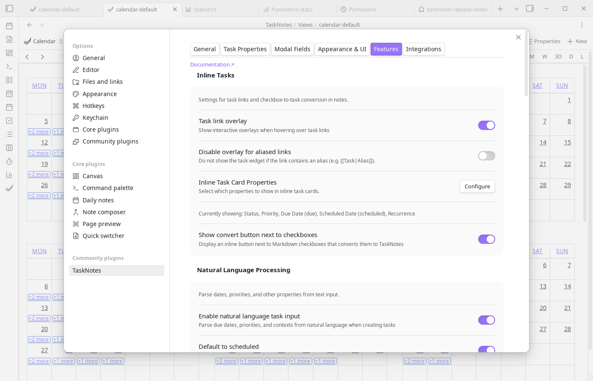

# Features Settings

These settings allow you to enable, disable, and configure the various features of the plugin, such as inline tasks, natural language processing, the Pomodoro timer, and notifications.

## Inline Tasks

Inline task settings control how aggressively TaskNotes turns plain note content into structured task interactions. **Task link overlay** enables the Live Preview card behavior for task links, while **Instant task convert** surfaces conversion buttons next to list items and checkboxes. For conversion output, **Inline task convert folder** sets destination behavior and supports `{{currentNotePath}}`, and **Use task defaults on instant convert** applies your default task values at conversion time.

## Body Template

Body template settings let you scaffold newly created tasks with consistent note content. When enabled, TaskNotes reads the configured template file and expands variables like `{{title}}`, `{{date}}`, `{{time}}`, `{{priority}}`, `{{status}}`, `{{contexts}}`, `{{tags}}`, and `{{projects}}`.

## Natural Language Processing

NLP settings define how text input is interpreted during task capture. **Enable natural language task input** activates date and metadata parsing, **Default to scheduled** changes ambiguous date handling, **NLP language** selects parsing patterns, and **Status suggestion trigger** controls optional status autocomplete activation.

## Pomodoro Timer

Pomodoro settings control interval lengths, long-break cadence, optional auto-start behavior, and end-of-session notifications/sound. **Pomodoro data storage** chooses whether history is kept in plugin data or daily notes.

## Notifications

Enable reminders globally and choose the delivery type (in-app toast, system desktop notifications, or both). The **"Send test"** button fires a test notification to verify your setup.

**Per-category behavior (advanced):** Expand this section to control how each time category (overdue, due today, due tomorrow, this week, scheduled) behaves after dismissal — snooze duration, bell count visibility, and popup visibility. This gives fine-grained control over which notifications are persistent vs awareness-only.

For full details on the toast, bell icon, snooze, and seen tracking, see [Notification Delivery](../features/notification-delivery.md). For what generates notifications, see [Reminders](../features/reminders.md) and [View Notifications](../features/bases-notifications.md).

## Performance & Behavior

These settings let you trade off completeness for speed, and fine-tune interaction feel.

| Setting | Default | Description |
|---------|---------|-------------|
| Hide completed from overdue | Off | When enabled, completed tasks are excluded from overdue sections even if their dates are in the past. Keeps overdue lists focused on actionable items. |
| Disable note indexing | Off | Skips indexing of non-task notes to reduce overhead in large vaults. Task workflows still work, but features that rely on non-task note lookups (e.g., note-oriented UI elements) will have reduced functionality. Restart recommended after changing. |
| Suggestion debounce | 0 ms | Delay before autosuggestion queries fire. Increase if suggestions cause lag in very large vaults. |

## Time Tracking

Time tracking options handle completion behavior. You can automatically stop running timers when a task is completed and optionally show a confirmation notification.

## Recurring Tasks

Use **Maintain due date offset in recurring tasks** to keep due/scheduled spacing consistent when recurring tasks roll forward.

## Timeblocking

Timeblocking enables lightweight daily-note scheduling blocks and controls whether those blocks are visible by default in calendar views.

### Usage

In the calendar view, click and drag on a time slot to select a time range. A context menu will appear—select "Create timeblock" to create a timeblock (this option only appears if timeblocking is enabled in settings). Drag existing timeblocks to move them. Resize edges to adjust duration.
