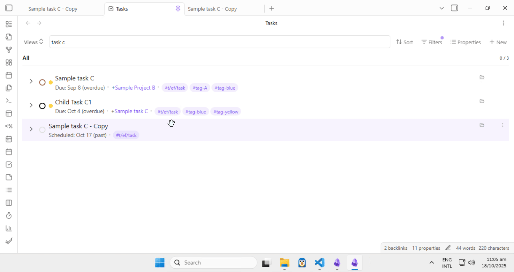

# General Settings

These settings control the foundational aspects of the plugin, such as task identification, file storage, and click behavior.

[← Back to Settings](../settings.md)

## Task Storage

- **Default tasks folder**: The default location for new tasks.
- **Move archived tasks to folder**: If enabled, tasks with a status of "archived" will be moved to the specified archive folder.
- **Archive folder**: The folder to move archived tasks to.

## Task Identification

TaskNotes can identify task notes using either a tag or a frontmatter property.

- **Identify tasks by**: Choose whether to identify tasks by a tag or by a frontmatter property.
    - **Tag**: If you choose to identify tasks by tag, you must specify the tag to use (e.g., `task`).
        - **Task tag**: The tag that identifies notes as tasks (without the `#` symbol).
        - **Hide identification tags in task cards**: When enabled, tags matching the task identification tag will be hidden from task card displays. This includes exact matches (e.g., `task`) and hierarchical children (e.g., `task/project`, `task/work/urgent`). This setting only appears when using tag-based identification.
    - **Property**: If you choose to identify tasks by property, you must specify the property name and value.
        - **Task property name**: The frontmatter property name (e.g., `category`, `isTask`).
        - **Task property value**: The value that the property must match (e.g., `task`, `true`).

### Hide Identification Tags

When using tag-based identification, you may want to keep your task identification tags in the frontmatter for organizational purposes, but hide them from the visual display in task cards to reduce clutter.

The **Hide identification tags in task cards** setting allows you to do this. When enabled:

- Tags that exactly match your task identification tag (e.g., `#task`) will be hidden
- Hierarchical child tags (e.g., `#task/project`, `#task/work/urgent`) will also be hidden
- Other tags that don't match the identification pattern will still be displayed
- The setting only affects the visual display—tags remain in the frontmatter

**Example:**

If your task identification tag is `task` and a task has the tags `#task`, `#task/project`, `#important`, and `#review`:

- With the setting **disabled** (default): All tags are shown: `#task`, `#task/project`, `#important`, `#review`
- With the setting **enabled**: Only non-identifying tags are shown: `#important`, `#review`

## Folder Management

- **Excluded folders**: A comma-separated list of folders to exclude from the Notes tab.

## Frontmatter

This section only appears when you have markdown links enabled globally in Obsidian settings.

- **Use markdown links in frontmatter**: Enable markdown link format `[text](path)` for project and dependency links in frontmatter. Requires the `obsidian-frontmatter-markdown-links` plugin. When disabled (default), frontmatter uses wikilink format `[[path]]` which is natively supported by Obsidian.

## Task Interaction

- **Single-click action**: The action to perform when single-clicking a task card. Can be either "Edit task" or "Open note".
- **Double-click action**: The action to perform when double-clicking a task card. Can be "Edit task", "Open note", or "No action".

## Release Notes

- **View release notes**: Opens a dedicated tab showing release notes for the current version. Release notes are displayed automatically after updating to a new version, and can also be accessed anytime via command palette or this settings button.
