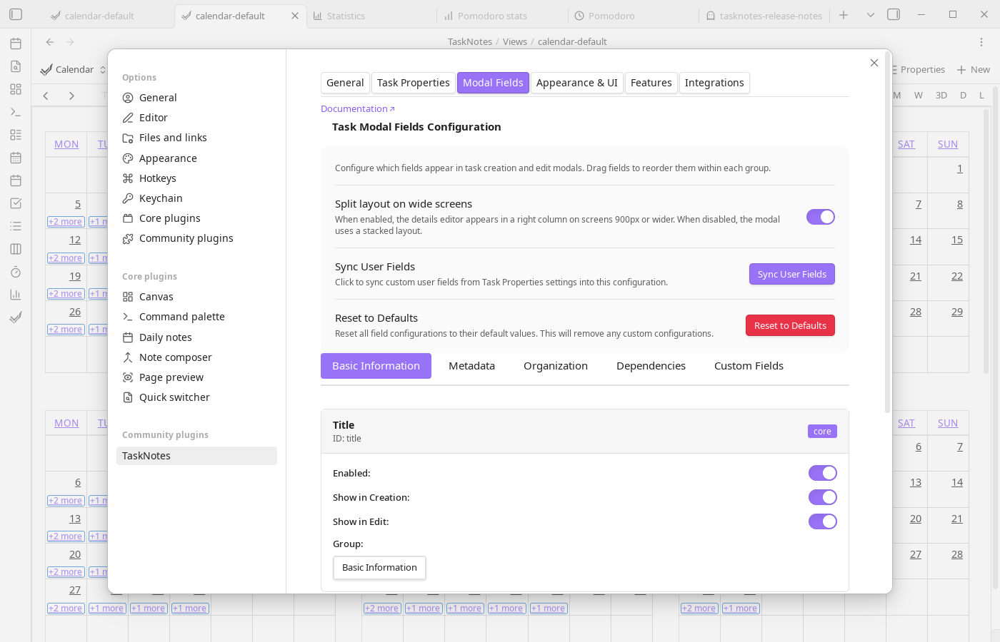

# Modal Fields Settings

The Modal Fields tab lets you decide exactly which fields appear in the task creation and edit modals. Open **Settings → TaskNotes → Modal Fields** to manage the configuration.

## Field Groups

Fields are organized into draggable groups:

- **Basic Information** – Title and Details
- **Metadata** – Contexts, Tags, Time Estimate
- **Organization** – Projects and Subtasks
- **Dependencies** – Blocked By and Blocking
- **Custom Fields** – Fields you register as [Custom Properties](task-properties.md#custom-properties) in the Task Properties tab. They sync here automatically so you can control their visibility and ordering in the modal

Each group can be collapsed, and their order in the manager matches the order shown in the modal.

## Managing Fields

Every field entry includes:

- **Visibility toggles** for creation and edit modals
- **Enable/disable** checkbox
- **Drag handle** for ordering within its group
- **Required** toggle (where applicable, e.g., Title)

Changes are saved automatically. Use this to hide fields you never touch, ensure required metadata appears up front, or reorder fields to match your workflow.

## Syncing Custom Properties

[Custom Properties](task-properties.md#custom-properties) registered in the Task Properties tab feed into this page as modal fields. The **Sync Custom Properties** button pulls the latest definitions into the Custom Fields group. New properties are appended, renamed properties update in place, and removed properties drop out of the configuration. Re-run the sync whenever you add or rename custom properties in Task Properties.

This is the second half of the custom property workflow: Task Properties defines *what* a field is (name, type, default value, NLP trigger, autocomplete filters), and Modal Fields controls *how* it appears in the modal (visibility, ordering, required status). See [Custom Properties](../features/custom-properties.md) for the full picture of where registered properties appear beyond just the modal.

## Resetting to Defaults

Select **Reset to Defaults** to restore the stock configuration (all built-in fields enabled plus empty custom slots). The reset keeps your existing custom property definitions; it only reverts modal layout and visibility.
