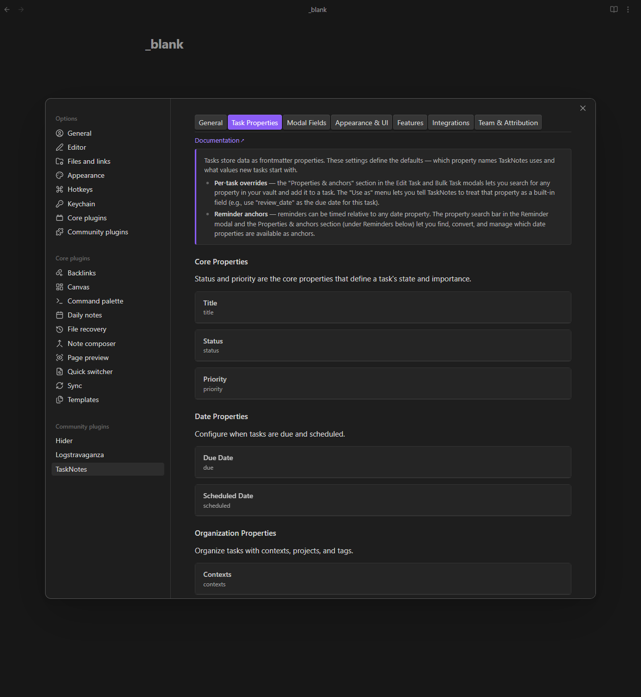

# Task Properties Settings

[← Back to Settings](../settings.md)

<!--
Recording Script
No test data setup needed — settings are static UI.

Show the task properties settings tab
Show expanding a single property card to reveal key, default value, NLP trigger, property-specific settings
-->

This tab configures all task properties. Each property is displayed as a card containing its configuration options. This tab defines the task schema used by creation flows, NLP parsing, views, and API payloads.



> [!tip] Looking for property type documentation?
> See the [Property Types Reference](property-types-reference.md) for detailed documentation on the expected data types (text, list, date, etc.) for each frontmatter property.

## Property Overview

| Property | Default Key | Type | Group |
|----------|------------|------|-------|
| Title | `title` | Text | Core |
| Status | `status` | Text (enum) | Core |
| Priority | `priority` | Text (enum) | Core |
| Due Date | `due` | Date | Date |
| Scheduled Date | `scheduled` | Date | Date |
| Contexts | `contexts` | List | Organization |
| Projects | `projects` | Link list | Organization |
| Tags | *(native)* | Tag list | Organization |
| Time Estimate | `timeEstimate` | Number | Task Details |
| Recurrence | `recurrence` | Text | Task Details |
| Reminders | `reminders` | Object list | Task Details |
| Date Created | `dateCreated` | DateTime | Metadata |
| Date Modified | `dateModified` | DateTime | Metadata |
| Completed Date | `completedDate` | DateTime | Metadata |
| Archive Tag | `archiveTag` | Text | Metadata |
| Time Entries | `timeEntries` | Object list | Metadata |
| Complete Instances | `completeInstances` | Object list | Metadata |
| Blocked By | `blockedBy` | Object list | Metadata |
| Pomodoros | `pomodoros` | Number | Feature |
| ICS Event ID | `icsEventId` | Text | Feature |
| ICS Event Tag | `icsEventTag` | Text | Feature |

## Property Card Structure

<!-- SCREENSHOT: A single property card expanded, showing the property key field, default value, NLP trigger toggle, and property-specific settings -->

Each property card contains:

- **Property key** — the frontmatter field name used to store this property
- **Default** — the default value applied to new tasks (where applicable)
- **NLP trigger** — toggle and character configuration for [natural language parsing](../features/natural-language.md) (where applicable)
- **Property-specific settings** — additional configuration options specific to that property

---

## Core Properties

??? info "Title — Task name"
    - **Property key**: `title` (default)
    - **Use title as filename**: When enabled, the filename is just the task title (e.g., `Weekly Review.md`). A zettel/timestamp suffix is only added on collision. When disabled, filenames use the configured format below.
    - **Filename format**: When "Use title as filename" is disabled, choose how filenames are generated:
        - Title-based
        - Zettelkasten-style (e.g., `260328ygzwi`)
        - Zettel + title (e.g., `260328ygzwi-Weekly Review`)
        - Timestamp-based
        - Custom template
    - **Custom template**: Define a custom filename pattern using variables (shown when "custom" format is selected)

    > **Tip:** TaskNotes custom views (TaskList, Kanban, Calendar, Upcoming) always display the `title` property regardless of filename. However, regular Bases table/list views show the filename directly. If you use both, enable **"Use title as filename"** for the cleanest experience.

??? info "Status — Task completion state"
    - **Property key**: `status` (default)
    - **Default**: Configurable default status for new tasks
    - **NLP trigger**: `*` (default)
    - **Status Values**: Individual status cards with value, label, color, icon, completed flag, auto-archive toggle and delay

    Status cards support drag-and-drop reordering.

    Each status value has:

    | Field | Description |
    |-------|-------------|
    | Value | Internal identifier stored in frontmatter (e.g., `in-progress`) |
    | Label | Display name shown in the interface (e.g., "In Progress") |
    | Color | Visual indicator color |
    | Icon | Optional icon identifier |
    | Completed | Whether this status represents a finished task |
    | Auto-archive | Automatically archive tasks after a delay (1–1440 minutes) |

    **Boolean status values**: TaskNotes supports `true`/`false` as status values, integrating with Obsidian's native checkbox property format. When you set a task's status to `"true"` or `"false"` (case-insensitive), TaskNotes automatically converts it to a boolean in frontmatter — and converts it back to a string when reading.

    ```yaml
    ---
    status: true    # Boolean checkbox in Obsidian
    ---
    ```

    Status values are stored in frontmatter; renaming them later may require migration of existing task files.

??? info "Priority — Task importance level"
    - **Property key**: `priority` (default)
    - **Default**: Configurable default priority (can be set to "No default")
    - **NLP trigger**: `!` (default, disabled by default)
    - **Priority Values**: Individual priority cards with value, label, and color

    Priority cards support drag-and-drop reordering.

    Each priority value has:

    | Field | Description |
    |-------|-------------|
    | Value | Internal identifier stored in frontmatter (e.g., `high`) |
    | Label | Display name shown in the interface (e.g., "High Priority") |
    | Color | Visual indicator color |

    Priority values are stored in frontmatter; renaming them later may require migration of existing task files.

    > **Note for Bases plugin users:** Obsidian's Bases plugin sorts priorities alphabetically by their **Value**. To control sort order, name values to sort alphabetically in the desired order:
    > - Example: `1-urgent`, `2-high`, `3-medium`, `4-normal`, `5-low`
    > - Or: `a-urgent`, `b-high`, `c-medium`, `d-normal`, `e-low`

## Date Properties

`due` tracks commitment deadlines, while `scheduled` tracks intended execution time.

??? info "Due Date — When the task must be completed"
    - **Property key**: `due` (default)
    - **Default**: None, Today, Tomorrow, or Next Week

??? info "Scheduled Date — When to work on the task"
    - **Property key**: `scheduled` (default)
    - **Default**: None, Today, Tomorrow, or Next Week

## Organization Properties

??? info "Contexts — Where or how the task can be done"
    - **Property key**: `contexts` (default)
    - **Default**: Comma-separated list of default contexts (e.g., @home, @work)
    - **NLP trigger**: `@` (default)

??? info "Projects — Project notes the task belongs to"
    - **Property key**: `projects` (default)
    - **Default projects**: Select project notes to automatically link to new tasks
    - **Use parent note as project**: Automatically link the parent note as a project during instant task conversion
    - **NLP trigger**: `+` (default)
    - **Autosuggest Filters**: Filter which notes appear in project suggestions
    - **Customize Display**: Configure project suggestion appearance (up to 3 rows)

    **Autosuggest Filters** — reduce suggestion noise in large vaults:

    | Filter | Description |
    |--------|-------------|
    | Required tags | Comma-separated; shows notes with ANY of these tags |
    | Include folders | Comma-separated folder paths; shows notes in ANY of these folders |
    | Required property key | Frontmatter property that must exist |
    | Required property value | Expected value for the property (optional) |

    A "Filters On" badge appears when any filters are configured.

    **Customize Display**:

    - **Enable fuzzy matching**: Allow typos and partial matches in project search
    - **Row 1, 2, 3**: Configure up to 3 lines of information for each project suggestion

    See [Natural Language Input — Enhanced Project Auto-suggester](../features/natural-language.md#enhanced-project-auto-suggester) for the token syntax and search behavior.

??? info "Tags — Obsidian tags for categorization"
    - **Default**: Comma-separated list of default tags (without `#`)
    - **NLP trigger**: `#` (default)

    Tags use native Obsidian tags and do not have a separate property key setting.

## Task Details

??? info "Time Estimate — Estimated completion time"
    - **Property key**: `timeEstimate` (default)
    - **Default**: Default time estimate in minutes (0 = no default)

??? info "Recurrence — Pattern for repeating tasks"
    - **Property key**: `recurrence` (default)
    - **Default**: None, Daily, Weekly, Monthly, or Yearly

    See [Recurring Tasks](../features/recurring-tasks.md) for full behavior and RRule syntax.

??? info "Reminders — Notifications before task deadlines"
    - **Property key**: `reminders` (default)
    - **Default Reminders**: Expandable section containing default reminder cards

    Each default reminder can be **relative** or **absolute**:

    **Relative reminders** (triggered relative to due or scheduled date):

    | Field | Options |
    |-------|---------|
    | Anchor date | Due date or scheduled date |
    | Offset | Amount and unit (minutes, hours, days) |
    | Direction | Before or after |
    | Description | Optional label |

    **Absolute reminders** (triggered at specific times):

    | Field | Options |
    |-------|---------|
    | Date | Specific date |
    | Time | Specific time |
    | Description | Optional label |

    See [Task Reminders](../features/reminders.md) for full setup and behavior.

## Metadata Properties

These properties are system-managed and typically only require property key configuration.

??? info "Metadata properties list"
    | Property | Default Key | Description |
    |----------|------------|-------------|
    | Date Created | `dateCreated` | When the task was created |
    | Date Modified | `dateModified` | When the task was last modified |
    | Completed Date | `completedDate` | When the task was completed |
    | Archive Tag | `archiveTag` | Tag used to mark archived tasks |
    | Time Entries | `timeEntries` | Time tracking entries for the task |
    | Complete Instances | `completeInstances` | Completion history for recurring tasks |
    | Blocked By | `blockedBy` | Tasks that must be completed first |

## Feature Properties

These properties are used by specific TaskNotes features and are not stored in task frontmatter.

??? info "Feature properties list"
    | Property | Default Key | Description |
    |----------|------------|-------------|
    | Pomodoros | `pomodoros` | Pomodoro session counts. When storage is set to "Daily notes", written to daily notes instead of task files. |
    | ICS Event ID | `icsEventId` | Calendar event identifier. Added to notes created from ICS calendar events. |
    | ICS Event Tag | `icsEventTag` | Calendar event tag. Added to notes created from ICS events for identification. |

## Custom Properties

Define custom frontmatter properties that integrate across the entire plugin — task modals, autocomplete, NLP recognition, task creation defaults, bulk operations, and [Modal Fields](modal-fields.md) configuration. Registering a property here wires it into the full task lifecycle. See [Custom Properties](../features/custom-properties.md) for the complete picture of where registered properties appear.

Custom fields are most maintainable when they map to repeated workflow decisions (for example `effort`, `owner`, or `client`).

??? info "Custom property configuration"
    Each custom field has:

    - **Display Name**: How the field appears in the UI
    - **Property Key**: The frontmatter property name
    - **Type**: Data type (text, number, boolean, date, or list)
    - **Default Value**: Pre-fill value for new tasks (format varies by type)
    - **NLP trigger**: Toggle and character for natural language parsing
    - **Autosuggest Filters**: Filter which files appear when using `[[` wikilink autocomplete

    **Default values** by type:

    | Type | Input format |
    |------|-------------|
    | Text | Default text value |
    | Number | Default number |
    | Boolean | Toggle for default checked/unchecked |
    | Date | Preset: None, Today, Tomorrow, Next Week |
    | List | Comma-separated default values |

    Defaults are applied when creating tasks via the modal, instant conversion, "Create or open task" command, or HTTP API.

    **Autosuggestion filters** — control which files appear in wikilink suggestions:

    | Filter | Description |
    |--------|-------------|
    | Required tags | Comma-separated; shows files with ANY of these tags |
    | Include folders | Comma-separated folder paths; shows files in ANY of these folders |
    | Required property key | Frontmatter property that must exist |
    | Required property value | Expected value for the property (optional) |

    A "Filters On" badge appears when filters are configured.

    See [Custom Properties — File Suggestion Filtering](../features/custom-properties.md#file-suggestion-filtering-advanced) for detailed examples.

## Related

- [Custom Properties](../features/custom-properties.md) — Register custom fields with full plugin integration
- [Property Mapping](../features/property-mapping.md) — Remap property names to core fields
- [Modal Fields](modal-fields.md) — Configure field visibility and ordering in task modals
- [Property Types Reference](property-types-reference.md) — Expected data types for each property
- [Natural Language Input](../features/natural-language.md) — NLP triggers and auto-suggestions
