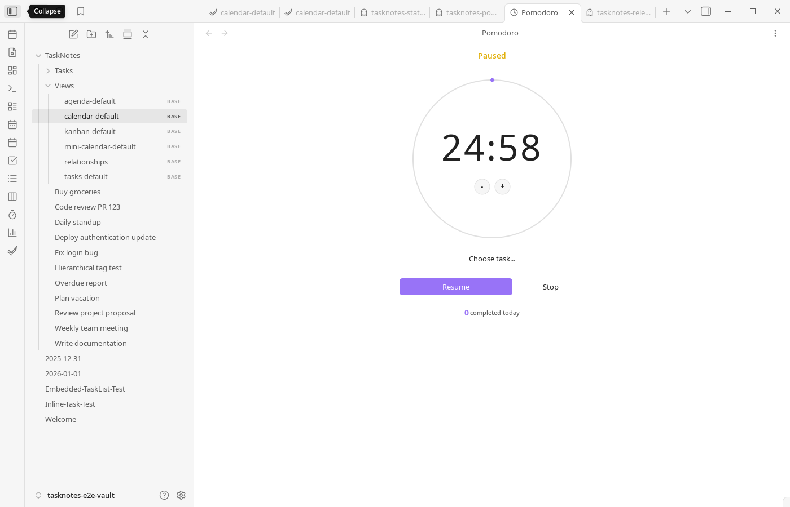

# Views

<!--
Recording Script
SETUP:
  cd .obsidian/plugins/tasknotes
  node scripts/generate-test-data.mjs --clean   # or: bun run generate-test-data:clean
  Reload plugin in Obsidian

Show the same set of tasks across task list, kanban, and calendar views side-by-side or in sequence
Show switching between views by opening different .base files
-->

TaskNotes provides multiple views for managing tasks and tracking productivity. All task-focused views operate as `.base` files located in the `TaskNotes/Views/` directory and require Obsidian's Bases core plugin to be enabled.

For details on Bases integration and how to enable it, see [Core Concepts](core-concepts.md#bases-integration). For view templates and configuration examples, see [Default Base Templates](views/default-base-templates.md).

<!-- TODO: Embed the quick tour video/GIF here — user has already recorded one -->
<!-- SCREENSHOT: Side-by-side comparison showing the same tasks in Task List, Kanban, and Calendar views -->

## Task-Focused Views

Task-focused views are different entry points into the same underlying task notes. The [Task List View](views/task-list.md) is a common starting view for day-to-day planning because it exposes filters, sorting, and grouping in list format.

When you want workflow by status, [Kanban View](views/kanban-view.md) organizes cards into columns and can optionally add swimlanes for an extra organizational layer. [Calendar Views](views/calendar-views.md) are useful when schedule and timing matter more than backlog shape, with month/week/day/year/list modes plus drag-and-drop scheduling and time-block support.

[Upcoming View](views/upcoming-view.md) groups tasks by when they are due -- overdue, today, tomorrow, this week, this month, and later -- in a single scrollable list with period navigation.

[Agenda View](views/agenda-view.md) is a preconfigured list-oriented calendar layout designed for short-horizon planning, while [MiniCalendar View](views/calendar-views.md#mini-calendar-view) gives a compact month heatmap and fast keyboard navigation.

## Productivity-Focused Views

These views support time management and work tracking.

[Pomodoro View](views/pomodoro-view.md) supports focused intervals directly inside Obsidian, and [Pomodoro Stats View](views/pomodoro-view.md#pomodoro-stats-view) summarizes completed sessions so you can see pace and consistency over time.

