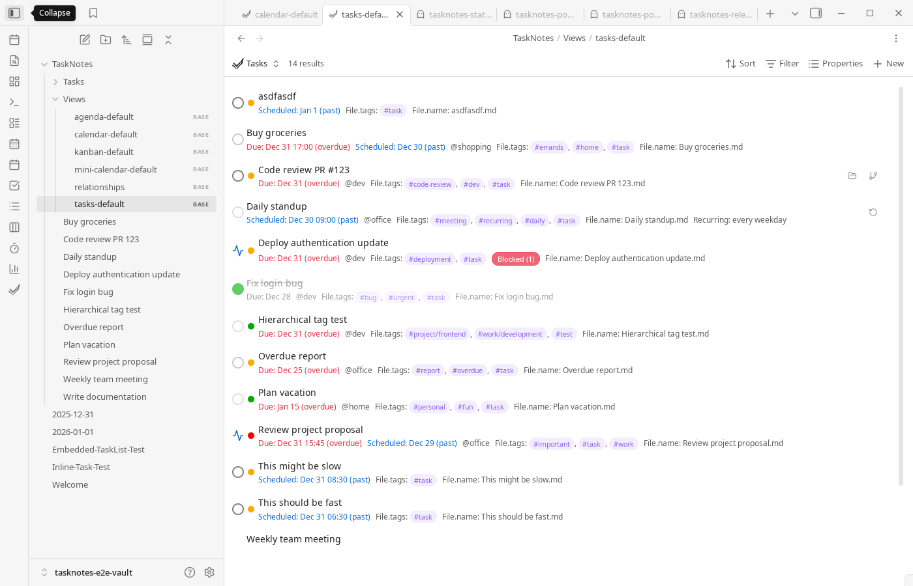
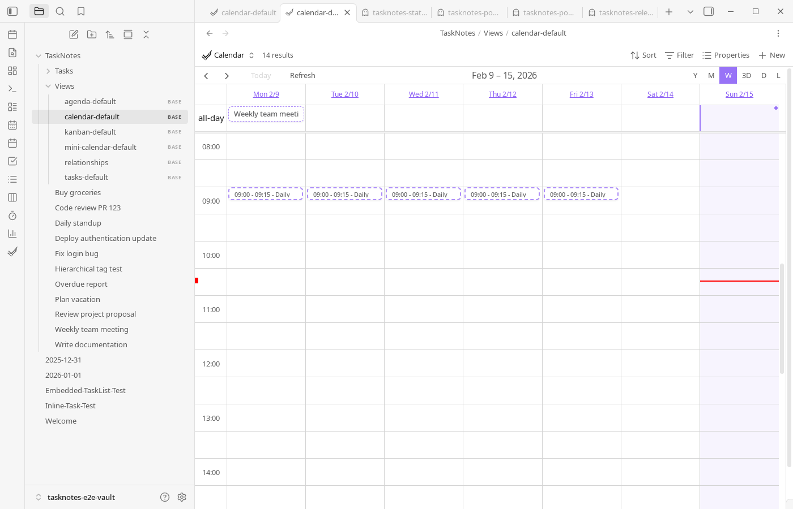
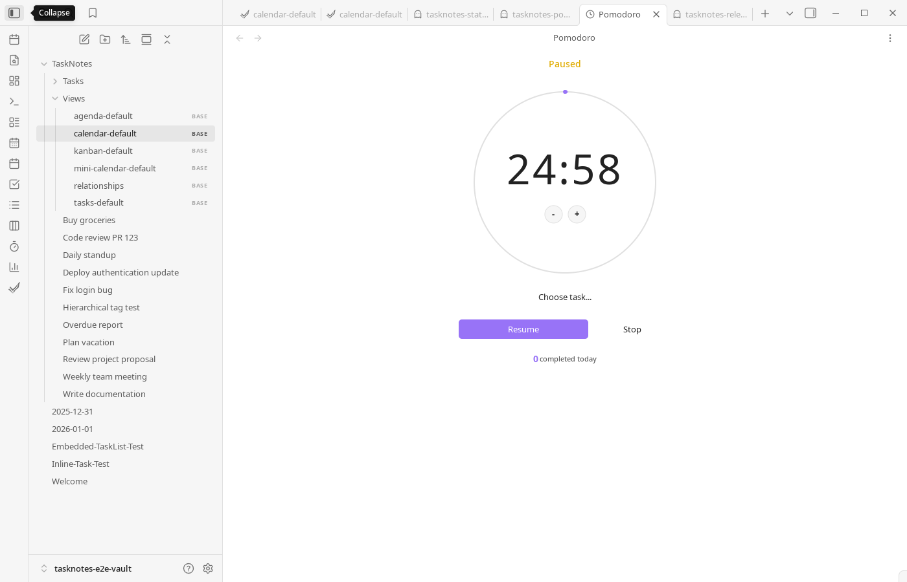

# Views

TaskNotes provides multiple views for managing tasks and tracking productivity. All task-focused views operate as `.base` files located in the `TaskNotes/Views/` directory and require Obsidian's Bases core plugin to be enabled.

For details on Bases integration and how to enable it, see [Core Concepts](core-concepts.md#bases-integration). For view templates and configuration examples, see [Default Base Templates](views/default-base-templates.md).

## Task-Focused Views

Task-focused views are different entry points into the same underlying task notes. The [Task List View](views/task-list.md) is a common starting view for day-to-day planning because it exposes filters, sorting, and grouping in list format.

Newly generated task Bases open on **Today**. Use **TaskNotes: Open Today** or **TaskNotes: Open Inbox** to select those views in the configured tasks Base. Inbox contains incomplete tasks without a project, due date, or scheduled date. Clear the scheduled date when capturing undated tasks.

Active generated views exclude tasks carrying your mapped archive tag. **Archived** shows archive history, while **All Tasks** retains the complete list. Existing Base files are not rewritten on startup. Use **Update default base files** only when you want to replace the configured templates, and copy customized files first.

New installs show Create task, Tasks, and Calendar in the ribbon. Right-click Obsidian's ribbon to enable Mini calendar, Agenda, Kanban, or Pomodoro. Existing ribbon visibility is retained.

When you want workflow by status, [Kanban View](views/kanban-view.md) organizes cards into columns and can optionally add swimlanes for an extra organizational layer. [Calendar Views](views/calendar-views.md) are useful when schedule and timing matter more than backlog shape, with month/week/day/year/list modes plus drag-and-drop scheduling and time-block support.

[Agenda View](views/agenda-view.md) is a preconfigured list-oriented calendar layout designed for short-horizon planning, while [MiniCalendar View](views/calendar-views.md#mini-calendar-view) gives a compact month heatmap and fast keyboard navigation.

## Productivity-Focused Views

These views support time management and work tracking.

[Pomodoro View](views/pomodoro-view.md) supports focused intervals directly inside Obsidian. Task time tracking and session history remain available; version 5 removes the separate Statistics and Pomodoro statistics dashboards.

Screenshots in this section are captured via the Playwright docs suite (`npm run e2e:docs`).
