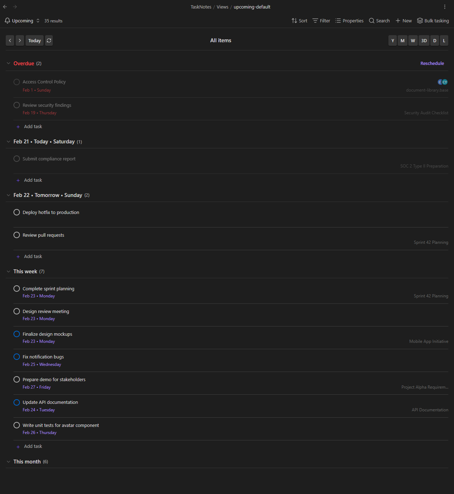
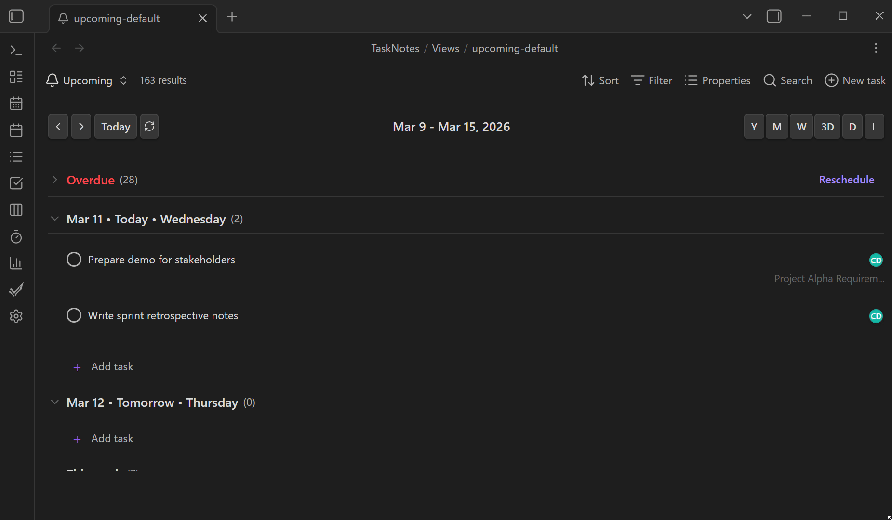
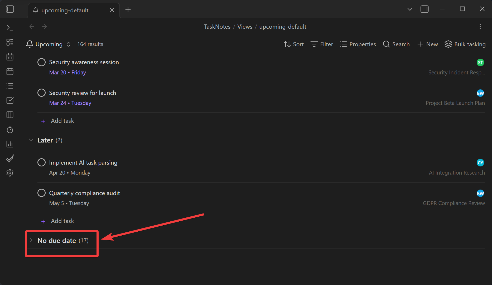
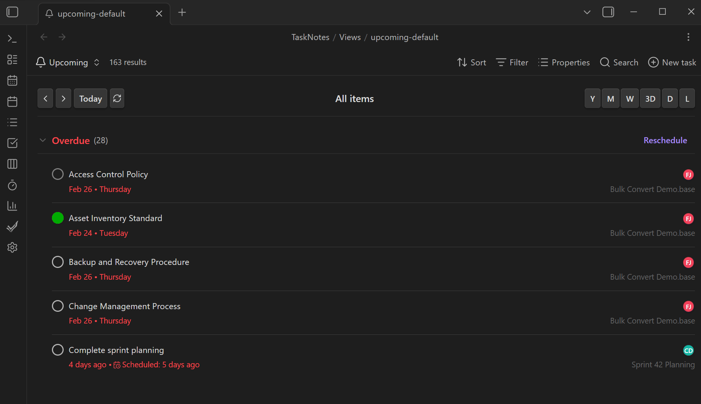
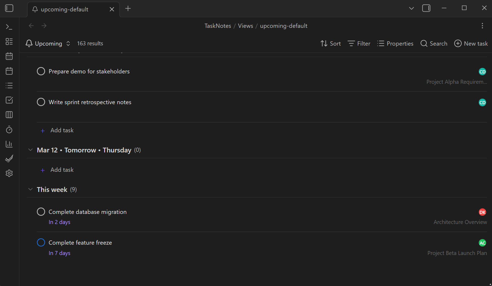

# Upcoming View

[← Back to Views](../views.md)

<!--
Recording Script
SETUP (need tasks spread across overdue/today/tomorrow/later):
  cd .obsidian/plugins/tasknotes
  node scripts/generate-test-data.mjs --clean   # or: bun run generate-test-data:clean
  Reload plugin in Obsidian

Show scrolling through Upcoming View: overdue (red) → today (green) → tomorrow → this week → later
Show clicking period selectors (D, 3D, W, M) and watching the view update
Show clicking "Add task" in the Tomorrow section → due date pre-filled
Show right-clicking a task → context menu → reschedule
Show overdue section header with red styling
Show "No Due Date" section collapsed by default

CLEANUP (rescheduling/adding tasks modifies files):
  cd .obsidian/plugins/tasknotes
  node scripts/generate-test-data.mjs --clean   # or: bun run generate-test-data:clean
-->

The Upcoming View groups your tasks by when they are due and lays them out in a single, scrollable list. Overdue items sit at the top in red. Today and tomorrow follow. Further out, tasks fall into This Week, This Month, Later, and a collapsible No Due Date section. Navigate through time with period selectors or jump straight to today.

<!-- SCREENSHOT: Upcoming View showing tasks grouped by time category with color-coded section headers -->



<!-- GIF: Scrolling through the Upcoming View showing overdue, today, tomorrow, and later sections -->



## How to Open It

Open the Upcoming View from the command palette with **TaskNotes: Open upcoming view**.

Like all TaskNotes views, it is a `.base` file. You can duplicate it, add your own filters, or embed it in a workspace layout. The view type is `tasknotesUpcoming`:

```yaml
views:
  - type: tasknotesUpcoming
    name: Upcoming
```

## Time Categories

Tasks are sorted into categories based on their due date relative to today:

<!-- SCREENSHOT: Overdue section header with red styling and item count -->


<!-- SCREENSHOT: Today section header with green styling -->
<!-- SCREENSHOT: No Due Date section collapsed by default -->



| Category | When | Color |
|----------|------|-------|
| Overdue | Due before today | Red |
| Today | Due today | Green |
| Tomorrow | Due tomorrow | Orange |
| This Week | Due within 7 days | Default |
| This Month | Due within 30 days | Default |
| Later | Due more than 30 days out | Default |
| No Due Date | No due date set | Default (collapsed by default) |

Within each category, items are sorted alphabetically by title. Overdue items always appear regardless of the selected period.

Each section header shows the category name, an icon, and a count of items. Click the header to collapse or expand the section.

## Navigation

A navigation bar at the top of the view lets you move through time and choose how much to show at once.

**Left side:**

- **< >** arrows step forward and backward by one period
- **Today** jumps back to the current date
- **Refresh** re-runs the view query

**Center:** Shows the current date range (e.g., "Jan 20 - Jan 26, 2026" for a week view).

<!-- GIF: Clicking through period selectors (D, 3D, W, M) and watching the view update -->



**Right side -- period selectors:**

| Button | Period                                            | Shows                                     |
| ------ | ------------------------------------------------- | ----------------------------------------- |
| **Y**  | Year                                              | All tasks due this calendar year          |
| **M**  | Month                                             | All tasks due this calendar month         |
| **W**  | Week                                              | Monday through Sunday of the current week |
| **3D** | 3 Days                                            | Today plus the next two days              |
| **D**  | Day                                               | Just today (plus overdue)                 |
| **L**  | List (default)                                    | Everything, no date range filter          |

Your period selection is saved per device and remembered across sessions. In List mode the arrow buttons are disabled since everything is already shown.

## Adding Tasks

<!-- GIF: Clicking "Add task" in the Tomorrow section and seeing the due date pre-filled -->



Each time category section has an **Add task** button. Clicking it opens the task creation modal with the due date pre-filled based on which section you clicked. For example, clicking "Add task" in the Tomorrow section sets the due date to tomorrow.

## Context Menus

<!-- GIF: Right-clicking a task and using the context menu to reschedule it -->

> [!note] Context menus are available in all TaskNotes views (Task List, Kanban, Calendar, Upcoming). See [Task Management — Context Menus](../features/task-management.md) for the full reference.

Right-click any item in the view to open a context menu:

- **Tasks** get the full task context menu: Edit, Complete, Reschedule, Open note, Archive, Delete, and more
- **Non-task items** get basic options: Open note and Convert to task

The context menu supports bulk reschedule. Select the reschedule option on a task and pick a new date using the date picker, which offers both specific dates and relative options (Today, Tomorrow, Next week, etc.).

## Date Display

Each item shows its due date next to the title. The display format is configurable:

| Format | Example |
|--------|---------|
| US | Jan 31, 2026 |
| EU | 31 Jan 2026 |
| ISO | 2026-01-31 |
| Relative | "Due in 3 days", "Yesterday" |
| Rich | Jan 31 with day name |
| Custom | Any date-fns pattern (e.g., `MMM d, yyyy`) |

When **relative dates** are enabled (the default), dates within the threshold (default: 7 days) show as "Due today", "Due tomorrow", "3 days ago", etc. Dates outside the threshold fall back to the selected format.

If a task has a time component in its due date (e.g., `2026-01-31T14:00`), the time is shown alongside the date with a clock icon.

## Collapsible Sections

Click any section header to collapse or expand it. The **No Due Date** section is collapsed by default since those items have no time urgency.

Collapse state is maintained during the current session but resets when you close and reopen the view.

## What Appears in the View

The Upcoming View only shows items that meet at least one of these criteria:

- The file is identified as a task (based on your task identification settings)
- The file has a due date set

This prevents random notes from cluttering the view even if the `.base` file's filters are broad.

Each item displays:

- **Title** (from frontmatter or filename)
- **Due date** (formatted per your settings)
- **Status** indicator
- **Project** name (extracted from the `projects` field, shown as a subtle label)
- **Assignee avatars** (colored initials, shown if assignees are set)

## Settings

These settings are in **Settings > General > Upcoming View**:

| Setting | Default | Description |
|---------|---------|-------------|
| Date format | US | How dates are displayed (US, EU, ISO, Relative, Rich, Custom) |
| Custom date format | `MMM d, yyyy` | date-fns pattern used when format is set to Custom |
| Relative dates | On | Show "Due today", "Due in 3 days" etc. for nearby dates |
| Relative date threshold | 7 | Number of days within which relative dates are shown |

You can also override the date format and relative dates setting per view by adding `dateFormat` and `useRelativeDates` to the view configuration in the `.base` file:

```yaml
views:
  - type: tasknotesUpcoming
    name: Upcoming
    dateFormat: iso
    useRelativeDates: false
```

## Related

- [Task Management](../features/task-management.md) for task properties that drive the view
- [Reminders](../features/reminders.md) for per-task date reminders
- [View Notifications](../features/bases-notifications.md) for the notification system (experimental)
