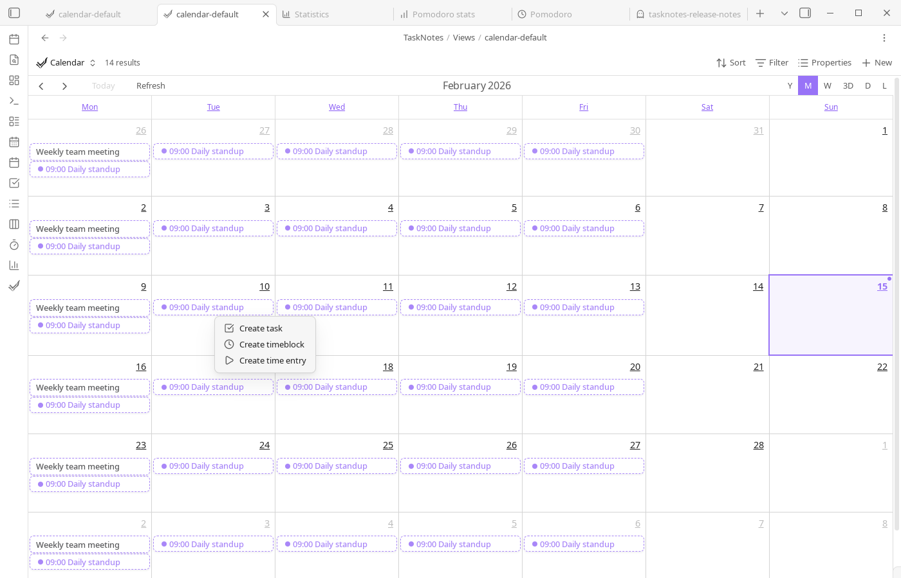

# Workflows

<!--
Recording Script
SETUP (run before each video section):
  cd .obsidian/plugins/tasknotes
  node scripts/generate-test-data.mjs --clean   # or: bun run generate-test-data:clean
  Reload plugin in Obsidian

Each section gets its own video — see VIDEO placeholders below
Full walkthrough: setup from scratch → first task → view → complete
Habit tracking: recurring task → calendar → completion pattern
Project management: project notes → task linking → project view
Daily execution: morning in Upcoming → schedule in Calendar → complete → Agenda review
Weekly review: clean up completed → check recurring → rebalance projects
Bulk from meetings: meeting notes → select action items → bulk generate → project view
Shared vault: two devices → register identities → auto-attribution → filtered notifications
Notifications: enable notify → toast appears → click through → resolve

CLEANUP (after each video):
  node scripts/generate-test-data.mjs --clean   # or: bun run generate-test-data:clean
-->

This page describes practical ways to combine TaskNotes features into repeatable workflows. The goal is to show how recurring tasks, projects, filtering, and scheduling fit together in everyday use.

<!-- VIDEO: Full walkthrough of setting up TaskNotes from scratch -- creating first task, opening a view, completing a task -->

## Habit Tracking with Recurring Tasks

<!-- VIDEO: Creating a recurring task with natural language, marking completions in the calendar, reviewing completion patterns -->

Habit tracking in TaskNotes is built on recurring task notes. You can create a recurring task from natural language (for example, "Exercise daily" or "Gym every Monday and Wednesday") or configure recurrence explicitly in the task modal. The modal recurrence controls support frequency, interval, weekday selection, and end conditions.

Once a task has a recurrence rule, its edit modal shows a recurrence calendar. That calendar is where you mark completion per occurrence. Completion history is stored in `complete_instances`, so a recurring task can remain open while still recording daily/weekly completion behavior.


```yaml
title: Morning Exercise
recurrence: "FREQ=DAILY"
scheduled: "07:00"
complete_instances:
  - "2025-01-01"
  - "2025-01-02"
  - "2025-01-04"
```

Use Calendar and Agenda views to review upcoming occurrences, and use recurring-task filters when you want a habit-only planning view.

## Project-Centered Planning

<!-- VIDEO: Setting up a project view -- creating project notes, linking tasks, filtering by project, saving the view -->

Projects in TaskNotes can be plain text values or wikilinks to project notes. Wikilinks are usually the better long-term option because they connect task execution to project context, backlinks, and graph navigation.

```yaml
title: "Research competitors"
projects: ["[[Market Research]]", "[[Q1 Strategy]]"]
```

During task creation, use the project picker to search and assign one or more projects. In day-to-day planning, open Task List or Kanban, then filter on `note.projects contains [[Project Name]]` to isolate one initiative. Save that filter as a Bases saved view if you revisit it regularly.


When work spans initiatives, assign multiple projects and combine with contexts or tags for secondary organization.

```yaml
title: "Prepare presentation slides"
projects: ["[[Q4 Planning]]"]
contexts: ["@computer", "@office"]
tags: ["#review"]
```

## Execution Workflow (Daily)

<!-- VIDEO: A day in TaskNotes -- morning review in Upcoming View, scheduling in Calendar, completing tasks, ending with the Agenda -->

A typical daily flow is to start in Task List for prioritization, move to Calendar for schedule placement, and finish in Agenda for near-term sequencing. This keeps backlog management, time allocation, and short-horizon execution in one system.

If you use timeboxing, drag-select on calendar timeline views and create timeblocks directly from the context menu. If you use Pomodoro, run sessions against active tasks so completion and timing data stay attached to task notes.



## Maintenance Workflow (Weekly)

<!-- VIDEO: Weekly review workflow -- cleaning up completed tasks, checking recurring patterns, rebalancing project views -->

A weekly review usually includes three steps: clean up completed/archived tasks, verify recurring-task completion patterns, and rebalance project filters/views. If calendar integrations are enabled, this is also a good point to refresh subscriptions and confirm sync health.

For teams or complex personal systems, keep project notes as source-of-truth documents and use TaskNotes views as execution dashboards derived from those notes.

## Bulk Tasking from Meeting Notes

<!-- VIDEO: Writing meeting notes, selecting action items, bulk-generating linked tasks, then viewing them in the project's Bases view -->

After a meeting, you often have a note full of action items. Rather than creating tasks one by one, open the meeting note in a Bases view (or right-click it in the file explorer) and use **Bulk tasking**. Generate mode creates a task file for each item and links it back to the meeting note via the `projects` field. Set a due date and assignee in the action bar and they apply to every generated task at once.

If the meeting note itself should become a task, use Convert mode instead. It adds task metadata to the note in place without creating a separate file.

## Team Workflow in a Shared Vault

<!-- VIDEO: Two devices opening the same vault -- registering identities, creating tasks with auto-attribution, filtering notifications by assignee -->

In a shared vault, each person registers their device to a person note once. After that, TaskNotes auto-attributes every task you create. The person/group picker makes assignment fast -- start typing a name or group, select it, and move on.

Enable "Only notify for my tasks" so each person only sees notifications for tasks assigned to them or their groups. Notifications filter silently -- you do not see a dismissal for other people's tasks, they simply do not appear.

## Notification-Driven Triage

<!-- VIDEO: Setting up notify: true on a "Needs Review" view, seeing the toast appear, clicking through to the Upcoming View, and resolving items -->

Create a Bases view filtered to tasks that need attention -- overdue items, tasks without assignees, or items flagged for review. Add `notify: true` to the view's YAML. TaskNotes watches the query in the background and surfaces a toast when items match. Click the toast to open the Upcoming View where everything is organized by urgency.

Combine with snooze to avoid notification fatigue. Snooze the toast for 4 hours during deep work, and it reappears when you are ready to triage again.
