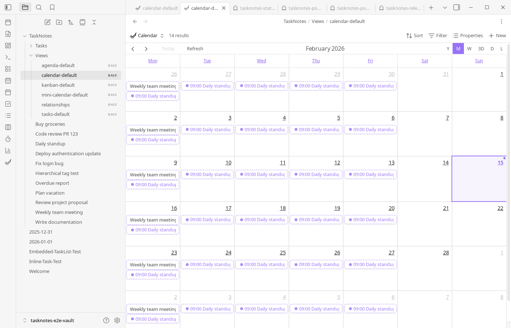

# Workflows

<!--
Recording Script
SETUP (run before each video section):
  cd .obsidian/plugins/tasknotes
  node scripts/generate-test-data.mjs --clean   # or: bun run generate-test-data:clean
  Reload plugin in Obsidian

Each section gets its own video — see VIDEO placeholders below
Full walkthrough: setup from scratch → first task → view → complete
Habit tracking: recurring task → calendar → completion pattern
Project management: project notes → task linking → project view
Daily execution: morning in Upcoming → schedule in Calendar → complete → Agenda review
Weekly review: clean up completed → check recurring → rebalance projects
Bulk from meetings: meeting notes → select action items → bulk generate → project view
Shared vault: two devices → register identities → auto-attribution → filtered notifications
Notifications: enable notify → toast appears → click through → resolve

CLEANUP (after each video):
  node scripts/generate-test-data.mjs --clean   # or: bun run generate-test-data:clean
-->

TaskNotes sits at the intersection of two disciplines: **knowledge management** and **task management**. Your vault already holds notes, documents, and ideas. TaskNotes adds structured action on top — status, scheduling, assignments, dependencies — without moving anything out of Markdown.

All productive work with information follows a cycle: **sense** the state of things, **decide** what to do, **act** on those decisions, and **integrate** the results back. Different kinds of work enter that cycle at different points. The four modes below describe those entry points. They are lenses, not silos — real work blends them, and TaskNotes supports that blending because the same [Bases view engine](views.md) serves all four.

## The Four Modes of Knowledge Work

| Mode | What drives the work | Primary views | Key features |
|------|---------------------|---------------|--------------|
| [Records & Registers](#records--registers) | State of knowledge artifacts | Bases tables, Document Library views | [Bulk Generate](features/bulk-tasking.md), [recurring tasks](features/recurring-tasks.md), [per-view mapping](features/per-base-mapping.md) |
| [Capture & Execute](#capture--execute) | Incoming items from any source | [Upcoming](views/upcoming-view.md), [Agenda](views/agenda-view.md), [Task List](views/task-list.md) | NLP capture, [inline conversion](features/inline-tasks.md), quick add |
| [Orchestration](#orchestration) | Relationships between tasks and people | [Kanban](views/kanban-view.md), [Calendar](views/calendar-views.md), project views | [Projects](features/task-management.md#projects), [dependencies](features/task-management.md#dependencies), [team assignment](features/shared-vault.md) |
| [Rhythm](#rhythm) | Recurring time cycles | [Calendar](views/calendar-views.md), [Upcoming](views/upcoming-view.md), [Pomodoro](views/pomodoro-view.md) | [Recurring tasks](features/recurring-tasks.md), completion tracking, habits |

<!-- VIDEO: Quick overview of all four modes — show one view per mode in rapid succession -->

## Records & Registers

> Maintaining a body of knowledge that drives its own task list.

In records management and archival science, a **register** is a structured inventory of items that require ongoing attention — a control library, document collection, asset inventory, or policy corpus. The items themselves are the knowledge. Tasks are *derived from* their state: "this document is due for review," "this control hasn't been tested," "this policy expires next month."

TaskNotes supports this pattern directly. A Bases view can act as a register — a structured table (like a spreadsheet) that filters documents by metadata and surfaces the ones that need action. [Bulk Generate](features/bulk-tasking.md) creates task files from those items. [Recurring tasks](features/recurring-tasks.md) enforce review cycles. [Per-view property mapping](features/per-base-mapping.md) lets each register use domain-appropriate field names (`review_date` instead of `due`, `control_owner` instead of `assignee`).

The register pattern is common in compliance, audit, documentation management, asset tracking, content calendars, and any context where a corpus of knowledge needs periodic maintenance.

### Example: Compliance Control Library

A security team maintains a folder of control documents (e.g., `Controls/AC-01 Access Control.md`, `Controls/IR-03 Incident Response.md`). Each document has frontmatter properties like `review_date`, `review_cycle`, and `control_owner`. A Bases view filters to controls where the review date has passed, surfaces them as a register, and the team uses Bulk Generate to create review tasks linked back to each control.

```yaml
# Example control document frontmatter
title: "AC-01 Access Control Policy"
review_date: 2025-12-15
review_cycle: quarterly
control_owner: "[[Alice Chen]]"
status: active
department: security
```

### TaskNotes Features Used

- [Bases views](views.md) as structured registers with filters, sorting, and grouping
- [Bulk Generate](features/bulk-tasking.md) to create task files from document metadata
- [Per-view property mapping](features/per-base-mapping.md) for domain-specific field names
- [Recurring tasks](features/recurring-tasks.md) for cyclical review requirements
- [Custom Properties](features/custom-properties.md) for domain-specific metadata (`review_cycle`, `department`)

### Try It

Open `TaskNotes/Demos/Records & Registers Demo.base` in the test fixtures to see a control library register with overdue and upcoming reviews.

<!-- VIDEO: Records & Registers workflow — browsing a control library register, filtering overdue reviews, bulk-generating review tasks -->

## Capture & Execute

> Fast capture from any source, then consolidation into focused workspaces.

Personal knowledge management (PKM) and GTD share a core insight: **capture must be frictionless**. Action items emerge continuously — from meetings, reading, conversations, sudden ideas — and if the capture step is slow, items get lost. The work happens later, in a dedicated review session where you triage, prioritize, and schedule.

TaskNotes supports this with multiple capture paths. The [command palette](features/task-management.md#creating-and-editing-tasks) opens a task creation modal from anywhere. [Natural language parsing](nlp-api.md) extracts dates, priorities, and contexts from plain text ("Buy groceries tomorrow at 3pm high priority"). [Inline task conversion](features/inline-tasks.md) turns any checkbox, bullet point, or text line into a tracked task file without leaving the current note. All captured tasks route to `TaskNotes/Tasks/` (or your configured folder), keeping your knowledge notes clean.

The execution side uses views as workbenches. The [Upcoming View](views/upcoming-view.md) groups tasks by when they are due — overdue, today, this week, later. The [Agenda View](views/agenda-view.md) focuses on the next few hours. The [Task List](views/task-list.md) is the inbox for triage: filter, sort, assign projects, set priorities.

### Example: Daily Task Management

You start the day in Upcoming View to see what is overdue and what is due today. You drag a few tasks into the Calendar to timebox your afternoon. During a meeting, you jot checkboxes in your meeting note, then use inline conversion to turn them into tracked tasks. At end of day, you check the Agenda to see what is left.

### TaskNotes Features Used

- [Task creation modal](features/task-management.md#creating-and-editing-tasks) with NLP parsing
- [Inline task conversion](features/inline-tasks.md) for checkboxes and text lines
- [Upcoming View](views/upcoming-view.md) for daily prioritization
- [Agenda View](views/agenda-view.md) for short-horizon execution
- [Calendar views](views/calendar-views.md) for schedule placement
- [Pomodoro View](views/pomodoro-view.md) for focused intervals

### Try It

Open `TaskNotes/Demos/Capture Workflow Demo.base` to see an inbox-style view of recently captured tasks ready for triage.

<!-- VIDEO: Capture & Execute workflow — quick-add from command palette, inline conversion from meeting note, triage in Upcoming, schedule in Calendar -->

## Orchestration

> Coordinating structured efforts across tasks, people, and timelines.

Project management theory and work breakdown structures describe work that has **inherent structure** — projects contain subtasks, tasks block other tasks, people own deliverables, milestones gate progress. In this mode, the relationships between tasks matter as much as the tasks themselves.

TaskNotes models these relationships directly. [Projects](features/task-management.md#projects) are wikilinks to notes, so project context lives alongside task execution. [Dependencies](features/task-management.md#dependencies) use `blockedBy`/`blocking` with RFC 9253 semantics. In a [shared vault](features/shared-vault.md), tasks are attributed to people and groups, and [notifications](features/bases-notifications.md) filter to show only your assignments.

[Kanban View](views/kanban-view.md) organizes cards by status for workflow visualization. [Calendar views](views/calendar-views.md) show timeline and scheduling. Project-filtered Task Lists let you isolate one initiative. Combine these views for full project visibility.

### Example: Cross-Team Project

A product launch involves design, engineering, and marketing. Each team's tasks are assigned to team members and linked to a `[[Product Launch Q2]]` project note. A Kanban board filtered to this project shows status flow. A Calendar view shows the timeline. The project lead uses notification-driven triage to catch blocked or overdue items.

```yaml
title: "Finalize launch assets"
projects: ["[[Product Launch Q2]]"]
assignee: "[[Jamie Torres]]"
blockedBy:
  - uid: "[[Design brand guidelines]]"
    reltype: FINISHTOSTART
status: in-progress
priority: high
due: 2025-03-15
```

### TaskNotes Features Used

- [Projects](features/task-management.md#projects) as wikilinks with backlink navigation
- [Dependencies](features/task-management.md#dependencies) for prerequisite tracking
- [Team & Attribution](features/shared-vault.md) for multi-person coordination
- [Kanban View](views/kanban-view.md) for status flow
- [Calendar views](views/calendar-views.md) for timeline management
- [View Notifications](features/bases-notifications.md) (experimental) for triage alerts

### Try It

Open `TaskNotes/Demos/Orchestration Demo.base` for a project-filtered Kanban with dependencies and team assignments. See also `TaskNotes/Demos/Project Dependencies Demo.base` and `TaskNotes/Demos/Shared Vault Demo.base`.

<!-- VIDEO: Orchestration workflow — project Kanban, adding dependencies, team assignment, notification triage -->

## Rhythm

> Recurring patterns of attention that structure time and build consistency.

Some work is neither project-shaped nor register-shaped — it is **cyclical**. Daily reviews, weekly planning, habit tracking, periodic check-ins. The pattern itself is the product. What matters is consistency over time and visibility into streaks, gaps, and trends.

TaskNotes models this with [recurring tasks](features/recurring-tasks.md) using RFC 5545 RRule syntax. A recurring task stays open while recording completion per occurrence in `complete_instances`. Calendar views show completion patterns visually. The [Upcoming View](views/upcoming-view.md) structures your day around what recurs. [Pomodoro View](views/pomodoro-view.md) supports focused intervals with break handling and session tracking.

### Example: Habit Tracking and Weekly Reviews

You create "Morning Exercise" as a daily recurring task and "Weekly Review" as a weekly one. Each day, you mark completion in the task's recurrence calendar. Over time, the Calendar view shows your streak — green dots for completed days, gaps for missed ones. The weekly review task prompts you to clean up completed work, check recurring patterns, and rebalance priorities.

```yaml
title: Morning Exercise
recurrence: "FREQ=DAILY"
scheduled: "07:00"
complete_instances:
  - "2025-01-01"
  - "2025-01-02"
  - "2025-01-04"
```

### TaskNotes Features Used

- [Recurring tasks](features/recurring-tasks.md) with RRule patterns
- `complete_instances` for streak and completion tracking
- [Calendar views](views/calendar-views.md) for pattern visualization
- [Upcoming View](views/upcoming-view.md) for daily cadence
- [Pomodoro View](views/pomodoro-view.md) for focused intervals

### Try It

Open `TaskNotes/Demos/Rhythm Demo.base` to see recurring tasks with completion history and streak visualization. See also `TaskNotes/Demos/Recurring Tasks Demo.base`.

<!-- VIDEO: Rhythm workflow — recurring tasks in calendar, marking completions, reviewing streak patterns, Pomodoro focus session -->

## Combining Modes

Real work blends modes. A compliance program uses **Records & Registers** to maintain the control library, **Orchestration** to coordinate audit tasks across a team, and **Rhythm** for quarterly review cycles. A freelancer uses **Capture & Execute** for daily client requests, **Orchestration** for multi-deliverable projects, and **Rhythm** for weekly invoicing.

The reason TaskNotes can serve all of these is architectural: every [Bases view](views.md) is a workspace that can filter, create tasks, run bulk operations, trigger notifications, and map properties. The same engine handles compliance registers, personal inboxes, project boards, and habit trackers — because the underlying operations (filter → act → track) are universal.

When you find yourself combining modes, create separate views for each concern. A project might have a Kanban for orchestration, a register for document tracking, and a recurring task for weekly status updates. Each view queries the same underlying task notes but presents them through a different lens.

---

## Practical Walkthroughs

The sections above describe *why* each mode works. The walkthroughs below show *how* — step-by-step guides for common scenarios. Each walkthrough is tagged with the mode(s) it demonstrates.

<!-- VIDEO: Full walkthrough of setting up TaskNotes from scratch -- creating first task, opening a view, completing a task -->

### Habit Tracking with Recurring Tasks

> Mode: **Rhythm**

<!-- VIDEO: Creating a recurring task with natural language, marking completions in the calendar, reviewing completion patterns -->

Habit tracking in TaskNotes is built on recurring task notes. You can create a recurring task from natural language (for example, "Exercise daily" or "Gym every Monday and Wednesday") or configure recurrence explicitly in the task modal. The modal recurrence controls support frequency, interval, weekday selection, and end conditions.

Once a task has a recurrence rule, its edit modal shows a recurrence calendar. That calendar is where you mark completion per occurrence. Completion history is stored in `complete_instances`, so a recurring task can remain open while still recording daily/weekly completion behavior.



```yaml
title: Morning Exercise
recurrence: "FREQ=DAILY"
scheduled: "07:00"
complete_instances:
  - "2025-01-01"
  - "2025-01-02"
  - "2025-01-04"
```

Use Calendar and Agenda views to review upcoming occurrences, and use recurring-task filters when you want a habit-only planning view.

### Project-Centered Planning

> Mode: **Orchestration**

<!-- VIDEO: Setting up a project view -- creating project notes, linking tasks, filtering by project, saving the view -->

Projects in TaskNotes can be plain text values or wikilinks to project notes. Wikilinks are usually the better long-term option because they connect task execution to project context, backlinks, and graph navigation.

```yaml
title: "Research competitors"
projects: ["[[Market Research]]", "[[Q1 Strategy]]"]
```

During task creation, use the project picker to search and assign one or more projects. In day-to-day planning, open Task List or Kanban, then filter on `note.projects contains [[Project Name]]` to isolate one initiative. Save that filter as a Bases saved view if you revisit it regularly.


When work spans initiatives, assign multiple projects and combine with contexts or tags for secondary organization.

```yaml
title: "Prepare presentation slides"
projects: ["[[Q4 Planning]]"]
contexts: ["@computer", "@office"]
tags: ["#review"]
```

### Execution Workflow (Daily)

> Mode: **Capture & Execute**

<!-- VIDEO: A day in TaskNotes -- morning review in Upcoming View, scheduling in Calendar, completing tasks, ending with the Agenda -->

A typical daily flow is to start in Task List for prioritization, move to Calendar for schedule placement, and finish in Agenda for near-term sequencing. This keeps backlog management, time allocation, and short-horizon execution in one system.

If you use timeboxing, drag-select on calendar timeline views and create timeblocks directly from the context menu. If you use Pomodoro, run sessions against active tasks so completion and timing data stay attached to task notes.


### Maintenance Workflow (Weekly)

> Modes: **Rhythm** + **Capture & Execute**

<!-- VIDEO: Weekly review workflow -- cleaning up completed tasks, checking recurring patterns, rebalancing project views -->

A weekly review usually includes three steps: clean up completed/archived tasks, verify recurring-task completion patterns, and rebalance project filters/views. If calendar integrations are enabled, this is also a good point to refresh subscriptions and confirm sync health.

For teams or complex personal systems, keep project notes as source-of-truth documents and use TaskNotes views as execution dashboards derived from those notes.

### Bulk Tasking from Meeting Notes

> Modes: **Capture & Execute** + **Records & Registers**

<!-- VIDEO: Writing meeting notes, selecting action items, bulk-generating linked tasks, then viewing them in the project's Bases view -->

After a meeting, you often have a note full of action items. Rather than creating tasks one by one, open the meeting note in a Bases view (or right-click it in the file explorer) and use **Bulk tasking**. Generate mode creates a task file for each item and links it back to the meeting note via the `projects` field. Set a due date and assignee in the action bar and they apply to every generated task at once.

If the meeting note itself should become a task, use Convert mode instead. It adds task metadata to the note in place without creating a separate file.

### Team Workflow in a Shared Vault

> Mode: **Orchestration**

<!-- VIDEO: Two devices opening the same vault -- registering identities, creating tasks with auto-attribution, filtering notifications by assignee -->

In a shared vault, each person registers their device to a person note once. After that, TaskNotes auto-attributes every task you create. The person/group picker makes assignment fast -- start typing a name or group, select it, and move on.

Enable "Only notify for my tasks" so each person only sees notifications for tasks assigned to them or their groups. Notifications filter silently -- you do not see a dismissal for other people's tasks, they simply do not appear.

### Notification-Driven Triage

> Modes: **Orchestration** + **Records & Registers**

<!-- VIDEO: Setting up notify: true on a "Needs Review" view, seeing the toast appear, clicking through to the Upcoming View, and resolving items -->

Create a Bases view filtered to tasks that need attention -- overdue items, tasks without assignees, or items flagged for review. Add `notify: true` to the view's YAML. TaskNotes watches the query in the background and surfaces a toast when items match. Click the toast to open the Upcoming View where everything is organized by urgency.

Combine with snooze to avoid notification fatigue. Snooze the toast for 4 hours during deep work, and it reappears when you are ready to triage again.
